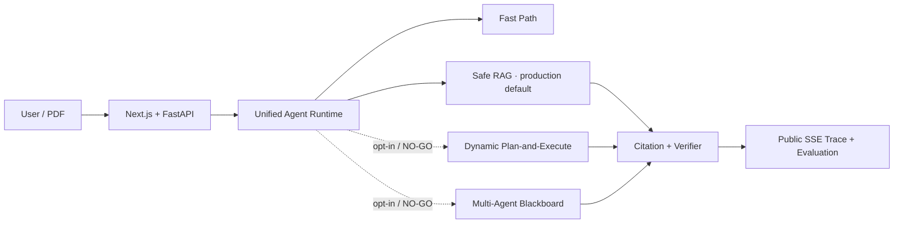

# PaperAgentSystem

一个证据优先、可恢复、可评测的论文 Agent 系统：把多文件论文任务拆成有预算的结构化步骤，通过 RAG、Memory、Tool、Verifier 和公开 Trace 完成回答，并让每个对外数字都能回查到冻结样本与版本化报告。

> **生产策略**：简单问题走 Fast Path，论文问题走 Safe RAG。动态 Planner 与 Multi-Agent 已完成机制和真实模型消融，但效果门槛为 **NO-GO**，因此保持显式实验开关；用户要求跳过 Stage O，SFT/Cascade 明确不可用且不声称效果。



| 冻结证据 | 真实结果 | 结论 |
|---|---:|---|
| B0～B3 固定集 | 300 case/系统，1,200 结果、1,800 次本地真实模型调用，系统异常 0 | 四组 Task Success 8.0% / 6.33% / 6.33% / 7.0%，无显著优于 B0 的系统 |
| Planner V2 | 270-case 最终 Schema 100%、非法调用 0、Required Step Recall 96.84% | 机制通过；M06 效果/成本门槛 NO-GO |
| Multi-Agent | Full vs Single Claim Support +5.63pp，Task Success -1.11pp，Token +398.03% | 效果/成本门槛 NO-GO，生产默认 Single Agent |
| 产品集成 | 隔离 Compose 8 服务全部 healthy，API `adapter_mode=real` | Fast/Safe 路径可部署，实验能力 fail-closed |

一条命令查看 3～5 分钟面试证据链（无需服务或模型）：

```bash
python -m evaluation.p05_demo
```

完整统计见 [`P04 Final Report`](./evaluation/reports/p04_final_v1/report.md)，管理员评测页位于 `/admin/evaluation`。

**项目状态**：阶段 P01～P05 已实施；O 阶段按用户要求跳过。

## 📋 核心特性

- **单一对话入口**: 类似 ChatGPT 的简洁交互体验
- **纯净用户界面**: 首页默认只展示会话、文件入口和消息输入，并提供按需展开的 RAG 诊断入口
- **论文智能分析**: 理解、总结、提取关键信息和证据
- **Self-RAG**: 小模型决定反问、检索或直接回答，章节问题按正文结构定位
- **可查看引用**: 点击回答中的证据标签即可展开原文与页码
- **版式感知 PDF**: 逐页判断单栏/双栏，双栏按左栏读完再读右栏，避免跨栏串行
- **视觉证据截图**: 图、表、算法按区域裁剪并保存页码/章节/bbox；回答提及时自动展示截图
- **相关多轮记忆**: 根据指代、追问信号和主题重合自动选择相关历史问答，避免无关历史污染上下文
- **Token 计量**: 右侧面板实时区分 1.7B/4B 的读入、写出和总用量
- **历史清理**: 最近会话可一键彻底删除，同时清理聊天记录、关联文件和解析索引
- **文件去重**: 重复上传同一 PDF 会复用已有文件记录并重新关联当前会话
- **检索诊断**: 主界面可查看 PDF 解析章节树、Chunk 以及 Exact/Section/Vector/BM25/Rerank 每步召回

下一阶段计划：按 [`Agent系统四方向深化实施计划.md`](./docs/development/Agent系统四方向深化实施计划.md)
M01～M06 动态 Plan-and-Execute 与 N01～N05 多智能体链路/消融已完成；M06、N05 效果门槛均为 No-Go，动态规划与多智能体保持非默认，后续仅在新验证集或明确改进后重新评估，并继续推进
模型级联。L05 已在冻结 300-case 数据集上用本地真实 `qwen3:1.7b`/`qwen3.5:4b` 完成
B0～B3 共 1,200 个 case、1,800 次模型调用；所有调用均记录 Profile、模型摘要和非零 usage。
四套 Task Success 为 8.0%/6.33%/6.33%/7.0%，真实暴露核验、生成、路由三类主要短板。
- **多文件对比**: 自动识别论文维度，生成对比表
- **学术写作辅助**: 章节撰写、段落改写、引用核验
- **完整记忆系统**: 短期会话记忆 + 长期跨会话检索
- **证据追踪**: 所有答案都附带原文页码和引用
- **本地模型设置**: 可分别选择 1.7B/4B 的 Base、SFT、RL 版本，并自动检查或下载其他 Ollama Base 模型
- **本地部署**: Docker Compose + Ollama，支持私有数据

## 🛠️ 技术栈

| 层级 | 技术 |
|---|---|
| 前端 | Next.js + React + TypeScript + Tailwind CSS |
| API | FastAPI + Pydantic + SQLAlchemy 2 |
| 数据库 | PostgreSQL + pgvector |
| 缓存/队列 | Redis + Celery |
| 存储 | MinIO |
| Agent Runtime | 显式状态机 + Schema 验证 |
| LLM | Qwen 1.7B/4B（可插拔） |
| Embedding | BGE-M3 |

## 📚 核心文档

请按以下顺序阅读：

1. **[AGENTS.md](./AGENTS.md)** - 工程规则和架构原则（必读）
2. **[技术栈文档](./docs/development/01-技术栈文档.md)** - 技术选型和依赖
3. **[产品架构文档](./docs/development/02-产品架构文档.md)** - 产品功能和用户场景
4. **[执行计划文档](./docs/development/03-执行计划文档.md)** - 开发方向和重点
5. **[详细开发计划](./docs/development/DEVELOPMENT_PLAN.md)** - 工作包和验收标准
6. **[Agent 系统四方向深化实施计划](./docs/development/Agent系统四方向深化实施计划.md)** - 动态规划、多智能体、可信评测与小模型训练路线
7. **[Final Evaluation Report](./evaluation/reports/p04_final_v1/report.md)** - 总体/切片、95% CI、消融、失败与限制
8. **[Model Card](./docs/MODEL_CARD.md)** / **[Dataset Card](./evaluation/datasets/DATASET_CARD.md)** - 模型与数据边界
9. **[Demo Runbook](./docs/DEMO_RUNBOOK.md)** / **[Failure Postmortems](./docs/FAILURE_POSTMORTEMS.md)** - 演示与失败复盘
10. **[Interview Guide](./docs/INTERVIEW_GUIDE.md)** / **[Resume Description](./docs/RESUME_PROJECT.md)** - 面试交付材料

## 🚀 快速开始

### 环境要求

- Python 3.12+
- Node.js 18+
- Docker & Docker Compose（推荐）
- [Ollama](https://ollama.com/download)（真实本地模型推理）

### 本地开发

```bash
# 1. 克隆并进入项目
git clone <repo>
cd PaperAgentSystem

# 2. 复制环境配置
cp .env.example .env.local

# 3. 启动前端
cd frontend
npm install
npm run dev
cd ..

# 4. 推荐使用 Docker Compose 启动 API、Worker、PostgreSQL、Redis 和 MinIO
docker compose -f infrastructure/docker/compose.yaml up --build -d

# 5. 运行当前阶段检查
python -m pytest -q
cd frontend
npm test
npm run type-check
npm run build
cd ..
```

### Docker Compose 一键启动

全新环境只需要 Docker Desktop（或 Docker Engine + Compose）：

```bash
git clone <repository-url>
cd PaperAgentSystem
docker compose -f infrastructure/docker/compose.yaml up -d
docker compose -f infrastructure/docker/compose.yaml ps
```

API、Web、MinIO Console 分别位于
`http://localhost:8000`、`http://localhost:3000`、`http://localhost:9001`。
默认通过宿主机 Ollama 提供真实 OpenAI-compatible 推理。首次使用请启动 Ollama，并准备
默认 Base 模型：

```bash
ollama pull qwen3:1.7b
ollama pull qwen3.5:4b
```

上传 PDF 后会先在 Worker 中执行 PyMuPDF 解析、分块和检索，再将命中的论文证据传给
当前设置的大模型。左侧底部“模型配置”可分别切换小模型和大模型；输入其他 Ollama
Base 模型名后，系统会先探活，本地缺失时自动下载并在成功后启用。SFT/RL 版本只有在
模型 Manifest 中存在唯一版本且服务可调用时才显示为可选。

PDF 解析会对每一页独立判断单栏或双栏。双栏页面先按纵向读取完整左栏，再读取右栏；
跨栏标题单独保留。图、表和算法优先使用 PDF 原生图片区域、表格检测结果和绘图边框确定
裁剪框，并以 2 倍分辨率 PNG 保存到对象存储。视觉区域内部文字标记为非正文，不进入正文
Chunk；标题仍可检索，并记录截图 ID、类型、章节、页码、bbox 和来源 block。回答提到对应
图表或算法时，消息 metadata 返回同页视觉证据，前端在回答下方显示截图。

多轮问答不会无条件拼接全部历史。系统根据“它、这个、继续、上述、列举、举例、逐一”等
指代或省略式追问信号及当前问题与历史消息的主题重合度，最多选择 8 条、3600 字符的相关
原始消息，同时记录来源 message ID。省略式追问会把最近相关用户问题补入本轮检索查询，再执行
RAG；与当前主题无关的新问题不注入历史上下文。只有用户明确给出章节编号、章节标题或结构性
章节表达时才启用章节强约束，“这篇文章用了哪些数据集”等主题问题始终走普通 RAG。

调试 RAG 时，文件标签旁边的“解析”会显示章节树和该章节下的 Chunk；“检索诊断”会调用
`POST /api/v1/debug/retrieval/preview`，只运行检索不调用 LLM，并展示 Exact、Section、
Vector、BM25、合并、重排以及最终送入 LLM 的上下文。解析和检索诊断同时导出 JSON/MD 到
`runtime/diagnostics/rag/`；Docker 启动时该目录挂载到 API 容器内，便于直接在本地查看。

Web 前端默认通过同源 `/api/v1` 调用产品 API，Next.js 会把请求代理到 FastAPI。Docker
Compose 中 Web 容器使用 `API_INTERNAL_URL=http://api:8000` 访问内部 API；本地
`npm run dev` 时默认代理到 `http://localhost:8000`。如需直连其他 API 地址，可以设置
`NEXT_PUBLIC_API_BASE_URL`。

```bash
docker compose -f infrastructure/docker/compose.yaml down
```

Windows 用户也可以直接双击仓库根目录的 `start-paperagent.cmd`。脚本会自动启动
Docker Desktop（如果尚未运行）、复用已有镜像和持久卷启动服务、等待健康检查，然后打开：

- Web：`http://localhost:3000`
- API 文档：`http://localhost:8000/docs`

双击 `stop-paperagent.cmd` 可停止系统并保留数据库与对象存储数据。PowerShell 高级用法：

```powershell
# 代码或依赖变化后强制重建镜像
.\scripts\start-paperagent.ps1 -Build

# 启动但不打开浏览器
.\scripts\start-paperagent.ps1 -NoBrowser

# 清空本地数据库、Redis 和 MinIO 数据卷，仅在需要重置时使用
.\scripts\stop-paperagent.ps1 -RemoveVolumes
```

### 代码导航

| 要找的内容 | 位置 |
|---|---|
| Web 前端 | `frontend/src/` |
| FastAPI 接口 | `backend/apps/api/` |
| Worker 与后台任务 | `backend/apps/worker/` |
| Agent 规划、执行、核验 | `backend/agent_runtime/` |
| PDF 解析 | `backend/document_processing/` |
| RAG、索引与引用 | `backend/rag/` |
| Skill 与 Skill-local Tool 清单 | `backend/skills/` |
| Tool 实现 | `backend/tool_runtime/` |
| 短期记忆 | `backend/memory/short_term.py` |
| 长期记忆 | `backend/memory/long_term.py` |
| 临时 Task/Plan 工作记忆 | `backend/agent_runtime/` |
| Redis/Celery | `backend/infrastructure/redis/` |
| PostgreSQL/pgvector | `backend/infrastructure/postgres/` |
| MinIO | `backend/infrastructure/minio/` |
| Docker Compose 与镜像 | `infrastructure/docker/` |
| Alembic 配置 | `infrastructure/database/alembic.ini` |
| Agent 日志 | `runtime/logs/agent/` |
| RAG 诊断导出 | `runtime/diagnostics/rag/` |
| 可清理实验临时文件 | `runtime/scratch/` |

### 项目结构

```text
PaperAgentSystem/
├── backend/                         # 后端单体包，所有 Python 业务代码
│   ├── apps/
│   │   ├── api/                    # FastAPI、路由、应用服务
│   │   └── worker/                 # Worker、队列处理入口
│   ├── core/                       # Domain、Port、错误和 ID
│   ├── agent_runtime/              # Planner、Executor、Context、Verifier
│   ├── document_processing/        # PDF/OCR/版式解析
│   ├── rag/                        # 索引、检索、章节解析、引用
│   ├── memory/                     # short_term.py / long_term.py
│   ├── skills/                     # Skill 包及 tools/tools.yaml
│   ├── tool_runtime/               # 真实原子 Tool 与 Pydantic 契约
│   ├── subagents/                  # 多 Agent 协议与协调器
│   ├── models/                     # Model Registry 与运行时客户端
│   └── infrastructure/             # PostgreSQL、Redis、MinIO 等 Adapter
├── frontend/                        # Next.js + React + TypeScript
├── infrastructure/
│   ├── docker/                     # compose.yaml、Dockerfile、OTel
│   └── database/                   # Alembic 入口配置
├── runtime/                         # 运行产生的数据，不与源码混放
│   ├── logs/agent/                 # 每任务 JSONL 审计日志
│   ├── diagnostics/rag/            # 解析与检索诊断
│   └── scratch/                    # 可删除的实验临时文件
├── evaluation/                      # 数据集、指标、评测和冻结报告
├── training/                        # 独立训练包
├── tests/                           # 单元、契约、集成和 E2E 测试
├── scripts/                         # 启停脚本
└── docs/
    ├── development/                # 技术栈、产品架构、计划和过程日志
    └── adr/                        # 架构决策记录
```

## 📦 开发命令

```bash
# Python 开发依赖（仓库根目录）
python -m pip install -e ".[dev]"

# FastAPI
python -m uvicorn backend.apps.api.main:app --reload --port 8000

# Worker
python -m backend.apps.worker.runtime

# 后端质量检查
python -m pytest -q
ruff check backend evaluation training tests
mypy backend evaluation training

# 前端质量检查
cd frontend
npm ci
npm test
npm run type-check
npm run build
cd ..

# Docker 全栈
docker compose -f infrastructure/docker/compose.yaml up --build -d
docker compose -f infrastructure/docker/compose.yaml ps
```

评测临时产物统一写入 `runtime/scratch/`：

```bash
paperagent-experiment-smoke --dataset evaluation/datasets/v1/test_cases_v1.jsonl --output evaluation/reports/smoke --checkpoint runtime/scratch/eval --run-id smoke-v1 --limit 10
paperagent-experiment-real --dataset evaluation/datasets/v1/test_cases_v1.jsonl --output evaluation/reports/real --checkpoint runtime/scratch/eval --run-id real-v1 --executor-factory package.module:factory --allow-real-model
```
## 🔄 开发阶段

- **A: 项目治理和架构契约** ✅ 完成
  - A01: 清理入口并建立项目元数据 ✅
  - A02: 建立 ADR 和模块依赖规则 ✅
  - A03: 定义全局 ID、枚举和错误模型 ✅
  - A04: 定义核心 Domain 实体 ✅
  - A05: 定义所有 Port ✅
  - A06: 定义 Agent Schema 和状态机 ✅
  - A07: 定义 REST API 和 SSE 契约 ✅
- **B: 完整代码骨架** ✅ 完成
  - FastAPI/Worker/FakeQueue 与统一错误、健康检查、关联 ID
  - 可构建的 Next.js Mock UI 与主要用户操作入口
  - 全 Port Fake 组合根、故障注入和 Workspace 隔离契约
  - Port-only Agent Runtime Stub 与预算/取消/持久化门禁
  - 11 个能力型 Skill Manifest 和 `paper_reader_agent`
  - 九个 Fake 端到端控制流场景
- **C: 基础设施 Adapter** ✅ 完成
  - PostgreSQL/pgvector、SQLAlchemy 2、Alembic、Repository 和 Unit of Work
  - Redis/Celery 四类队列、数据库任务真值、取消、锁、重试、死信与崩溃恢复
  - MinIO Workspace 隔离、SHA-256 去重、MIME/签名校验、引用计数与流式上传
  - 数据库 TaskEvent、Redis 通知、SSE sequence、断线续传和最终事件关闭
- **D: 会话、Workspace 和 Memory** ✅ 完成
  - 历史会话与消息 CRUD、搜索分页、附件和删除级联
  - ConversationWorkspace/TaskWorkspace、Manifest、Promote、恢复和路径安全
  - Workspace 文本/摘要/Embedding 分层检索与完整来源追踪
  - 短期 Memory 摘要定位、原消息回读、删除失效和重建
  - 长期 ConversationSummary、显式 Preference、跨会话/历史文件检索和遗忘
- **E: 真实 Agent Runtime** ✅ 完成
  - 逻辑 Model Profile/Version Manifest、OpenAI 兼容客户端、fallback 和版本 Trace
  - 检索优先的 Requirement Clarifier、两轮澄清和原 Task 恢复
  - Top-3 Skill 选择、正文按需加载、结构化 DAG Plan 和最多两次 Replan
  - 有预算、取消、超时、幂等、逐步持久化和子 Agent 门禁的 Executor
  - 来源可追踪且受 Profile Token 预算约束的 ContextBuilder
  - Schema、Claim-Evidence、数字、引用和不可变项规则 Verifier
- **F: Tool、Skill 和子 Agent** ✅ 完成
  - Pydantic Tool Runtime、Skill 白名单、权限、确认、超时重试、幂等和 Trace
  - Workspace 六项 Tool，强制 Workspace/Task 范围、对象存储和 Promote 审计
  - 11 个能力型 Skill 的唯一 Manifest/Registry/Selector/Runtime 链路；按任务声明 object、Markdown 或 Markdown 表格等结构化契约
  - 每个 Skill 通过 `tools/tools.yaml` 声明可调用 Tool、用途和实现绑定；参数及返回值由共享 `tool_runtime/` 的 Pydantic 模型校验并写入 Trace
  - 单文件 `paper_reader_agent`、完整 Paper Card、证据、缺失字段和独立 Profile/预算
  - 父子 Task 持久化、Celery Group、并发限制、部分失败汇总和取消传播
- **G: 论文解析和 RAG** ✅ 完成
  - PyMuPDF 页码、文本、bbox、页眉页脚、双栏阅读顺序、章节与质量评分
  - 扫描检测及 PaddleOCR/Tesseract 可选 Adapter、主备回退、置信度和低质量 Trace
  - 可追溯父子 Chunk、Section path、页面/bbox/邻接、幂等 Embedding 和删除失效
  - PostgreSQL pgvector HNSW、FTS GIN、Top-30 双路召回、RRF 和 Top-8 Reranker
  - 程序分配 Citation ID、PDF 页面定位、Claim-Evidence 检查和证据不足拒答
  - `parse_document`、`search_document`、`get_document_section` Tool Runtime 集成
- **H: 论文领域功能** ✅ 完成
  - 单论文 Paper Card 八类字段、Evidence 绑定、缺失字段和字段 F1 评测
  - 并行 Paper Card 比较、字段标准化、比较矩阵、数字核验和证据支持结论
  - Writing Brief、Evidence Map、事实/观点/推测分类和不可变项
  - 七类章节及段落计划、证据约束草稿、来源/缺失项和待用户审阅标记
  - 压缩、扩写、润色、重组及数字/公式/术语/引用回归检查
  - Evidence Matrix 优先综述、事实追溯、推断标记和 Claim 引用核验
  - 六项论文领域服务接入安全 Tool Runtime
- **I: 安全、观测和交付** ✅ 完成
  - 持久 Trace Span、task_id 全链重建、OpenTelemetry 语义和敏感内容脱敏
  - Workspace/路径/符号链接、Prompt Injection、恶意文件和 Tool 参数安全测试
  - 禁用型 SandboxExecutor，未配置真实沙箱时明确拒绝代码和 LaTeX 执行
  - Contract、Component、Trajectory、Domain、E2E、Security、Performance 七层评测
  - Docker Compose 十服务、健康检查和模型不可用结构化降级
  - 十个最终场景 100% 完成、死循环率 0、引用支持率 100%、删除失效和无 Adapter 运行
- **J: 模型训练** 🚧 J01 完成，J02 等待真实训练资产
  - J01 独立训练工程与数据契约 ✅ 完成
  - 训练只读取导出的 Schema、Tool 定义和版本化 JSONL，不依赖在线服务
  - 私有数据必须显式授权并匿名化；按论文和会话隔离 train/validation/test
  - J02 已提供 1.7B 分任务规模、算法、指标和 fail-closed 前置审计；当前缺少经审核数据、
    Hugging Face 基座权重及独立训练依赖，未生成或发布任何虚假 Adapter
- **K: 产品入口真实集成** ✅ 完成
  - 新对话、搜索对话、历史会话恢复和文件库接入真实 PostgreSQL API
  - 上传 PDF 后由独立 Worker 执行 PyMuPDF 解析、分块和索引
  - 用户问题经 Redis 队列进入证据检索和 OpenAI-compatible 模型调用
  - 模型不可用时明确失败，不把 Fake 或规则模板伪装为模型回答
  - 左侧模型配置页管理 1.7B/4B Base、SFT、RL 版本，默认 Base
  - Ollama 模型探活、缺失自动下载、选择持久化和 Worker 动态路由
  - Qwen3 1.7B 与 Qwen3.5 4B Base 已通过真实推理验收
- **L: 可信评测与 Baseline** ✅ L00～L05 完成
  - 固定 300-case L1～L6 数据集、33 项指标、95% CI 与规则优先 Judge
  - 可恢复并发 Runner、预算预约、失败 taxonomy、Trace 回放和三类报告输出
  - smoke 与真实模型命令完全分离；B0～B3 各完成 300 条 `offline_real_model` 全量基线
  - 冻结 JSON/Markdown/Dashboard/case-score 报告、95% CI、paired B0 差值和 SHA-256 Manifest
  - M01～M06 已完成；真实消融未达到晋级线，冻结为 No-Go，不将机制测试包装为效果提升
- **M: 动态规划与执行** ⚠️ 实施完成，M06 No-Go
  - Plan V2 表达目标、依赖、输入引用、输出 Schema、证据要求、预算、风险、Fallback 和完成谓词
  - Observation、不可变 Plan Patch、版本差异 Trace 与 V1 兼容迁移已落地
  - 复杂任务由受约束 4B Planner 生成 Plan V2；一次结构化修复后仍失败则进入安全固定 Workflow
  - 270-case 验收中最终 Plan 合法率 100%、越权率 0，复杂任务 Required Step Recall 96.84%
  - Completion Evaluator 不以 Tool 成功代替任务完成，输出具体缺失项与可供 Replanner 消费的质量信号
  - Strategy Replanner 覆盖 8 类失败，使用不可变 Plan Patch 切换查询、范围、工具、模型、证据或降级策略
  - Dynamic Executor 按 Plan version/DAG 领取步骤，原子提交 Observation/usage/预算/Trace，并支持幂等崩溃恢复与取消传播
  - 五组 4B 消融中完整候选 L3～L5 Task Success 仅较最佳旧组 +1.33pp（95% CI [-3.33pp,6.00pp]），单位成功 Token +78.55%
  - 有限 ReAct 支持最多两轮反问，并在用户补充后恢复同一个原任务
  - Self-RAG 由 1.7B 决定是否检索；4B 使用章节连续证据生成带引用回答
  - 引用可点击查看原文；右侧面板实时展示会话级 small/large Token
  - 生产检索移除 Fake Adapter，固定中英评测 Pass@5/Recall@10/MRR@10 为 1.00
  - K04.1 已持久化编号章节树、章节目录和 Chunk 章节身份，为精确 section 定位提供底座
  - K04.2 支持编号、标题、中英别名和上下文指代解析；不存在或歧义章节不再被强行匹配
  - 新增调试预览接口和前端面板，可查看解析结果、章节 Chunk 与多路检索各阶段命中
  - 本地 Qwen/Ollama 回答会使用 `/no_think`，并拒绝保存空回答或明显过短的无效回答
  - 主界面上传请求改为同源 `/api/v1` 代理，避免浏览器跨 Origin 或 `localhost` 差异导致
    `Failed to fetch`
- **N: 多智能体协作系统** ⚠️ N01～N05 完成，N05 No-Go
  - 定义 Coordinator、Paper Reader、Evidence、Critic、Writer、Verifier 六个职责隔离角色
  - 每个角色具备独立 Manifest、Model Profile 引用、Tool 白名单、输入/输出 Schema、预算与停止条件
  - Agent 间只传递版本化 Artifact/DataRef，不传原始正文、Prompt 或隐藏推理
  - 子 Agent 禁止直接联系用户和递归创建 Agent；Critic 可显式降级，其余必需角色缺失时失败
  - 协议已冻结数据所有权、冲突保留、超时、一次重试、取消传播和终态语义
  - Evidence Blackboard 以 PostgreSQL/append-only event 为真值，支持乐观锁、Workspace 隔离、来源删除失效与确定性重建
  - Coordinator 将多论文步骤展开为深度 1 的角色 DAG，按 GPU/Worker/Token 预算并发，复用单次 Paper Card 并显式汇总部分失败
  - Critic—Writer—Verifier 使用结构化 issue/resolution/finding，Critic 与 Verifier 修订各最多一轮，最终 Claim 必须回指 Evidence Matrix 或标记推断
  - 90 个 L4/L5 真实 4B case 的六组消融完整；完整系统 Claim Support +5.63pp、Task Success -1.11pp、总 Token +398.03%，未晋级
  - 默认仍走 single Agent；Critic 仅实验启用，Verifier 合并为确定性门禁，额外 LLM Verifier 与完整修订默认关闭

详见 [DEVELOPMENT_PLAN.md](./docs/development/DEVELOPMENT_PLAN.md)

## Agent 任务监控与审计日志

发送消息并创建后台任务后，输入框下方的任务状态旁会显示“监控”按钮。浮层通过现有 SSE
事件流实时展示小模型问题判断、内置 RAG 流程、证据检索、大模型回答生成和 Verifier 回答检验等
公开阶段；重新打开浮层时可由 `GET /api/v1/product-tasks/{task_id}/monitor` 回读已持久化事件。
界面只展示阶段和结果，不展示模型隐藏推理、Prompt 或论文全文。

Worker 同时按任务生成 UTF-8 JSONL 审计日志，记录组件、动作、状态、文件 ID、对象键和检索/核验
计数等白名单元数据。Docker 启动时容器目录 `/app/runtime/logs/agent` 映射到项目目录
`D:\vscode\Projects\PaperAgentSystem\runtime\logs\agent`，单个任务文件为
`runtime/logs/agent/<task_id>.jsonl`。可通过 `AGENT_LOG_DIR` 修改 Worker 内部写入目录；日志目录已加入
`.gitignore`，且不会记录用户问题、回答正文、Prompt、论文全文或密钥。

## 🧪 测试

项目遵循自顶而下的测试策略：

- **Contract 测试**: Port 和 Fake/Real Adapter 一致性
- **Unit 测试**: 纯逻辑和状态机
- **Integration 测试**: 数据库、缓存、存储交互
- **E2E 测试**: 用户场景和任务完整流程
- **Security 测试**: 越权、路径穿越、注入

## 🔐 隐私和安全

- ✅ 所有用户数据隔离在 Workspace 层
- ✅ 不提交模型权重、用户论文、密钥和真实私有数据
- ✅ 支持本地部署和私有数据处理
- ⚠️ 首版不支持端到端加密（待实现）

## 📖 贡献指南

参考 [AGENTS.md](./AGENTS.md) 的工程规则。核心原则：

1. 先写测试和契约，再实现
2. Domain 层不依赖框架
3. 所有外部系统通过 Port 访问
4. 修改必须同步文档
5. 不覆盖用户未提交的修改

## 📝 许可证

MIT

---

**最后更新**: 2026-07-22
**当前维护者**: PaperAgent Team
