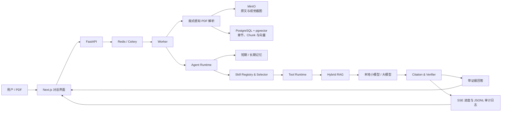

# PaperAgentSystem

面向学术论文阅读、分析、比较与写作的本地化智能体系统。

PaperAgentSystem 将版式感知 PDF 解析、混合检索、对话记忆、结构化 Skill/Tool 调用、答案核验与可观测执行链路整合到一个统一对话界面中。系统强调“先找证据，再生成回答”，回答中的关键结论可追溯到论文、章节、页码和原文片段。

[](https://www.python.org/)
[](https://fastapi.tiangolo.com/)
[](https://nextjs.org/)
[](https://github.com/pgvector/pgvector)
[](#许可证)

## 核心能力

- **统一论文工作台**：在同一会话中完成论文上传、问答、总结、比较、写作和引用核验。
- **版式感知 PDF 解析**：逐页识别单栏或双栏版式；双栏页面按照“左栏完整读取，再读取右栏”的顺序恢复正文。
- **图表与算法证据**：独立裁剪图片、表格和算法区域，保存章节、页码、边界框和来源关系；回答引用相关内容时展示对应截图。
- **证据优先 RAG**：组合精确匹配、章节检索、向量检索、BM25、RRF 和重排，生成带页码与证据片段的回答。
- **多轮会话记忆**：根据指代、省略式追问和主题相关性选择历史消息，避免机械拼接全部上下文。
- **结构化 Skill/Tool 链路**：Skill 通过 Manifest 声明触发规则、输入输出契约和可调用 Tool，运行时统一执行参数校验、权限控制和结果检查。
- **答案核验**：对 Claim、数字、引用和证据关系进行验证；证据不足时明确说明限制。
- **任务进度监控**：实时展示问题判断、Skill 激活、证据检索、回答生成和 Verifier 核验等公开阶段。
- **本地化部署**：支持 Ollama、本地模型、PostgreSQL、Redis、MinIO 和 Docker Compose，论文数据无需发送到第三方模型服务。

## 界面与使用场景

系统适合以下任务：

- 针对单篇论文进行带引用问答和结构化总结；
- 比较多篇论文的方法、数据集、实验设置、结果与局限；
- 提取论文中的数据集、指标、模型配置和关键结论；
- 根据论文证据生成综述、大纲或章节草稿；
- 检查文本中的事实、数字与引用是否得到原文支持；
- 在连续追问中继承必要的论文范围和会话上下文；
- 查看 Agent 的任务进度、文件访问记录和检索诊断。

## 系统架构



默认运行策略针对不同任务选择合适链路：

- 简单任务使用低开销 Fast Path；
- 论文证据问题使用 Safe RAG；
- 动态 Plan-and-Execute 与多智能体协作作为显式实验模式保留，不影响默认链路的稳定性。

## 快速开始

### 环境要求

- Windows、macOS 或 Linux
- Docker Desktop，或 Docker Engine + Docker Compose
- [Ollama](https://ollama.com/download)
- 建议至少 16 GB 内存；运行本地模型时根据模型量化版本准备额外内存或显存

### 1. 准备本地模型

启动 Ollama，并下载默认模型：

```bash
ollama pull qwen3:1.7b
ollama pull qwen3.5:4b
```

### 2. 创建环境配置

macOS / Linux：

```bash
cp .env.example .env
```

Windows PowerShell：

```powershell
Copy-Item .env.example .env
```

默认配置可直接用于本地体验。部署到共享或生产环境前，请修改 PostgreSQL、MinIO 和应用密钥。

### 3. 启动系统

```bash
docker compose --env-file .env -f infrastructure/docker/compose.yaml up --build -d
```

等待服务健康后访问：

| 服务 | 地址 |
|---|---|
| Web 应用 | [http://localhost:3000](http://localhost:3000) |
| API 文档 | [http://localhost:8000/docs](http://localhost:8000/docs) |
| MinIO Console | [http://localhost:9001](http://localhost:9001) |

查看服务状态：

```bash
docker compose --env-file .env -f infrastructure/docker/compose.yaml ps
```

停止系统并保留数据：

```bash
docker compose --env-file .env -f infrastructure/docker/compose.yaml down
```

Windows 用户也可以直接运行：

```text
start-paperagent.cmd
```

停止时运行 `stop-paperagent.cmd`。该方式会使用 Docker 构建缓存同步当前代码、复用持久卷，并在服务健康后打开 Web 页面。

## 基本使用

1. 打开 Web 应用并新建会话。
2. 上传一篇或多篇 PDF，等待后台完成解析和索引。
3. 直接输入问题，例如：

   ```text
   这篇论文使用了哪些数据集？请列出对应实验、页码和原文证据。
   ```

4. 继续追问：

   ```text
   分别说明这些数据集在训练集和测试集中的作用。
   ```

5. 点击回答中的引用查看原文证据；回答涉及图、表或算法时，可在回答下方查看对应截图。
6. 点击任务状态旁的“监控”查看本轮 Agent 的公开执行阶段。

系统只会在问题确实依赖历史上下文时注入相关消息。主题切换后，新问题不会自动继承无关会话内容。

## PDF、RAG 与视觉证据

每个 PDF 页面都会独立进行版式判断。正文解析保留页面、章节路径、文本边界框和阅读顺序，并过滤重复页眉页脚。图、表和算法优先利用 PDF 原生区域、表格检测结果、绘图边框与标题关系确定裁剪范围，以高分辨率 PNG 单独保存。

视觉区域中的文字不会混入普通正文 Chunk；标题、章节、页码、边界框和截图 ID 会作为结构化元数据保留。检索命中相关视觉对象时，回答可同时返回文字证据与截图。

RAG 链路包含：

1. 查询理解与必要的多轮问题补全；
2. 论文和章节范围解析；
3. Exact、Section、Vector 与 BM25 多路召回；
4. RRF 合并与重排；
5. 上下文预算控制；
6. 大模型回答生成；
7. Claim、数字、引用与证据核验。

## Skill 与 Tool

论文能力以独立 Skill 包组织。每个 Skill 包含：

```text
skill-name/
├── SKILL.md
├── manifest.yaml
├── tools/
│   └── tools.yaml
├── references/
├── assets/
└── scripts/
```

`SKILL.md` 描述能力边界、触发与不触发条件、执行步骤和结构化输入输出模板；`manifest.yaml` 提供机器可读契约；`tools/tools.yaml` 声明该 Skill 可调用的 Tool、用途和参数示例。

运行时链路为：

```text
SkillManifestLoader → SkillRegistry → SkillSelector → SkillRuntime → ToolRuntime
```

Tool 参数与返回结果由 Pydantic 模型校验，非法调用会被拒绝并写入 Trace。

## Memory

系统将不同类型的状态明确分离：

| 类型 | 作用 | 位置 |
|---|---|---|
| 短期记忆 | 当前会话消息、摘要和相关历史回读 | `backend/memory/short_term.py` |
| 长期记忆 | 跨会话摘要、偏好和历史资料检索 | `backend/memory/long_term.py` |
| Agent 工作状态 | Task、Plan、Observation、预算和执行状态 | `backend/agent_runtime/` |
| Redis 协调状态 | 队列、取消、锁、事件通知和短期协调 | `backend/infrastructure/redis/` |

详细边界见 [`backend/memory/README.md`](./backend/memory/README.md)。

## 任务监控与审计日志

监控面板通过 SSE 展示可公开的执行阶段，不展示隐藏推理、完整 Prompt 或论文全文。重新打开面板时，已持久化事件可从任务监控接口回读。

Worker 会为每个任务生成 UTF-8 JSONL 审计日志：

```text
runtime/logs/agent/<task_id>.jsonl
```

日志仅记录组件、动作、状态、文件 ID、对象键、耗时和检索/核验计数等白名单字段。RAG 解析与检索诊断保存在：

```text
runtime/diagnostics/rag/
```

## 模型配置

系统通过 OpenAI-compatible 接口连接 Ollama，并区分小模型和大模型职责：

- 小模型：意图判断、路由和低成本决策；
- 大模型：证据约束下的回答生成与复杂任务处理；
- Embedding：默认使用 BGE-M3；
- Reranker：通过独立服务端点接入。

主要环境变量：

| 变量 | 说明 | 默认值 |
|---|---|---|
| `OLLAMA_ENDPOINT` | Ollama 服务地址 | `http://host.docker.internal:11434` |
| `ADAPTER_MODE` | 基础设施适配模式 | `real` |
| `DATABASE_URL` | PostgreSQL 连接地址 | 见 `.env.example` |
| `REDIS_URL` | Redis 连接地址 | `redis://localhost:6379/0` |
| `MINIO_ENDPOINT` | MinIO 地址 | `localhost:9000` |
| `EMBEDDING_MODEL_NAME` | Embedding 模型 | `bge-m3` |
| `AGENT_LOG_DIR` | Agent 审计日志目录 | `runtime/logs/agent` |

完整配置见 [`.env.example`](./.env.example)。

## 项目结构

```text
PaperAgentSystem/
├── backend/
│   ├── apps/                    # FastAPI 与 Worker
│   ├── agent_runtime/           # 规划、执行、上下文与核验
│   ├── document_processing/     # PDF、OCR 与版面解析
│   ├── rag/                     # 索引、混合检索与引用
│   ├── memory/                  # 短期与长期记忆
│   ├── skills/                  # Skill 定义与本地 Tool 清单
│   ├── tool_runtime/            # Tool 实现与数据契约
│   ├── models/                  # 模型注册和运行时
│   └── infrastructure/          # PostgreSQL、Redis、MinIO 等适配器
├── frontend/                    # Next.js + React + TypeScript
├── infrastructure/
│   ├── docker/                  # Compose、Dockerfile 与 OpenTelemetry
│   └── database/                # Alembic 配置
├── runtime/                     # 日志、诊断和临时运行产物
├── evaluation/                  # 数据集、指标和冻结评测报告
├── training/                    # 独立模型训练工程
├── tests/                       # 单元、契约、集成与端到端测试
├── scripts/                     # 系统启停脚本
└── docs/                        # 架构、模型、数据和使用文档
```

常用代码入口：

| 模块 | 路径 |
|---|---|
| Web 前端 | `frontend/src/` |
| FastAPI | `backend/apps/api/` |
| Worker | `backend/apps/worker/` |
| Agent Runtime | `backend/agent_runtime/` |
| PDF Parser | `backend/document_processing/pdf_parser.py` |
| RAG | `backend/rag/` |
| Skill | `backend/skills/` |
| Tool Runtime | `backend/tool_runtime/` |
| PostgreSQL | `backend/infrastructure/postgres/` |
| Redis/Celery | `backend/infrastructure/redis/` |
| Docker | `infrastructure/docker/` |

## 质量与可复现性

当前仓库通过以下自动化验证：

| 检查 | 结果 |
|---|---:|
| Python 单元、契约与集成测试 | 398 passed |
| 前端组件测试 | 20 passed |
| TypeScript 类型检查 | 通过 |
| Next.js 生产构建 | 通过 |
| Ruff 静态检查 | 通过 |
| 核心 Agent、模型与 Tool Runtime 类型检查 | 通过 |
| API、Worker、Web Docker 镜像构建 | 通过 |

评测框架提供版本化数据集、资源预算、失败分类、95% 置信区间、逐 Case 结果和 SHA-256 Manifest。动态规划与多智能体模块不会仅因机制测试通过就进入默认路径，而是依据冻结评测结果和成本门槛决定是否启用。

相关材料：

- [产品架构](./docs/development/02-产品架构文档.md)
- [最终评测报告](./evaluation/reports/p04_final_v1/report.md)
- [Model Card](./docs/MODEL_CARD.md)
- [Dataset Card](./evaluation/datasets/DATASET_CARD.md)
- [Demo Runbook](./docs/DEMO_RUNBOOK.md)
- [Failure Postmortems](./docs/FAILURE_POSTMORTEMS.md)

## 隐私与安全

- 论文、索引和会话数据可完全保留在本地环境；
- Workspace、Conversation 与 Task 使用独立标识和范围检查；
- 上传文件执行 MIME、文件签名、大小和路径安全校验；
- Tool 调用执行参数 Schema、权限、超时和幂等检查；
- Prompt Injection 内容不会直接获得 Tool 权限；
- 日志默认不记录用户问题、回答正文、完整 Prompt、论文全文或密钥；
- 删除会话时同步处理关联消息、文件引用、索引和记忆失效。

在共享或公网环境部署时，应替换 `.env` 中的默认密码和密钥，并在外部增加 TLS、访问控制与网络隔离。

## 故障排查

### 页面可以打开，但回答任务失败

确认 Ollama 正在运行，并检查模型是否存在：

```bash
ollama list
```

### 查看容器状态和日志

```bash
docker compose --env-file .env -f infrastructure/docker/compose.yaml ps
docker compose --env-file .env -f infrastructure/docker/compose.yaml logs --tail=200 api worker
```

### PDF 已上传但仍在处理中

检查 Worker、Redis 和 PostgreSQL：

```bash
docker compose --env-file .env -f infrastructure/docker/compose.yaml logs --tail=200 worker redis postgres
```

### 完全重置本地数据

以下操作会删除 PostgreSQL、Redis 和 MinIO 的本地持久卷：

```bash
docker compose --env-file .env -f infrastructure/docker/compose.yaml down -v
```

## 许可证

本项目采用 MIT License。
