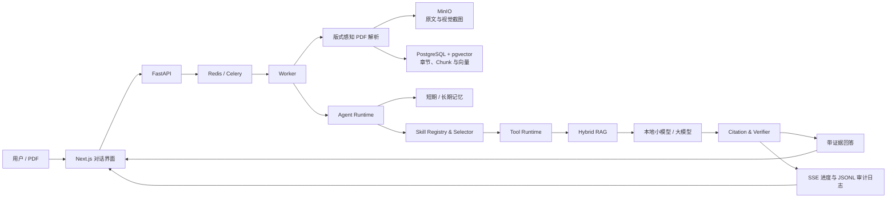

# PaperAgentSystem

面向学术论文阅读、分析、比较与写作的本地化智能体系统。

PaperAgentSystem 将版式感知 PDF 解析、混合检索、对话记忆、结构化 Skill/Tool 调用、答案核验与可观测执行链路整合到一个统一对话界面中。系统强调“先找证据，再生成回答”，回答中的关键结论可追溯到论文、章节、页码和原文片段。

[](https://www.python.org/)
[](https://fastapi.tiangolo.com/)
[](https://nextjs.org/)
[](https://github.com/pgvector/pgvector)
[](#许可证)

## 核心能力

- **统一论文工作台**：在同一会话中完成论文上传、问答、总结、比较、写作和引用核验。
- **版式感知 PDF 解析**：逐页识别单栏或双栏版式；双栏页面按照“左栏完整读取，再读取右栏”的顺序恢复正文。
- **图表与算法证据**：独立裁剪图片、表格和算法区域，保存章节、页码、边界框和来源关系；回答引用相关内容时展示对应截图。
- **证据优先 RAG**：组合精确匹配、章节检索、向量检索、BM25、RRF 和重排，生成带页码与证据片段的回答。
- **可区分的多论文对比**：对比任务按文件分别保留证据配额，提示上下文使用论文文件名标识来源，避免全局 Top-K 被单篇论文占满或把两篇论文混为一篇。
- **按需会话记忆**：回答完成后异步更新短期 `MemorySegment` 与长期 `ConversationSummary`；结构化路由先判断本轮是新任务还是延续任务，新任务默认不注入旧 Memory，明确引用历史材料时才按 message ID 回读原文。
- **结构化需求与混合 Skill/Tool 链路**：权限和负触发条件先做硬过滤，规则分 + Embedding 语义分召回 Top-K；1.7B 小模型在一次调用中同时输出任务类型、轮次关系、来源、Memory 策略和 0～N 个 Skill。确定性 Preflight 再检查材料是否就绪，Planner 负责 DAG、权限和预算。
- **答案核验**：对 Claim、数字、引用和证据关系进行验证；证据不足时明确说明限制。
- **任务进度监控**：实时展示问题判断、Skill 激活、证据检索、回答生成和 Verifier 核验等公开阶段。
- **本地化部署**：支持 Ollama、本地模型、PostgreSQL、Redis、MinIO 和 Docker Compose，论文数据无需发送到第三方模型服务。

## 界面与使用场景

系统适合以下任务：

- 针对单篇论文进行带引用问答和结构化总结；
- 比较多篇论文的方法、数据集、实验设置、结果与局限；
- 提取论文中的数据集、指标、模型配置和关键结论；
- 根据论文证据生成综述、大纲或章节草稿；
- 检查文本中的事实、数字与引用是否得到原文支持；
- 在连续追问中继承必要的论文范围和会话上下文；
- 查看 Agent 的任务进度、文件访问记录和检索诊断。

## 系统架构



默认运行策略针对不同任务选择合适链路：

- 无论文的简单任务使用低开销 Fast Path；
- 单论文及普通论文任务默认由受约束 Planner 生成最多八步公开 Plan，再由 Safe RAG 完成真实执行；
- Plan 的步骤、依赖和实时状态通过任务监控展示，Prompt 与隐藏推理不进入事件；
- 至少两篇论文且具有比较、综述或综合意图时，默认执行受约束多智能体 DAG；两个门禁可用于显式关闭和回退。

## 快速开始

### 环境要求

- Windows、macOS 或 Linux
- Docker Desktop，或 Docker Engine + Docker Compose
- [Ollama](https://ollama.com/download)
- 建议至少 16 GB 内存；运行本地模型时根据模型量化版本准备额外内存或显存

### 1. 准备本地模型

启动 Ollama，并下载默认模型：

```bash
ollama pull qwen3:1.7b
ollama pull qwen3.5:4b
```

### 2. 创建环境配置

macOS / Linux：

```bash
cp .env.example .env
```

Windows PowerShell：

```powershell
Copy-Item .env.example .env
```

默认配置可直接用于本地体验。部署到共享或生产环境前，请修改 PostgreSQL、MinIO 和应用密钥。

### 3. 启动系统

```bash
docker compose --env-file .env -f infrastructure/docker/compose.yaml up --build -d
```

等待服务健康后访问：

| 服务 | 地址 |
|---|---|
| Web 应用 | [http://localhost:3000](http://localhost:3000) |
| API 文档 | [http://localhost:8000/docs](http://localhost:8000/docs) |
| MinIO Console | [http://localhost:9001](http://localhost:9001) |

查看服务状态：

```bash
docker compose --env-file .env -f infrastructure/docker/compose.yaml ps
```

停止系统并保留数据：

```bash
docker compose --env-file .env -f infrastructure/docker/compose.yaml down
```

Windows 用户也可以直接运行：

```text
start-paperagent.cmd
```

停止时运行 `stop-paperagent.cmd`。默认启动会直接复用已有 Docker 镜像和持久卷，不再每次强制
执行镜像构建。首次安装或修改 Dockerfile、Python 依赖、BGE-M3 版本后，显式运行：

```text
start-paperagent.cmd -Build
```

Python 镜像在构建阶段安装 PyTorch/CUDA 和 Sentence Transformers，并把配置的 BGE-M3 快照
预下载到 `/opt/huggingface`。依赖层和模型层位于源码 `COPY` 之前，因此普通代码修改不会使这些
大文件的构建缓存失效；新 Worker 容器直接读取镜像内缓存。变更 `EMBEDDING_MODEL_NAME` 或
`EMBEDDING_MODEL_VERSION` 后需要执行一次 `-Build`，使新模型进入镜像。

## 基本使用

1. 打开 Web 应用并新建会话。
2. 上传一篇或多篇 PDF，等待后台完成解析和索引。
3. 直接输入问题，例如：

   ```text
   这篇论文使用了哪些数据集？请列出对应实验、页码和原文证据。
   ```

4. 继续追问：

   ```text
   分别说明这些数据集在训练集和测试集中的作用。
   ```

5. 鼠标指向或点击回答中的引用编号，可在编号旁查看原文证据；每个编号实例独立控制浮层，
   即使同一证据在回答中重复出现，也只显示当前指向或点击的实例。图、表和算法标签以相同方式
   悬浮显示对应截图。
6. 点击任务状态旁的“监控”查看本轮 Agent 的公开执行阶段。

系统始终保留最近一轮有界短期上下文，并只在识别出指代、省略或主题相关性时用历史问题补全
检索语句。主题切换后，新问题不会继承旧问题的检索范围。

## PDF、RAG 与视觉证据

每个 PDF 页面都会独立进行版式判断。正文解析保留页面、章节路径、文本边界框和阅读顺序，并过滤重复页眉页脚。图、表和算法优先利用 PDF 原生区域、表格检测结果、绘图边框与标题关系确定裁剪范围，以高分辨率 PNG 单独保存。

视觉区域中的文字不会混入普通正文 Chunk；标题、章节、页码、边界框和截图 ID 会作为结构化元数据保留。检索命中相关视觉对象时，回答可同时返回文字证据与截图。

RAG 链路包含：

1. 查询理解与必要的多轮问题补全；
2. 论文和章节范围解析；
3. Exact、Section、Vector 与 BM25 多路召回；
4. RRF 合并与重排；
5. 上下文预算控制；
6. 大模型回答生成；
7. Claim、数字、引用与证据核验。

多论文对比会先按每个文件独立执行混合检索，再在总上下文预算内合并证据。每条证据同时携带论文文件名、`file_id`、章节和页码；输出表固定包含“论文”列，对比维度则根据问题动态选择，例如“主要内容”“方法”“数据集”或“结果”。若首次生成未满足 Skill 的 Markdown 表格契约，系统只进行一次有界格式修复，不重复执行 PDF 解析和整条检索链路。前端会将通过契约校验的 Markdown 表格渲染为可横向滚动的语义化 HTML 表格，并保留单元格内证据编号的交互式原文预览。

## Skill 与 Tool

论文能力以独立 Skill 包组织。每个 Skill 包含：

```text
skill-name/
├── SKILL.md
├── manifest.yaml
├── tools/
│   └── tools.yaml
├── references/
├── assets/
└── scripts/
```

`SKILL.md` 描述能力边界、触发与不触发条件、执行步骤和结构化输入输出模板；`manifest.yaml` 提供机器可读契约；`tools/tools.yaml` 声明该 Skill 可调用的 Tool、用途和参数示例。

运行时链路为：

```text
硬规则过滤 → 规则/语义 Top-K → 1.7B 一次输出结构化需求与 0～N Skill
→ 确定性 Skill Input Preflight → Skill DAG Planner → Registry/权限/预算校验
→ SkillRuntime → ToolRuntime → 输出契约/引用核验 → 有限重规划
```

Skill 描述向量在 Worker 生命周期内批量计算并缓存；Embedding 或小模型异常时退回规则候选和
`paper_reader` 安全基线。Tool 参数与返回结果由 Pydantic 模型校验，非法调用会被拒绝并写入
Trace。当前 Safe RAG 会按拓扑顺序合并多个 Skill 的约束并执行一次共享检索/生成；DAG
`parallel_group` 已可观测，但尚未为每个 Skill 启动独立并行 LLM。

`academic_rewriter` 支持本轮粘贴文本、明确引用的历史消息和上传文件。存在本轮或历史原文时
不会要求上传论文；历史材料以 message ID 和 SHA-256 引用，摘要只用于定位。数字、公式、术语、
实体和引用在生成前提取、生成后回归检查，失败最多修复一次。缺少材料时由该 Skill 的
`input_policy` 提出精确问题，而不是退回统一的“上传要检索的论文”。

系统另提供 `paper_discovery` Skill 处理“按主题找论文”请求，无需先上传 PDF。它通过统一
Tool Runtime 并行调用 `search_crossref`、`search_semantic_scholar`、`search_openalex` 和
`search_arxiv`，统一标题、作者、年份、DOI、摘要、引用数与开放获取链接，并按 DOI/规范化标题
去重。单个来源失败只会产生部分降级；外部元数据不会被标记为已核验的 PDF 正文证据。

## Memory

系统将不同类型的状态明确分离：

| 类型 | 作用 | 位置 |
|---|---|---|
| 短期记忆 | 当前会话消息、摘要和相关历史回读 | `backend/memory/short_term.py` |
| 长期记忆 | 跨会话摘要、偏好和历史资料检索 | `backend/memory/long_term.py` |
| Agent 工作状态 | Task、Plan、Observation、预算和执行状态 | `backend/agent_runtime/` |
| Redis 协调状态 | 队列、取消、锁、事件通知和短期协调 | `backend/infrastructure/redis/` |

原始消息存于 PostgreSQL `messages`，是事实来源。`MemorySegment` 存于 `memory_segments`，虽然持久化但只服务当前 Conversation，因此语义上仍是短期 Memory；`ConversationSummary` 存于 `conversation_summaries`，与 `memory_preferences` 中用户明确保存的偏好一起构成跨会话长期 Memory。历史文件的元数据和检索文本存于 `workspace_entries`/`workspace_search`，文件对象存于 MinIO/S3。Redis 只负责调度和短期协调。

每次助手回答保存后，Worker 会投递幂等的 `memory_summary` 任务。当前实现达到 8 条未删除消息或约 1200 个正则词项时创建带 Embedding、Embedding 指纹和原始消息 ID 的 `MemorySegment`；长期 Memory 同步 upsert 会话级 `ConversationSummary`。下一轮回答先检索摘要，再从 `source_message_ids` 回读仍未删除的原始消息，摘要本身不作为事实来源。跨会话检索只在“以前”“其他会话”“历史”等明确意图出现时启用，并排除当前会话。

详细边界见 [`backend/memory/README.md`](./backend/memory/README.md)。

## 任务监控与审计日志

监控面板通过 SSE 展示可公开的执行阶段，不展示隐藏推理、完整 Prompt 或论文全文。重新打开面板时，已持久化事件可从任务监控接口回读。

Worker 会为每个任务生成 UTF-8 JSONL 审计日志：

```text
runtime/logs/agent/<task_id>.jsonl
```

日志仅记录组件、动作、状态、文件 ID、对象键、耗时和检索/核验计数等白名单字段。RAG 解析与检索诊断保存在：

```text
runtime/diagnostics/rag/
```

## 默认动态 Planner

`DYNAMIC_PLANNER_ENABLED` 默认为 `true`。有论文的任务会使用小模型生成 Plan V2；计划必须
通过 Schema、DAG、Registry、Tool 白名单和预算检查，模型输出无效时最多修复一次，再失败
则采用安全固定计划。计划创建、步骤开始、完成、跳过和结束都写入持久化 TaskEvent，并通过
SSE 在任务监控中实时显示。

Planner 默认执行仍复用有界 Safe RAG，不允许绕过 Workspace、Skill/Tool 权限、引用核验或
终止预算。旧代码生成的评测结果已失效，当前质量与成本需要重新评测。设置
`DYNAMIC_PLANNER_ENABLED=false` 可恢复原直接 Safe RAG 路由。

## 默认多 Agent 生产链

以下两个开关默认均为 `true`：

```env
MULTI_AGENT_ENABLED=true
ALLOW_EXPERIMENTAL_NO_GO=true
```

至少两篇不同论文且问题包含比较、对比、综述或综合意图时，任务默认执行
`Coordinator → Paper Reader × N → Evidence → Critic → Writer → Verifier`。
每个 Reader 只检索分配给自己的论文；角色间通过任务级 Evidence Blackboard 交换结构化引用。
Verifier 发现严重问题时最多允许一次 Writer 定向修订和一次复验，复验仍失败则不保存回答。
Reader 单篇失败会显式列为缺失论文，Critic 不可用可降级，Evidence、Writer 或 Verifier 失败
则任务失败。关闭任一开关即可恢复原 Safe RAG 路径，不需要回滚数据库。

单论文和普通论文问答仍走 Dynamic Planner + Safe RAG。旧代码评测结果不再作为当前结论；
当前默认多 Agent 的质量、Token 和 P95 需要基于新代码重新评测。

## 模型配置

系统通过 OpenAI-compatible 接口连接 Ollama，并区分小模型和大模型职责：

- 小模型：默认 `qwen3:1.7b`，实际用于 `ReActSelfRAGController` 的 `clarify/retrieve/answer` 结构化决策、`ConstrainedLLMPlanner` 的 Plan V2 生成，以及 Top-K 候选内的 0～N Skill 结构化选择；
- 大模型：默认 `qwen3.5:4b`，用于 Safe RAG 最终回答，并驱动多 Agent 分支中的 Paper Reader、Evidence、Critic、Writer 和 Verifier；
- Coordinator、Unified Runtime Router、Requirement Clarifier、Skill 硬过滤/混合召回/DAG Planner 和 Safe RAG 规则 Verifier 都是确定性组件；只有 Skill 候选集内的最终多标签判断调用小模型。
- 多 Agent 角色 Manifest 已声明独立逻辑 Profile，但当前 Worker 的 role resolver 将五个执行角色统一映射到同一个运行时 Large Client，尚未部署角色专用权重；
- Embedding：默认使用 BGE-M3 Dense Embedding（1024 维），加载或推理失败时可降级到 Hash；
- Reranker：通过独立服务端点接入。

当前模型选择保存在 PostgreSQL `model_runtime_configs`。Worker 每次调用前按 `small`/`large` 角色解析当前 Ollama 模型，因此切换已安装模型不需要重建 Docker 镜像。逻辑 Model Profile 用于版本、Trace、评测和未来 Adapter 晋级，不在 Skill 或 Agent 中硬编码物理权重路径。

主要环境变量：

| 变量 | 说明 | 默认值 |
|---|---|---|
| `OLLAMA_ENDPOINT` | Ollama 服务地址 | `http://host.docker.internal:11434` |
| `ADAPTER_MODE` | 基础设施适配模式 | `real` |
| `DATABASE_URL` | PostgreSQL 连接地址 | 见 `.env.example` |
| `REDIS_URL` | Redis 连接地址 | `redis://localhost:6379/0` |
| `MINIO_ENDPOINT` | MinIO 地址 | `localhost:9000` |
| `EMBEDDING_PROVIDER` | `hash`、`bge_m3` 或 `auto` | `bge_m3` |
| `EMBEDDING_MODEL_NAME` | BGE-M3 模型 | `BAAI/bge-m3` |
| `EMBEDDING_DEVICE` | `auto`、`cpu` 或 `cuda` | `auto` |
| `EMBEDDING_BATCH_SIZE` | Chunk 推理批次 | `32` |
| `EMBEDDING_MAX_LENGTH` | 最大 Token 长度 | `512` |
| `EMBEDDING_USE_FP16` | CUDA 推理优先使用 FP16 | `true` |
| `EMBEDDING_QUERY_TIMEOUT_MS` | Query 性能熔断阈值 | `300` |
| `EMBEDDING_BATCH_TIMEOUT_SECONDS` | Batch 性能熔断阈值 | `30` |
| `EMBEDDING_FALLBACK_ENABLED` | 允许异常或超阈值后降级 Hash | `true` |
| `AGENT_LOG_DIR` | Agent 审计日志目录 | `runtime/logs/agent` |
| `MULTI_AGENT_ENABLED` | 允许合格多论文任务进入多 Agent | `true` |
| `ALLOW_EXPERIMENTAL_NO_GO` | 多 Agent 第二运行门禁（兼容旧变量名） | `true` |
| `DYNAMIC_PLANNER_ENABLED` | 论文任务默认生成并展示受约束 Plan | `true` |

完整配置见 [`.env.example`](./.env.example)。

切换 Embedding Provider 后，旧向量不会参与新模型的向量检索，Exact Match 和 BM25 仍可工作。使用以下命令只重新向量化已有 Chunk，不重新解析 PDF：

```bash
python -m backend.rag.reindex --provider bge_m3 --only-stale
```

Embedding 性能基准命令：

```bash
python -m backend.rag.benchmark_embeddings --providers hash,bge_m3 --devices cpu,cuda
```

六类固定检索样例的 Hash/BGE-M3 Top-K 对比：

```bash
python -m backend.rag.evaluate_embeddings --providers hash,bge_m3 --device auto
```

## 项目结构

```text
PaperAgentSystem/
├── backend/
│   ├── apps/                    # FastAPI 与 Worker
│   ├── agent_runtime/           # 规划、执行、上下文与核验
│   ├── document_processing/     # PDF、OCR 与版面解析
│   ├── rag/                     # 索引、混合检索与引用
│   ├── memory/                  # 短期与长期记忆
│   ├── skills/                  # Skill 定义与本地 Tool 清单
│   ├── tool_runtime/            # Tool 实现与数据契约
│   ├── models/                  # 模型注册和运行时
│   └── infrastructure/          # PostgreSQL、Redis、MinIO 等适配器
├── frontend/                    # Next.js + React + TypeScript
├── infrastructure/
│   ├── docker/                  # Compose、Dockerfile 与 OpenTelemetry
│   └── database/                # Alembic 配置
├── runtime/                     # 日志、诊断和临时运行产物
├── evaluation/                  # 数据集、指标和冻结评测报告
├── training/                    # 独立模型训练工程
├── tests/                       # 单元、契约、集成与端到端测试
├── scripts/                     # 系统启停脚本
└── docs/                        # 架构、模型、数据和使用文档
```

常用代码入口：

| 模块 | 路径 |
|---|---|
| Web 前端 | `frontend/src/` |
| FastAPI | `backend/apps/api/` |
| Worker | `backend/apps/worker/` |
| Agent Runtime | `backend/agent_runtime/` |
| PDF Parser | `backend/document_processing/pdf_parser.py` |
| RAG | `backend/rag/` |
| Skill | `backend/skills/` |
| Tool Runtime | `backend/tool_runtime/` |
| PostgreSQL | `backend/infrastructure/postgres/` |
| Redis/Celery | `backend/infrastructure/redis/` |
| Docker | `infrastructure/docker/` |

## 质量与可复现性

当前仓库通过以下自动化验证：

| 检查 | 结果 |
|---|---:|
| Python 非 Docker 单元、契约与组件测试 | 421 passed |
| 前端组件测试 | 22 passed（本次未改前端） |
| TypeScript 类型检查 | 通过 |
| Next.js 生产构建 | 通过 |
| Ruff 静态检查 | 通过 |
| 核心 Agent、模型与 Tool Runtime 类型检查 | 通过 |
| API、Worker、Web Docker 镜像构建 | 通过 |

评测框架提供版本化数据集、资源预算、失败分类、95% 置信区间、逐 Case 结果和 SHA-256
Manifest。旧代码生成的基线、Planner、多 Agent 和最终效果报告不代表当前默认链，当前状态为
待重新评测；新报告必须绑定代码、模型 Profile、Prompt/Manifest、数据集和运行配置版本。

可使用 `python -m evaluation.p05_demo` 复现离线演示报告；具体步骤和输出位置见 Demo Runbook。

相关材料：

- [产品架构](./docs/development/02-产品架构文档.md)
- [项目面试完整介绍](./docs/项目面试完整介绍.md)
- [结构化需求理解与跨任务 Skill 路由修改计划](./docs/结构化需求理解与跨任务Skill路由修改计划.md)（已按最小闭环实施）
- [MCP Client 外部能力接入修改计划](./docs/MCP%20Client外部能力接入修改计划.md)（待实施，仅规划出站 Client Gateway）
- [Model Card](./docs/MODEL_CARD.md)
- [Dataset Card](./evaluation/datasets/DATASET_CARD.md)
- [Demo Runbook](./docs/DEMO_RUNBOOK.md)
- [Failure Postmortems](./docs/FAILURE_POSTMORTEMS.md)

面试介绍中的两条关键链路已逐步标明真实责任主体：上传链路区分 Ingestion Worker 与确定性
解析/索引组件，问答链路区分主 Agent、Dynamic Planner、Safe RAG、Skill/Tool Runtime、
确定性 Verifier 和默认合格多 Agent 分支；文档每个二级标题均先说明本节目的。

## 隐私与安全

- 论文、索引和会话数据可完全保留在本地环境；
- Workspace、Conversation 与 Task 使用独立标识和范围检查；
- 上传文件执行 MIME、文件签名、大小和路径安全校验；
- Tool 调用执行参数 Schema、权限、超时和幂等检查；
- Prompt Injection 内容不会直接获得 Tool 权限；
- 日志默认不记录用户问题、回答正文、完整 Prompt、论文全文或密钥；
- 删除会话时同步处理关联消息、文件引用、索引和记忆失效；被其他有效会话共享的上传文件按
  引用计数保留，只有引用归零后才删除原始对象和派生索引。

在共享或公网环境部署时，应替换 `.env` 中的默认密码和密钥，并在外部增加 TLS、访问控制与网络隔离。

## 故障排查

### 页面可以打开，但回答任务失败

确认 Ollama 正在运行，并检查模型是否存在：

```bash
ollama list
```

### 查看容器状态和日志

```bash
docker compose --env-file .env -f infrastructure/docker/compose.yaml ps
docker compose --env-file .env -f infrastructure/docker/compose.yaml logs --tail=200 api worker
```

### PDF 已上传但仍在处理中

检查 Worker、Redis 和 PostgreSQL：

```bash
docker compose --env-file .env -f infrastructure/docker/compose.yaml logs --tail=200 worker redis postgres
```

### 完全重置本地数据

以下操作会删除 PostgreSQL、Redis 和 MinIO 的本地持久卷：

```bash
docker compose --env-file .env -f infrastructure/docker/compose.yaml down -v
```

## 许可证

本项目采用 MIT License。
