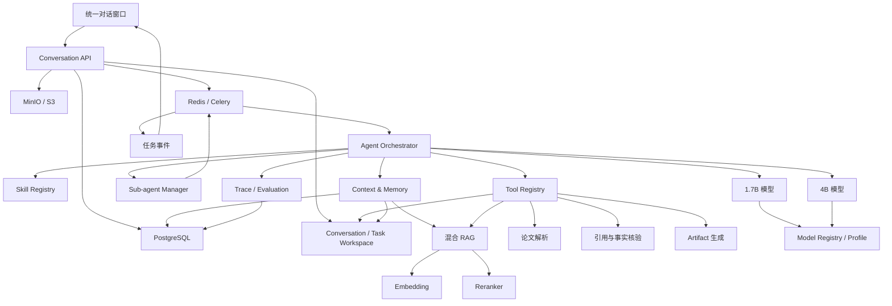
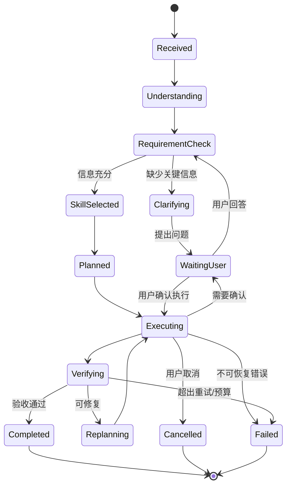
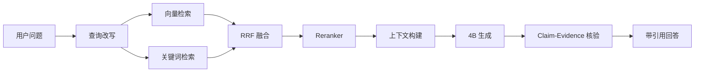
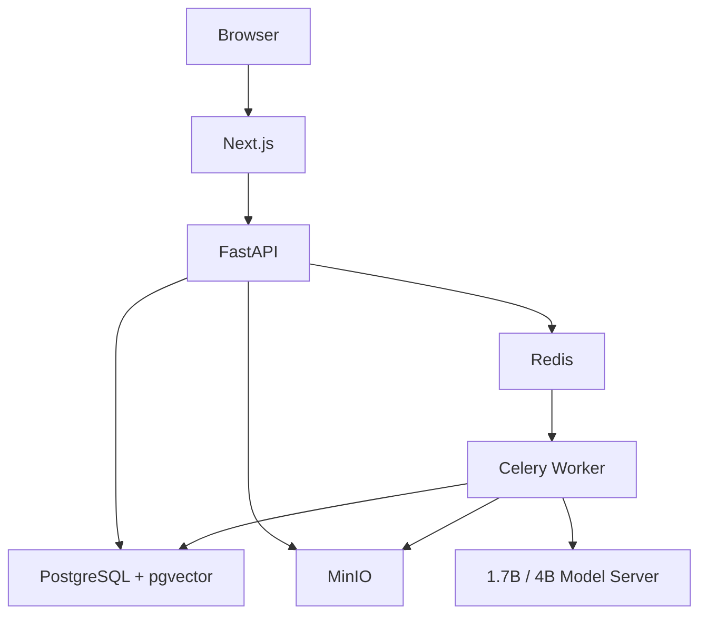
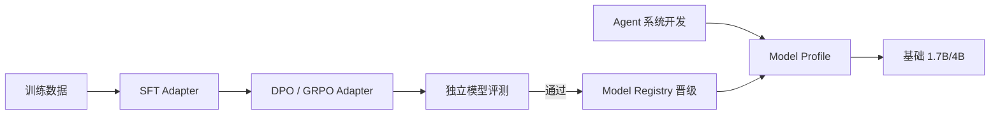

# 统一对话式论文 Agent：产品架构文档

> 文档状态：产品与系统架构基线 V1  
> 目标读者：产品设计者、开发者、测试者  
> 关联文档：[01-技术栈文档.md](./01-技术栈文档.md)、[03-执行计划文档.md](./03-执行计划文档.md)

---

## 1. 产品定义

### 1.1 一句话定义

一个只有单一对话入口的论文 Agent：用户上传材料并描述目标，系统在后台自动完成任务理解、工作流规划、Skill 选择、Tool 调用、子 Agent 协作、结果核验和文件生成。

系统同时提供可管理的 Memory：用户可以在列表中查看历史会话、聊天记录和上传文件；当前会话过长时，系统自动分段摘要并在需要时从摘要回查原始消息；后续会话也能按需查找仍保留的历史文件和对话信息。

### 1.2 产品目标

用户不需要学习 Prompt、RAG、工具和 Agent 工作流，只需要表达自然语言需求，例如：

- “总结这篇论文，并解释作者的方法。”
- “比较这三篇论文的模型结构和实验结果。”
- “根据这些论文帮我设计一份文献综述大纲。”
- “根据我提供的实验设计、结果和参考文献，初步撰写方法章节。”
- “把这份提纲和材料整理成两个连贯的论文段落。”
- “润色这一段英文，但不要改变数字和引用。”
- “检查这份草稿中的引用是否都能被上传论文支持。”

系统应自动选择合适的执行方式，并在同一个会话中返回：

- 最终回答。
- 原文证据和页码。
- 对比表。
- 可下载的 Markdown 等 Artifact。
- 必要的风险、缺失信息和不确定性说明。
- 与当前任务相关的历史会话、原始消息和历史文件。

### 1.3 非目标

首版不追求：

- 完整复制 ChatGPT/Codex 的所有通用能力。
- 无限制访问本机文件或执行代码。
- 完全自主、无限运行的 Agent。
- 自动伪造实验、文献或学术结论。
- 规避查重或 AI 检测。
- 代替研究者做学术责任判断。

---

## 2. 目标用户与核心场景

### 2.1 目标用户

| 用户 | 核心需求 |
|---|---|
| 本科生 | 理解论文、总结概念、完成阅读笔记 |
| 研究生 | 多论文比较、综述辅助、章节/段落撰写与改写 |
| 科研人员 | 快速定位证据、核验引用、分析实验 |
| Agent 开发学习者 | 理解并展示完整 Agent 系统工程 |

### 2.2 MVP 核心场景

#### 场景 A：单论文问答

用户上传一篇论文，询问方法、数据集、指标或结论。系统返回答案和页码证据。

#### 场景 B：论文结构化分析

用户要求分析论文。系统生成研究问题、方法、数据集、实验、贡献、局限和未来工作。

#### 场景 C：多论文比较

用户上传多篇论文，要求按指定或自动推断维度比较，并生成对比表。

#### 场景 D：论文章节或段落初次撰写

用户提供研究主题、提纲、实验设计、结果、数据表、参考论文和写作约束，系统据此生成指定章节或段落的初稿。

系统必须：

- 先整理用户提供的材料和可用证据。
- 明确缺失信息，不把推测写成研究事实。
- 按指定章节功能撰写，例如引言、相关工作、方法、实验设置、结果分析或讨论。
- 为来自论文或用户材料的事实保留来源。
- 将输出标记为需要用户审阅的草稿。
- 不生成用户未提供的实验数据、结果或已完成研究声明。

#### 场景 E：论文章节或段落改写

用户提供已有章节或段落，要求重构逻辑、调整篇幅、修改语言、统一术语或改变目标风格。系统在保持核心含义、事实、数字、公式、实体和引用的前提下进行改写，并可返回修改说明。

#### 场景 F：学术文本润色

用户粘贴或上传段落，要求改写、翻译或润色。系统保护数字、公式、术语和引用。

#### 场景 G：引用核验

用户上传草稿和论文，系统判断草稿中的事实性陈述是否得到材料支持。

---

## 3. 产品界面架构

### 3.1 页面

MVP 只有三个主要页面：

1. 登录页，可在个人演示阶段暂时省略。
2. 会话页，包含可搜索的历史会话列表。
3. 文件与 Memory 管理页。
4. 设置/数据管理页。

### 3.2 会话页布局

```text
┌──────────────┬─────────────────────────────────────────┐
│ 会话列表     │ 当前会话                                │
│              │                                         │
│ 新建会话     │ 用户消息 + 附件                         │
│ 搜索历史     │ Agent 公开进度                           │
│ 历史会话     │ Memory 来源提示                          │
│              │ Tool/子任务状态摘要                      │
│              │ 最终答案、引用、Artifact                 │
│              │                                         │
│              ├─────────────────────────────────────────┤
│              │ 上传文件  输入需求……  停止/发送         │
└──────────────┴─────────────────────────────────────────┘
```

### 3.3 消息类型

- user_message
- assistant_message
- progress_message
- warning_message
- clarification_request
- confirmation_request
- artifact_message
- error_message

### 3.4 用户操作

- 创建、重命名和删除会话。
- 搜索、分页查看历史会话和聊天记录。
- 删除单条消息、选定消息范围或整个会话。
- 上传、查看和删除文件。
- 在文件列表中按会话、文件名和上传时间筛选历史文件。
- 在新会话中继续使用之前上传但尚未删除的文件。
- 查看当前会话工作空间中的中间文件、脚本和任务输出。
- 将有价值的中间结果提升为会话共享文件或正式 Artifact。
- 发送文本需求。
- 停止任务。
- 重试失败任务。
- 回答 Agent 的澄清问题。
- 选择“按现有信息继续”，允许系统记录假设后执行。
- 打开引用对应的 PDF 页面。
- 下载生成文件。
- 对回答进行赞同/不赞同反馈。

### 3.5 首页真实交互（2026-06-22）

- 点击“新对话”时，前端立即调用后端创建 Conversation，并切换到空白任务界面。
- 点击“搜索对话”展开关键词输入框，过滤最近对话；选择历史会话后回读原始 Message
  和关联 File，右侧恢复该会话。
- “文件库”展示当前 Workspace 已上传文件及解析状态。
- “上传论文”位于消息 Composer 内，上传成功后在输入区上方显示文件名和解析状态；
  首页不再展示没有真实工作流的“撰写或改写”“检索文献”快捷按钮。
- 用户发送问题后，界面显示 queued/running/completed/failed 状态。Worker 必须先保证
  关联 PDF 已解析和索引，再检索证据、调用模型并保存 assistant Message。
- 若模型服务未配置或不可用，任务明确失败并显示原因；不得把规则模板或 FakeLLM 文本
  伪装成真实模型回答。

---

## 4. 产品模块

### 4.1 Conversation

职责：

- 管理会话和消息。
- 维护消息与文件关联。
- 将后台事件转化为用户可理解的进度。
- 恢复历史任务和结果。
- 支持历史会话搜索、分页、消息删除和会话删除。

### 4.2 Workspace

职责：

- 管理用户上传文件。
- 管理解析状态、索引状态和版本。
- 管理 Agent 生成的 Artifact。
- 保证不同用户和会话的数据隔离。
- 允许同一 Workspace 中的后续会话按需引用仍保留的历史文件。
- 为每个会话建立持久工作空间，并为每个 Task 创建隔离子目录。
- 管理中间文件、脚本、输出候选、保留策略和内容索引。

### 4.3 Agent Runtime

职责：

- 理解目标。
- 选择 Skill。
- 生成计划。
- 执行步骤。
- 管理 Tool 和子 Agent。
- 检查完成条件。
- 在失败时重规划。
- 生成最终答案。

阶段 E 的实现边界为：Runtime 决策与策略保持确定性可测，模型通过逻辑 Profile 注入；
每个执行动作前检查取消、预算和注册项，动作后持久化步骤结果；检索上下文必须携带
Memory、WorkspaceEntry 或证据块来源 ID；Verifier 的 Schema、数字、引用和不可变项
检查不依赖生成模型。Tool 权限、真实子 Agent 生命周期和论文 RAG 能力分别在后续
阶段 F、G 完成。

### 4.4 Skill Registry

职责：

- 注册论文领域能力。
- 向 Agent 提供任务方法和输出标准。
- 控制每类任务可用的 Tool。
- 支持 Skill 版本管理。

阶段 F 后，Skill 注册不再只检查目录存在：Manifest、说明、输出 Schema、示例、
Tool 白名单、逻辑 Profile、追问条件、终止条件和验收规则必须同时有效；激活 Skill 时
Trace 保存名称、版本、Profile 和允许 Tool。

### 4.5 Tool Registry

职责：

- 提供原子能力。
- 验证参数。
- 执行权限检查。
- 统一错误、超时、重试和日志。

Tool 的 Workspace、用户、会话、Task、权限和确认字段由系统上下文注入，模型参数若
包含这些字段会被拒绝。Tool 必须同时通过 Registry、Skill 白名单和权限检查；大输出
返回 `data_ref`，写操作只能落入当前 TaskWorkspace 或显式 Artifact 区域。

### 4.6 Sub-agent Manager

职责：

- 将可并行任务拆成子任务。
- 创建受限子 Agent。
- 控制并发、预算、文件范围和 Tool 范围。
- 汇总结果。

首个真实子 Agent 为单文件 `paper_reader_agent`。Manager 持久化父子 Task，使用 Celery
Group 调度多论文任务，最大嵌套深度为 1；单个子任务失败只进入失败集合，不丢弃其他
Paper Card。主任务取消会传播到 Group 和尚未开始的子任务。

### 4.7 Knowledge/RAG

职责：

- 解析论文。
- 构建文档结构。
- 分块和向量化。
- 关键词与向量混合检索。
- 重排序。
- 返回可定位证据。

阶段 G 后，解析结果以 ParsedDocument 和可追溯 Chunk 为真值：每个 Chunk 保存原始
block ID、Section path、页码和 bbox，可回到 PDF 页面。扫描页通过可追踪 OCR 回退，
低质量或空结果显式告警。检索在 Workspace/File 范围内执行 vector/keyword 双路召回、
RRF 和 Reranker；删除文件会使解析结果、Chunk、Embedding 和检索索引同时失效。

### 4.8 Verification

职责：

- 核验结论是否被证据支持。
- 核验数字、方向性结论和引用。
- 检查输出 Schema 和任务完成度。

引用回答中的 Citation ID 不来自模型，而由程序基于检索 Chunk 分配；每条 Citation
携带页面打开目标。答案 Claim 在返回前必须通过 Claim-Evidence 检查，证据不足时返回
不可回答状态，不生成无依据严重结论。

### 4.9 Evaluation & Observability

职责：

- 保存完整 Trace。
- 运行固定测试集。
- 比较模型、Prompt、Skill 和检索版本。
- 监控延迟、失败率和资源消耗。

### 4.10 Memory Manager

职责：

- 维护当前会话最近消息窗口。
- 将较早消息按区间生成可追溯摘要。
- 维护摘要到原始消息范围的映射。
- 生成历史会话的会话级摘要。
- 检索跨会话的相关历史、偏好和文件。
- 控制 Memory 的上下文预算。
- 在消息、会话或文件删除后使相关摘要、向量和缓存失效。

### 4.11 Model Registry

职责：

- 将 Skill、主 Agent 和子 Agent 的逻辑 `model_profile` 映射到实际基座与 Adapter。
- 在基础模型、SFT 模型和 RL 模型之间切换。
- 保存模型版本、能力范围、推理参数、评测报告和回退版本。
- 确保 Agent Runtime 不依赖具体权重路径。
- 支持在不修改系统业务代码的情况下部署新训练模型。

ModelVersion Trace 记录 `profile_version`、Base、SFT Adapter、RL Adapter 和最终生效
Profile；无 Adapter 时字段为空并直接使用基础模型。调用失败时必须明确返回
`MODEL_NOT_AVAILABLE`，或切换到 Profile 中声明的 fallback，禁止静默选择未知模型。

---

## 5. 系统逻辑架构



---

## 6. Agent 核心运行流程

### 6.1 主流程



### 6.2 一轮任务的处理

1. 接收用户消息与附件。
2. 创建主任务及其隔离 TaskWorkspace。
3. 收集最近消息、当前会话摘要、文件和用户约束。
4. 判断是否需要检索当前会话早期内容或跨会话 Memory。
5. 从相关摘要回查原始消息和历史文件。
6. 1.7B 模型进行意图与复杂度初步分类。
7. Requirement Clarifier 判断需求是否具备可执行信息。
8. 如果信息不足，一次提出 1～5 个关键问题并暂停任务。
9. 用户回答后，将原需求和回答合并为 Requirement Brief，再次检查完整性。
10. 信息充分后检索候选 Skill。
11. 4B 模型选择 Skill。
12. Planner 基于 Requirement Brief 生成结构化计划。
13. Runtime 检查计划中的 Tool、依赖和预算。
14. Executor 在当前 TaskWorkspace 中逐步执行并保存中间文件。
15. 可并行任务交给 Sub-agent Manager。
16. Verifier 检查完整性和证据。
17. 失败时最多重规划两次。
18. 生成最终答案并保存 Artifact。
19. 会话中展示最终消息，并异步更新 Memory 摘要。

### 6.3 Requirement Clarifier

#### 需要追问的情况

- 用户没有说明期望输出，例如只说“帮我处理这篇论文”。
- 所需文件、章节、对比对象或目标文本不明确。
- 论文撰写任务缺少章节类型、材料、实验结果或关键约束。
- 改写任务未说明目标，例如压缩、扩写、重构还是改变语言。
- 语言、篇幅、格式或目标场合会明显改变结果，但用户未提供。
- 多种合理理解会产生实质不同的工作流。

#### 不应追问的情况

- 信息能从已上传文件、当前会话、Memory 或 Tool 自动获得。
- 缺失信息不影响主要结果，可以使用安全默认值。
- 用户明确表示按现有信息直接处理。
- 问题只是为了让输出“更完美”，但会不必要地阻塞任务。

#### 提问规则

- 每轮一次提出 1～5 个问题。
- 必填问题在前，可选偏好问题在后。
- 问题要具体、可回答，并说明必要时可使用默认值。
- 默认最多两轮澄清。
- 用户可选择“按现有信息继续”，此时系统记录假设和缺失项。

示例：

```text
为了开始撰写，我还需要确认三点：
1. 你希望先写“方法”还是“实验设置”章节？
2. 哪些上传文件包含可以作为事实使用的实验参数和结果？
3. 目标语言和大致篇幅是多少？如果没有要求，我可以先按中文约 1200 字起草。
```

#### Requirement Brief

用户回答后生成：

- clarified_goal
- target_artifact
- scope
- input_files
- required_content
- constraints
- immutable_items
- assumptions
- missing_information

Planner 只能基于 Requirement Brief 和可用证据制定后续计划。

---

## 7. 直接回答与 Agent 模式

不是每条消息都需要复杂工作流。

### 7.1 直接回答

适用：

- 打招呼。
- 解释产品能力。
- 基于上一条结果的小范围追问。
- 不需要 Tool 的简单文本改写。

### 7.2 固定工作流

适用：

- 单论文问答。
- 标准论文总结。
- 引用检查。

优先使用预定义步骤，减少小模型规划错误。

### 7.3 动态 Agent 工作流

适用：

- 多论文综合。
- 同时要求比较、综述和导出文件。
- 需要根据中间结果决定下一步。

原则：

- 能固定就固定。
- 只有路径不确定时才由 Agent 决策。

---

## 8. Skill 架构

### 8.1 Skill 生命周期

```text
注册 → 候选召回 → 选择 → 加载 → 执行 → 验收 → 记录版本
```

### 8.2 Skill 与 Tool 的关系

Skill 决定：

- 标准步骤。
- 可使用的 Tool。
- 输出 Schema。
- 验收标准。
- 默认 `model_profile`，但不保存模型物理路径。

Tool 不知道业务工作流，只完成一个原子动作。

### 8.3 Skill 列表

| Skill | 输入 | 输出 |
|---|---|---|
| paper_qa | 问题、论文 | 带证据答案 |
| paper_summary | 论文、摘要目标 | 分层摘要 |
| paper_analysis | 论文 | Paper Card |
| paper_comparison | 多篇论文、维度 | 比较表和综合 |
| literature_review | 多篇论文、主题 | 证据矩阵和草稿 |
| outline_generation | 主题、材料、要求 | 论文大纲 |
| section_drafting | 提纲、用户材料、证据、章节要求 | 章节初稿和缺失信息 |
| paragraph_drafting | 段落目标、要点、证据 | 段落初稿 |
| section_rewriting | 原章节、改写目标、不可变项 | 重构后的章节 |
| academic_rewrite | 原文、风格 | 受保护的改写 |
| citation_check | 草稿、论文 | 支持/不支持报告 |

### 8.4 Skill 与训练模型绑定

Skill Manifest 使用逻辑 Profile：

```yaml
name: paper_comparison
model_profile: paper_synthesis_v1
fallback_profile: general_4b_base
```

同一个 Skill 在不同环境可以映射到：

- 开发环境：基础 4B。
- 评测环境：候选 SFT/RL Adapter。
- 生产环境：已通过晋级评测的 Adapter。

Skill 的工作流、Tool、Schema 和验收规则不依赖模型是否训练，因此系统开发和模型训练可以独立推进。

### 8.5 论文撰写工作流

`section_drafting` 与 `paragraph_drafting` 不允许模型收到主题后直接自由生成，而使用材料约束工作流：

```text
识别章节类型和写作目标
 → 收集用户提纲、事实、实验信息和参考材料
 → 构建 Writing Brief
 → 将材料拆成“可陈述事实 / 用户观点 / 待补信息”
 → 为事实建立 Evidence Map
 → 生成段落级写作计划
 → 撰写草稿
 → 检查事实、数字、引用、术语和章节功能
 → 输出草稿、来源和待补信息
```

Writing Brief 至少包括：

- section_type
- target_language
- target_length
- target_venue/style
- outline
- required_points
- user_provided_facts
- evidence_ids
- terminology
- immutable_items
- missing_information

章节类型对应约束：

| 章节 | 主要要求 |
|---|---|
| 引言 | 背景、问题、研究缺口、目标与贡献必须可区分 |
| 相关工作 | 按主题组织，论文结论需要引用支持 |
| 方法 | 只描述用户提供或材料证实的方法，不补造设计 |
| 实验设置 | 数据、参数、指标和流程必须来自用户材料 |
| 结果分析 | 只能分析已提供结果，不生成不存在的数值 |
| 讨论 | 明确区分证据、解释、局限和推测 |
| 结论 | 总结已有内容，不引入新的实验事实 |

`section_rewriting` 工作流：

```text
提取原文命题和不可变项
 → 分析用户改写目标
 → 生成新的段落结构
 → 执行改写
 → 对照原文检查语义、事实、数字和引用
 → 输出改写文本和修改说明
```

如果材料不足以完成章节，系统应返回可用草稿范围和缺失清单，而不是自动补造内容。

---

### 阶段 H 论文领域任务语义（2026-06-20）

领域任务统一采用“结构化输入 → 程序事实边界 → 可审阅输出”：

- 单论文分析只从 Evidence Passage 构建 Paper Card，字段与证据双向可追溯。
- 多论文比较复用并行 `paper_reader_agent`，对标准字段建立矩阵，数字不一致时禁止形成
  综合结论。
- 写作先构建 Writing Brief 和 Evidence Map；只有带 source/evidence 的事实可进入草稿。
- 草稿包含段落计划、来源、缺失信息和待用户审阅标记。
- 改写先冻结数字、公式、术语和 Citation，回归失败时输出失败项而不是静默交付。
- 文献综述先形成 Evidence Matrix，事实 100% 追溯，推断明确标记。

上述服务经 Tool Registry 调用，继承 Workspace、Skill 白名单、权限、幂等和 Trace
约束；不允许 Skill 或模型绕过 Tool Runtime 直接访问存储。

## 9. Tool 架构

### 9.1 Tool 类型

| 类型 | 示例 | 风险 |
|---|---|---|
| 只读 | search_document | 低 |
| 计算 | verify_numbers | 低 |
| Artifact 写入 | save_artifact | 中 |
| 外部查询 | lookup_paper_metadata | 中 |
| 删除/外部副作用 | delete_file | 高 |

### 9.2 权限策略

- 只读 Tool 可自动执行。
- 普通写入 Tool 只能写当前任务的 `scratch/`、`scripts/` 或 `outputs/`。
- 只有 `promote_workspace_entry` 可以将结果提升到 `shared/` 或 `artifacts/`。
- 删除操作必须用户确认。
- MVP 不开放任意 Shell、Python 和网络访问。
- Tool 输入中的 `workspace_id` 由系统注入，不由模型生成。
- Tool 使用 `workspace_entry_id`，不能接受任意绝对路径。

### 9.3 Tool 输出

Tool 返回结构化结果和面向模型的短摘要：

```json
{
  "ok": true,
  "data_ref": "artifact://tool-results/result_001.json",
  "summary": "找到 8 个相关证据块，覆盖第 3、4、6 页",
  "citations": [],
  "error": null
}
```

避免把数万字结果直接塞回上下文。

---

## 10. 子 Agent 架构

### 10.1 创建条件

- 两个以上可独立并行的子任务。
- 单个子任务需要独立长上下文。
- 主上下文会超过预算。
- 子任务需要不同 Tool 白名单。

### 10.2 首个子 Agent

`paper_reader_agent`

输入：

- parent_task_id
- file_id
- analysis_goal
- output_schema
- allowed_tools
- model_profile
- budget

输出：

- Paper Card
- Claim-Evidence 列表
- 缺失字段
- 质量评分

### 10.3 限制

- 最大嵌套深度：1。
- 单个主任务默认最多 8 个并行子 Agent。
- 子 Agent 不能创建新的子 Agent。
- 子 Agent 不直接写用户消息。
- 只可访问明确分配的文件。

### 10.4 子 Agent 与模型 Profile

子 Agent 类型和默认模型对应关系：

| 子 Agent/执行器 | Profile | 基座 | 后续训练 |
|---|---|---:|---|
| route_classifier | router_v1 | 1.7B | 路由 SFT + DPO |
| requirement_clarifier | requirement_clarifier_v1 | 4B | 澄清判断 SFT + DPO |
| tool_executor_agent | tool_caller_v1 | 1.7B | Tool SFT + GRPO/DPO |
| paper_reader_agent | paper_reader_v1 | 4B | 证据阅读 SFT + DPO |
| planner_agent | planner_v1 | 4B | 计划 SFT + DPO/GRPO |
| synthesis_agent | paper_synthesis_v1 | 4B | 综合写作 SFT + DPO |
| drafting_agent | academic_drafting_v1 | 4B | 章节/段落撰写 SFT + DPO |
| verifier_agent | verifier_v1 | 4B | 核验 SFT，可选 DPO |

这些只是默认映射。Sub-agent Manager 只传递 `profile_id`，Model Registry 决定实际加载哪个 Adapter。

---

## 11. 论文 RAG 架构

### 11.1 摄取流水线


### 11.2 查询流水线



### 11.3 引用数据

每条引用必须携带：

- document_id
- chunk_id
- page_start/page_end
- section_path
- quote/snippet
- bbox，可选

引用编号由程序生成，模型只输出 Claim 与证据 ID 的对应关系。

---

## 12. 数据模型

### 12.1 核心实体

| 实体 | 说明 |
|---|---|
| User | 用户 |
| Workspace | 数据隔离边界 |
| Conversation | 会话 |
| Message | 用户/Agent 消息 |
| File | 上传文件 |
| Document | 解析后的文档 |
| Chunk | 检索文本块 |
| Task | 主任务或子任务 |
| Plan | 任务计划版本 |
| Step | 计划步骤 |
| ToolCall | Tool 调用 |
| SkillRun | Skill 执行 |
| Artifact | 生成文件 |
| Citation | 回答证据 |
| TaskEvent | SSE 事件 |
| EvaluationRun | 评测记录 |
| Feedback | 用户反馈 |
| ConversationSummary | 整个历史会话的检索摘要 |
| MemorySegment | 当前会话某段消息的摘要与索引 |
| MemoryPreference | 用户明确保存的长期偏好 |
| ConversationFile | 会话与 Workspace 文件的多对多关联 |
| ConversationWorkspace | 会话级持久工作空间 |
| TaskWorkspace | 单个任务的隔离子空间 |
| WorkspaceEntry | 中间文件、脚本、输出或 Artifact 的元数据 |
| ModelProfile | 逻辑能力到模型版本的映射 |
| ModelVersion | Base、SFT/RL Adapter 与评测元数据 |

### 12.2 关键关系

```text
User 1─N Workspace
Workspace 1─N Conversation
Conversation 1─N Message
Workspace 1─N File
File 1─1/N Document
Document 1─N Chunk
Conversation 1─N Task
Task 1─N Plan
Plan 1─N Step
Task 1─N ToolCall
Task 1─N Child Task
Message 1─N Citation
Task 1─N Artifact
Conversation 1─N MemorySegment
Conversation 1─1/N ConversationSummary
Workspace 1─N MemoryPreference
Conversation N─N File
Conversation 1─1 ConversationWorkspace
ConversationWorkspace 1─N TaskWorkspace
TaskWorkspace 1─N WorkspaceEntry
ModelProfile N─1 ModelVersion
```

---

## 13. API 架构

### 13.1 Conversation

- `POST /api/conversations`
- `GET /api/conversations`
- `GET /api/conversations/{conversation_id}`
- `PATCH /api/conversations/{conversation_id}`
- `DELETE /api/conversations/{conversation_id}`
- `GET /api/conversations/search?q=...`
- `DELETE /api/conversations/{conversation_id}/messages/{message_id}`
- `DELETE /api/conversations/{conversation_id}/messages?from=...&to=...`

### 13.2 Message/Task

- `POST /api/conversations/{conversation_id}/messages`
- `GET /api/tasks/{task_id}`
- `POST /api/tasks/{task_id}/cancel`
- `POST /api/tasks/{task_id}/retry`
- `POST /api/tasks/{task_id}/confirm`
- `POST /api/tasks/{task_id}/clarifications`
- `POST /api/tasks/{task_id}/continue-with-assumptions`
- `GET /api/tasks/{task_id}/events`

发送消息响应：

```json
{
  "message_id": "msg_001",
  "task_id": "task_001",
  "status": "queued"
}
```

### 13.3 File

- `POST /api/files`
- `GET /api/files/{file_id}`
- `DELETE /api/files/{file_id}`
- `GET /api/files/{file_id}/content`
- `GET /api/files/{file_id}/pages/{page}`
- `GET /api/files?conversation_id=...&q=...`
- `POST /api/conversations/{conversation_id}/files/{file_id}/attach`

### 13.4 Workspace

- `GET /api/conversations/{conversation_id}/workspace`
- `GET /api/tasks/{task_id}/workspace`
- `GET /api/workspace/entries/{entry_id}`
- `GET /api/workspace/entries/{entry_id}/content`
- `GET /api/workspace/search?q=...&conversation_id=...`
- `POST /api/workspace/entries/{entry_id}/promote`
- `DELETE /api/workspace/entries/{entry_id}`

### 13.5 Artifact

- `GET /api/artifacts/{artifact_id}`
- `GET /api/artifacts/{artifact_id}/download`

### 13.6 Memory

- `GET /api/memory/search?q=...&scope=current|workspace`
- `GET /api/conversations/{conversation_id}/summaries`
- `GET /api/memory/segments/{segment_id}/messages`
- `GET /api/memory/preferences`
- `POST /api/memory/preferences`
- `DELETE /api/memory/preferences/{preference_id}`

Memory 搜索结果必须包含可追溯来源：

```json
{
  "source_type": "conversation_segment",
  "conversation_id": "conv_001",
  "summary_id": "summary_003",
  "start_message_id": "msg_021",
  "end_message_id": "msg_032",
  "file_ids": ["file_002"],
  "score": 0.87
}
```

### 13.7 Model Registry

管理接口仅对开发/管理环境开放：

- `GET /api/admin/model-profiles`
- `GET /api/admin/model-versions`
- `POST /api/admin/model-profiles/{profile_id}/candidate`
- `POST /api/admin/model-profiles/{profile_id}/promote`
- `POST /api/admin/model-profiles/{profile_id}/rollback`

普通 Agent 请求只传 `profile_id`，不允许用户直接提交任意本地模型路径。

---

## 14. 上下文与记忆架构

### 14.1 Memory 定义

#### 短期记忆

短期记忆属于当前会话，包括：

- 最近一段原始消息。
- 当前任务目标、计划和中间结果。
- 当前会话较早消息的分段摘要。
- 当前会话关联的上传文件和 Artifact。

#### 长期记忆

长期记忆跨会话存在，包括：

- 历史会话的会话级摘要。
- 历史会话的分段摘要及原消息范围。
- 用户明确保存的偏好、术语和写作约束。
- Workspace 中仍保留的历史上传文件及其索引。

原始消息和原始文件是事实来源；摘要只负责发现和定位。

### 14.2 上下文内容

一次模型调用只包含：

- 系统规则。
- 当前 Skill。
- 当前 Tool Schema。
- 当前任务目标。
- 当前计划与步骤。
- 当前会话最近消息。
- Memory 检索到的相关原始消息及来源。
- 检索证据或 Tool Observation。
- 剩余预算。

### 14.3 短期记忆摘要

当当前会话新增约 8～12 条消息、未摘要内容达到 4K～6K tokens，或上下文预计超过预算的 60% 时，异步创建一个 MemorySegment。

MemorySegment 保存：

- summary_text
- start_message_id/end_message_id
- entities
- decisions
- constraints
- file_ids
- summary_embedding
- summary_model/version

检索时：

1. 最近消息直接保留。
2. 使用当前问题检索当前会话的 MemorySegment。
3. 选择相关摘要。
4. 根据消息范围回读原始消息。
5. 对原始消息重排和裁剪。
6. 将来源 ID 一并交给 Agent。

摘要不能覆盖原始消息，也不能在原消息被删除后继续作为有效记忆。

### 14.4 长期记忆检索

触发条件：

- 用户提到“之前”“上次”“我以前上传的”。
- 当前任务明确需要历史材料。
- 当前会话证据不足，且用户允许跨会话检索。

流程：

```text
当前问题
 → 检索 ConversationSummary 与 MemoryPreference
 → 定位相关历史会话
 → 检索该会话的 MemorySegment
 → 回读原始消息
 → 按需读取历史文件或文档索引
 → 构建带来源的 Memory Context
```

跨会话 Memory 默认只读。Agent 不应因为一次临时表述自动创建永久偏好；长期偏好必须由用户明确保存或确认。

### 14.5 历史文件记忆

- File 属于 Workspace，不因会话切换失效。
- ConversationFile 记录文件在哪些会话被上传或使用。
- 用户可以从会话详情查看当时的文件，也可以从全局文件列表查找。
- 新会话可通过文件选择器重新关联历史文件。
- Agent 可通过文件名、元数据、会话摘要和文档语义搜索历史文件。
- 文件正文不直接进入 Memory；需要时通过文件 Tool 或论文 RAG 读取。

### 14.6 删除与遗忘

支持三种操作：

1. 删除单条或一段聊天记录。
2. 删除整个会话。
3. 删除某个历史文件。

删除消息后：

- 受影响的 MemorySegment 和 ConversationSummary 标记失效。
- 后台重新生成仍有必要的摘要。
- 删除对应摘要向量和缓存。
- 后续 Memory 检索不能返回已删除消息。

删除会话时：

- 立即从列表和检索中隐藏。
- 取消会话下未完成任务。
- 删除消息、摘要、Memory Embedding 和内容型 Trace。
- 默认保留仍在 Workspace 中的文件，并允许用户选择“同时删除该会话独有文件”。

删除文件时：

- 删除对象存储文件。
- 删除 Document、Chunk、Embedding、OCR 和解析缓存。
- 从摘要的 file_ids 中移除或重建摘要。
- 历史消息可以保留“曾上传某文件”的事件，但不能继续读取已删除文件内容。

### 14.7 Memory 质量指标

- 摘要关键事实保持率 ≥ 90%。
- 摘要到原消息范围的可追溯率 100%。
- 当前会话历史信息 Recall@5 ≥ 90%。
- 跨会话相关信息 Recall@5 ≥ 85%。
- 历史文件定位成功率 ≥ 95%。
- 已删除内容再次被检索的比例为 0。
- Memory 加入后，模型输入 Token 仍不超过任务预算。

---

## 15. 会话工作空间与任务执行隔离

### 15.1 工作空间层级

每个会话有一个持久工作空间，每个 Task 在其中拥有独立目录：

```text
conversation workspace
├── uploads
├── shared
├── tasks/{task_id}
│   ├── inputs
│   ├── scratch
│   ├── scripts
│   ├── outputs
│   └── logs
└── artifacts
```

用途：

- `uploads`：用户上传文件的引用。
- `shared`：用户或 Agent 决定在后续对话继续复用的材料。
- `inputs`：当前任务选中的输入引用。
- `scratch`：解析缓存、临时表格和中间数据。
- `scripts`：Agent 生成的 Python、Shell、LaTeX 等脚本源码。
- `outputs`：尚未成为正式 Artifact 的候选结果。
- `artifacts`：用户可见并长期保留的结果。

### 15.2 后续对话如何使用

ContextBuilder 在后续消息中可以：

1. 检索当前会话的 `shared` 和 `artifacts`。
2. 检索历史 Task 中保留的 `outputs`、文本日志摘要和脚本。
3. 根据 WorkspaceEntry 找到产生它的 Task、Skill、Tool 和消息。
4. 读取相关文件片段，而不是加载整个目录。
5. 在用户提到历史会话时，再通过 Memory 扩大到其他会话工作空间。

工作空间文件与 Memory 的区别：

- Memory 负责找到“之前讨论过什么”。
- Workspace 负责找到“当时产生或使用了什么文件”。
- 两者通过 conversation_id、task_id、message_id 和 entry_id 关联。

### 15.3 文件可见性

用户可以在会话页展开“工作空间”面板，查看：

- 文件名、类型、大小和创建时间。
- 来源任务和生成 Tool。
- 文件摘要。
- 是否为临时、会话共享或正式 Artifact。
- 文本/脚本预览。
- 下载、提升、删除操作。

用户可以将某个中间结果“保留到会话”，把它从任务输出提升到 `shared/`；也可以提升为正式 Artifact。

### 15.4 持久化方式

- Worker 的本地任务目录是执行时的临时挂载。
- MinIO/S3 保存需要跨任务和跨进程使用的内容。
- PostgreSQL 保存 WorkspaceEntry 和权限元数据。
- 文本内容、摘要和 Embedding 建立可检索索引。
- Worker 重启后可根据 Manifest 恢复任务工作空间。

### 15.5 沙箱边界

创建文件夹本身不是安全沙箱。MVP 的普通 Worker 可以：

- 调用预注册解析、检索和文件转换 Tool。
- 在当前任务目录写入中间文件。
- 生成脚本源码但不能执行。

以下行为必须进入一次性强沙箱：

- 执行 Python、Shell 或其他用户/Agent 生成代码。
- 编译 LaTeX。
- 运行论文附带项目。
- 安装依赖。
- 解压或运行不可信二进制。

沙箱约束：

- 当前任务 `inputs` 只读。
- 只有独立 `scratch` 可写。
- 不挂载其他会话、宿主机目录或模型权重。
- 默认无网络，按 Tool 白名单临时开放。
- 限制 CPU、内存、进程数、运行时间和输出体积。
- 结束后销毁；合规输出扫描后写回 `outputs`。

### 15.6 清理与删除

- `scratch` 默认在任务完成后 24 小时内清理。
- `scripts` 和 `outputs` 按会话保留策略清理。
- `shared` 与 `artifacts` 由用户管理。
- 删除 WorkspaceEntry 后同步删除内容索引、Embedding 和缓存。
- 删除会话后级联删除任务工作空间；共享上传文件按引用计数处理。

---

## 16. 错误与恢复架构

### 16.1 错误分类

- USER_INPUT_ERROR
- FILE_PARSE_ERROR
- MODEL_OUTPUT_INVALID
- TOOL_ARGUMENT_INVALID
- TOOL_TIMEOUT
- RETRIEVAL_EMPTY
- VERIFICATION_FAILED
- BUDGET_EXCEEDED
- PERMISSION_DENIED
- CANCELLED
- INTERNAL_ERROR

### 16.2 恢复策略

| 错误 | 处理 |
|---|---|
| 模型 JSON 非法 | 修复一次，再重新调用一次 |
| Tool 临时超时 | 指数退避重试 |
| 解析质量低 | 切换解析器/OCR |
| 检索为空 | 查询改写、扩大范围 |
| 核验失败 | 重新检索并修复一次 |
| 缺少用户信息 | 暂停并追问 |
| 超预算 | 输出已完成内容和缺失项 |
| 权限错误 | 立即停止，不重试 |
| Memory 摘要失效 | 回读仍保留的原消息并异步重建 |
| 历史文件已删除 | 返回文件已删除，不使用旧 Chunk 或缓存 |

### 16.3 幂等性

- 文件上传使用内容哈希去重。
- 解析和 Embedding 使用 `(file_hash, parser_version, model_version)` 作为幂等键。
- ToolCall 使用 `idempotency_key`。
- SSE 事件使用递增 `sequence`。
- MemorySegment 使用 `(conversation_id, start_message_id, end_message_id, summary_version)` 唯一键。

---

## 17. 安全与学术诚信

### 17.1 文件安全

- MIME 与文件签名双重检查。
- 文件大小和页数限制。
- 文件名不作为磁盘路径。
- 原始文件只存对象存储。
- 可选病毒扫描。

### 17.2 租户隔离

所有查询强制带：

- workspace_id
- user_id 或成员权限

这些字段由后端注入，模型不可覆盖。

### 17.3 Prompt Injection

- 将论文正文标记为不可信数据。
- 文档中的指令不能改变 System Policy。
- Tool 描述和权限不从论文内容中生成。
- 外部链接不自动访问。
- 检测“忽略指令”“调用工具”“泄漏系统提示”等模式。

### 17.4 学术诚信

系统应拒绝或限制：

- 伪造实验数据。
- 伪造引用。
- 将生成内容冒充真实研究结果。
- 明确要求规避检测的任务。

系统可以提供：

- 写作建议。
- 基于用户材料和可追溯证据的章节/段落初稿。
- 对已有章节或段落的结构化改写。
- 结构和语言修改。
- 证据整理。
- 引用核验。
- 清楚标注的草稿。

---

## 18. 非功能要求

### 18.1 性能

MVP 目标：

- API 非模型请求 P95 < 500 ms。
- 发送消息后 1 秒内收到 `queued/started` 事件。
- 普通文本 PDF 解析 P95 < 60 秒。
- 首个回答 Token P95 < 8 秒，取决于硬件。
- 任务取消信号 2 秒内被 Worker 观察。

### 18.2 可靠性

- Agent 死循环率为 0。
- 所有任务有最大步骤、时间和 Token。
- Worker 崩溃后任务可恢复或明确失败。
- 关键状态写入 PostgreSQL。

### 18.3 质量

- Skill Top-1 ≥ 90%。
- Tool 参数合法率 ≥ 98%。
- Recall@10 ≥ 90%。
- 引用支持率 ≥ 90%。
- MVP 端到端任务完成率 ≥ 80%。

### 18.4 可维护性

- Tool 可独立测试。
- Skill 可独立版本化。
- 模型可配置替换。
- API、Agent 和 Worker 不共享隐式全局状态。

---

## 19. 部署架构

### 19.1 MVP 单机部署



### 19.2 进程职责

- Web：静态资源和交互。
- API：短请求、鉴权、SSE。
- Worker：Agent 和文档任务。
- Model Server：模型推理。
- PostgreSQL：系统真值。
- Redis：队列和瞬时状态。
- MinIO：文件和 Artifact。

---

## 20. 模型训练与系统解耦架构

### 20.1 两条独立流水线



系统流水线负责：

- 会话、Memory、Agent Runtime、Skill、Tool、子 Agent 和 RAG。
- 通过统一推理协议调用 Profile。
- 使用基础模型也能完整运行。

训练流水线负责：

- 导出并版本化训练数据。
- 分别训练 1.7B/4B 的功能 Adapter。
- 运行模型级和端到端评测。
- 只通过 Registry 配置发布，不修改系统代码。

### 20.2 Profile 与模型目录

模型统一放在 `models/` 顶层目录：

```text
models/
├── base/qwen3-1.7b/
├── base/qwen3-4b/
├── adapters/1.7b/{router,tool_caller,...}/
├── adapters/4b/{planner,paper_reader,writer,...}/
├── profiles/
├── manifests/
└── eval_reports/
```

Skill 和子 Agent 只引用 `router_v1`、`paper_reader_v1` 等 Profile。训练前 Profile 指向基础模型；训练后指向 Base + SFT Adapter + RL Adapter。

### 20.3 模型晋级

候选模型必须经过：

1. 模型专项固定测试集。
2. Agent 端到端回归测试。
3. 安全测试。
4. 延迟和显存测试。
5. 影子流量或离线历史任务重放。

任何核心指标退化都可以阻止晋级。Registry 必须保留上一生产版本以便回滚。

---

## 21. MVP 验收场景

### 场景 1：单论文问答

1. 上传一篇 PDF。
2. 提问使用了什么数据集。
3. Agent 自动解析、检索和回答。
4. 用户可打开引用页。

### 场景 2：多论文比较

1. 上传两篇 PDF。
2. 要求比较方法和实验结果。
3. 主 Agent 创建两个论文阅读子任务。
4. 汇总成表格。
5. 关键数字都有证据。

### 场景 3：润色

1. 粘贴包含数字和引用的英文段落。
2. 要求学术润色。
3. 系统返回修改结果。
4. 数字、公式、实体和引用保持不变。

### 场景 4：章节初次撰写

1. 用户上传提纲、方法说明、实验结果和参考论文。
2. 要求撰写“实验设置”章节初稿。
3. Agent 构建 Writing Brief 和 Evidence Map。
4. 系统只使用用户材料中的参数、数据集和指标。
5. 输出章节草稿、引用来源以及缺失信息清单。

### 场景 5：章节改写

1. 用户提供已有“讨论”章节。
2. 要求重构逻辑并压缩到指定篇幅。
3. 系统提取不可变事实、数字和引用。
4. 输出改写章节与修改说明。
5. 语义和不可变项检查通过。

### 场景 6：失败恢复

1. 上传扫描质量差的 PDF。
2. 主解析失败。
3. 系统自动切换 OCR。
4. 若仍失败，向用户说明具体限制。

---

## 22. 产品演进路线

### V0：Agent Shell

聊天、文件、后台任务、三个简单 Tool。

### V1：论文 RAG MVP

单论文问答、分析、引用定位。

### V2：Skill 与子 Agent

多论文比较、综述、章节/段落撰写、改写与润色。

### V3：训练与优化

分别完成：

- 1.7B 路由/Skill 选择 SFT + DPO。
- 1.7B Tool 调用 SFT + DPO/GRPO。
- 4B Planner SFT + DPO/GRPO。
- 4B Requirement Clarifier SFT + DPO。
- 4B Paper Reader/QA SFT + DPO。
- 4B 综合写作与章节撰写 SFT + DPO。
- 4B Verifier SFT，可选 DPO。

训练成果通过 Model Registry 独立接入已经完成的系统。

### V4：通用 Agent 平台

在论文 Skill 之外增加数据分析或代码 Skill，但保持统一 Runtime。
# 阶段 B 已实现骨架（2026-06-20）

阶段 B 已建立可替换真实基础设施的完整 Fake 控制流：

- FastAPI 提供健康检查、统一错误、request/trace 关联 ID、任务投递和 Fake 场景 API。
- Worker 通过 TaskQueue Port 使用内存 FakeQueue，支持幂等、取消、异步 Handler 和重试策略。
- Next.js Mock UI 覆盖会话搜索/切换、消息、上传、澄清、任务进度、引用、Artifact、Workspace、文件预览、Memory 来源和数据管理入口；开发环境显示 Model Profile 管理入口。
- Agent Runtime Stub 只依赖持久化、取消等 Port，在每个动作前检查取消和预算、动作后持久化状态。
- Repository Port 明确要求 Workspace 隔离参数，Fake 与后续 Real Adapter 必须遵守同一契约。
- 骨架层采用 11 个能力型 Skill：`paper_reader`、`document_parser`、`claim_extractor`、`claim_verifier`、`citation_manager`、`summary_generator`、`insight_extractor`、`comparison_analyzer`、`literature_synthesizer`、`methodology_reviewer`、`limitation_analyst`。F03 可在其上注册面向用户任务的组合 Skill，不替换这些底层能力契约。
- `paper_reader_agent` 仅允许单文件范围、最大嵌套深度 1，并只引用逻辑 `model_profile`。
- 九个 Fake 场景覆盖直接执行、澄清恢复、子 Agent 部分失败、核验重规划、取消重试、Memory 回读、Workspace 回读、删除失效和章节 Artifact。
# 阶段 C 完成状态（2026-06-20）

阶段 C 的真实基础设施 Adapter 已完成：

- PostgreSQL 保存用户、Workspace、会话、消息、任务、文件、Agent 结构、队列任务、对象引用和任务事件；所有租户资源按 Workspace 隔离。
- Redis/Celery 承担后台投递、取消、锁、重试、死信和临时通知，但数据库始终是任务与事件真值。
- MinIO 持久化上传、Workspace 内容和 Artifact；相同 Workspace/Bucket 内按 SHA-256 去重，共享引用归零后才删除对象。
- SSE 从数据库按 sequence 回放，通过 Redis 获取低延迟通知；页面刷新、Redis 丢失或断线重连均可从 `Last-Event-ID` 恢复，终态事件不会丢失。

# 阶段 D 完成状态（2026-06-20）

- 用户可以创建、重命名、搜索、分页和删除历史会话；消息支持分页、文件关联以及单条/范围删除。已删除内容不再由 Repository/API 数据源返回。
- 每个会话拥有持久 Workspace，每个 Task 拥有隔离执行视图。Task 输出可 Promote 到会话 `shared`/`artifacts`，并保留来源 Task/Tool/Message。
- Workspace 文件可按当前 Task、当前会话和历史会话分层检索；同名文件通过 entry_id、Conversation 和来源区分。
- 短期 Memory 保留最近消息与当前会话摘要，摘要只能用于定位，回答前必须回读原消息。
- 长期 Memory 只保存 ConversationSummary 和用户明确确认的偏好；历史文件与摘要联合检索。删除会话、文件、消息或偏好后，相关摘要和索引同步失效。

# 阶段 I 交付与降级语义（2026-06-21）

- 用户任务的 API、状态机、Tool、子 Agent、模型、Memory、Workspace 和 RAG 行为可按
  `task_id` 回放关键 Trace，但用户不可见隐藏推理或未脱敏正文。
- 文档内容、Prompt 和上传文件均视为不可信输入；注入内容不能改变 System Policy、
  Tool 白名单、Workspace 范围或 Model Profile。
- 当前产品不向用户提供代码/LaTeX 执行。请求执行时返回明确不可执行错误，不交给普通
  Worker。
- 模型不可用不影响基础健康检查和 Fake 开发流程；真实模型调用返回可重试的
  `model_not_available`，由已声明 fallback 决定是否切换 Profile。
- 最终验收固定覆盖十个用户场景，删除后的 Memory/Workspace 内容必须从摘要、索引和
  检索结果中消失。

# 阶段 J 训练数据边界（2026-06-21）

- 线上系统只负责导出版本化 Schema、Tool 定义和明确允许的数据；训练工程不连接线上
  API、数据库、Worker、Memory 或 Workspace。
- 每条训练样本记录来源、基座家族、SFT target 或偏好对、自动校验、人工审核、许可证、
  隐私标签、论文 ID、会话 ID 和数据 split。
- 用户私有会话默认禁止训练；只有显式授权、完成匿名化并保存 consent_id 后才允许导出。
- train/validation/test 必须按论文和会话隔离，任何泄漏都会使数据集校验失败。
- 模型训练只有在数据最低规模、基座 Manifest、训练依赖和硬件预检全部通过后才能启动。
  预检失败必须生成阻塞报告，不得用少量演示样例训练并宣称达到产品指标。
## K02 模型设置产品行为

- 主界面左侧底部固定提供“模型配置”入口。
- 设置页分别展示小模型（1.7B）和大模型（4B），每组按 Base、SFT、RL 分类。
- 初始选择均为 Base；每个后训练版本显示不可重复的版本 ID。
- 用户输入其他 Ollama Base 模型名后，系统先检查安装和真实推理能力。
- 已安装且可调用的模型直接启用；缺失模型明确提示下载状态，并自动下载、探活和启用。
- 下载或探活失败时保持原选择，不让不可调用模型进入 Worker 路由。
