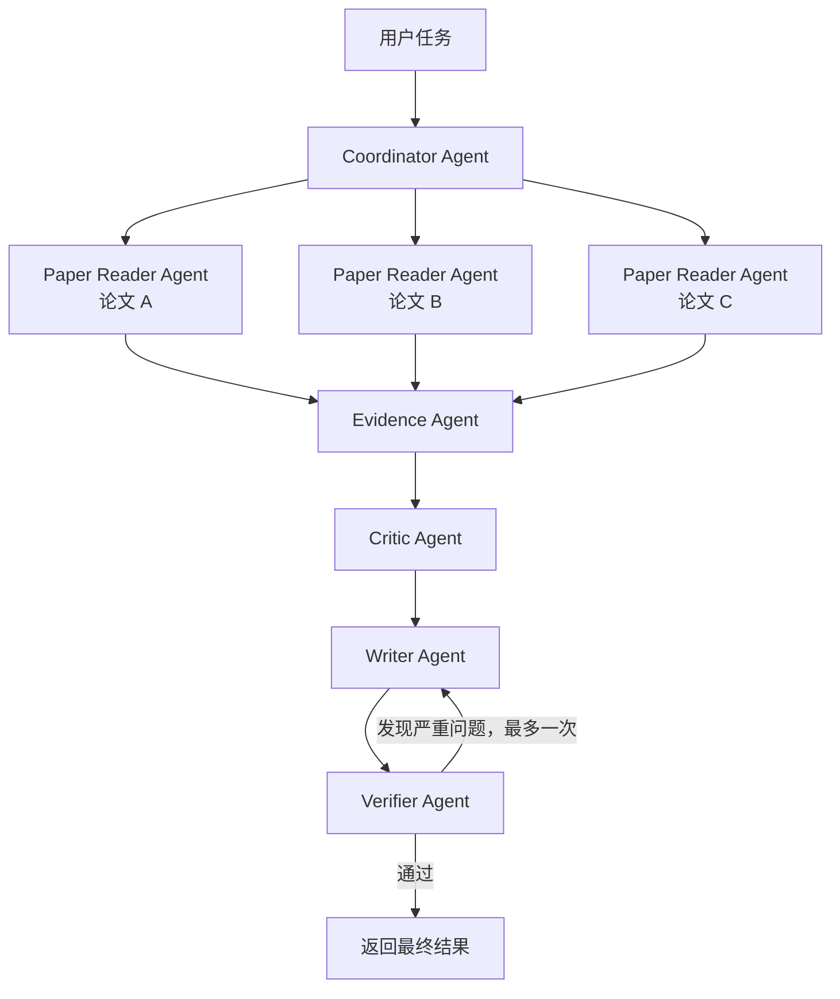
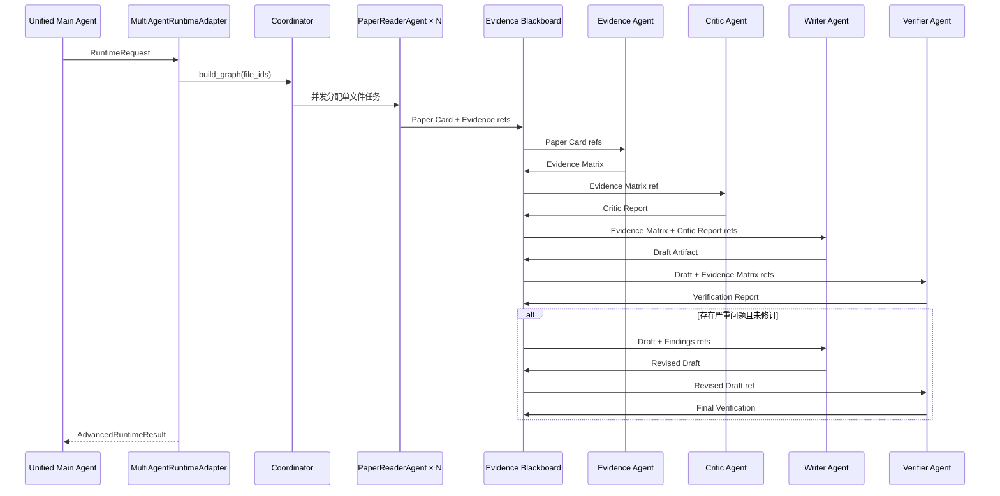

# PaperAgent 多 Agent 生产链启用实施计划

> 目标文件最终位置：`D:\vscode\Projects\PaperAgentSystem\docs\多Agent生产链启用实施计划.md`  
> 文档性质：实施计划与验收基线；A～P 已于 2026-07-24 按本文件完成，默认晋级结论仍为 NO-GO。  
> 核心约束：仅补齐现有多 Agent 模块到默认 Worker 的生产接线，不重构统一主 Agent、RAG、Skill、Tool、Memory、数据库或前端整体架构。

## 1. 实施目标

实施状态：**已完成显式实验路径的生产接线**。两个开关仍默认关闭；真实模型效果门禁未通过，
所以“可显式运行”和“默认生产启用”是两个不同结论。

当且仅当下面两个开关同时开启：

```env
MULTI_AGENT_ENABLED=true
ALLOW_EXPERIMENTAL_NO_GO=true
```

并且用户任务满足多 Agent 路由条件时，使系统真实执行以下链路：



关闭任一开关、任务不满足多 Agent 条件、运行时依赖不可用时，继续使用当前已验证的 `safe_rag` 路径，不改变现有产品行为。

## 2. 成功定义

本计划完成后必须同时满足：

1. 两个开关关闭或仅开启一个时，所有任务仍走现有 Fast Path/Safe RAG。
2. 两个开关开启且用户上传至少两篇论文并明确要求比较、综述或综合分析时，`runtime_mode=multi_agent`。
3. Trace 中真实出现 Coordinator、每篇论文对应的 Paper Reader、Evidence、Critic、Writer、Verifier 执行记录，而不只是展示模拟进度。
4. 多个 Paper Reader 能并发执行，并且每个 Reader 只能读取分配给自己的 `file_id`。
5. Agent 之间只传 `ArtifactRef`、`DataRef` 或 Blackboard 引用，不在消息中复制整篇论文。
6. Evidence Agent 必须先于 Writer 执行；Writer 只能依据 Evidence Matrix 写作。
7. Verifier 发现严重问题时最多触发一次 Writer 修订和一次复验，不允许无限循环。
8. 核验未通过时不得将结果保存为成功回答。
9. 每个角色的输入、输出、Tool 权限、预算、超时和失败策略都由现有角色 Manifest 约束。
10. 多 Agent 失败不得影响关闭开关时的原有单 Agent 路径。

## 3. 当前现状与缺口

### 3.1 已存在且必须复用

| 能力 | 现有位置 | 处理原则 |
|---|---|---|
| Fast/Safe/Dynamic/Multi 路由 | `backend/agent_runtime/unified.py` | 保留，只补真实 `advanced_runtime` |
| 六角色 Manifest 和 Schema | `backend/subagents/roles/` | 保留并作为唯一角色契约 |
| 角色协议和 Tool 白名单 | `backend/subagents/protocol.py` | 保留，禁止绕过 |
| 多 Agent DAG、并发和预算 | `backend/subagents/coordinator.py` | 保留，必要时只做小范围扩展 |
| 单论文 Reader 实现 | `backend/subagents/paper_reader.py` | 直接复用 |
| Reader 批量管理 | `backend/subagents/manager.py` | 复用其文件作用域、并发和失败记录语义 |
| Critic—Writer—Verifier 审核逻辑 | `backend/subagents/review_loop.py` | 复用其“一次 Critic、最多一次修订”约束 |
| Blackboard Port | `backend/core/ports/blackboard.py` | 作为角色间事实和证据交换边界 |
| PostgreSQL Blackboard | `backend/infrastructure/postgres/blackboard.py` | 作为生产持久化实现 |
| Tool Registry/Runtime | `backend/tool_runtime/` | 所有角色 Tool 调用必须通过这里 |
| 模型 Profile | `backend/models/` | 角色只引用 Profile，不硬编码模型 |
| 主 Agent | `backend/apps/api/product_service.py` | 保留当前回答、Memory、保存与核验流程 |
| Worker 装配 | `backend/apps/worker/runtime.py` | 只增加多 Agent 依赖装配和注入 |
| 任务进度和审计日志 | `backend/observability/` | 扩充角色事件，不新建第二套日志 |

### 3.2 当前缺口

1. `UnifiedAgentRuntime` 的 `advanced_runtime` 当前为 `None`。
2. 缺少实现 `AdvancedRuntimePort` 的生产多 Agent Adapter。
3. 缺少把六角色 Manifest、模型 Profile、ToolRuntime 和 Blackboard 串起来的真实 `RoleRunner`。
4. 只有 `PaperReaderAgent` 有完整执行类；Evidence、Critic、Writer、Verifier 仍缺少真实模型调用接线。
5. 当前 Worker 即使读取到两个开关，也只能选择模式，无法执行多 Agent。
6. `.env.example` 和 Compose 尚未完整声明并传入多 Agent 开关。
7. 监控事件尚不能证明每个角色真实开始、完成、失败、降级或修订。
8. 缺少“开关开启后真实多 Agent E2E”测试。

## 4. 最小改动设计

### 4.1 建议新增的两个生产文件

只新增以下两个核心文件，避免把逻辑散落到更多目录：

```text
backend/subagents/runtime_adapter.py
backend/subagents/role_runner.py
```

职责：

- `runtime_adapter.py`
  - 实现 `AdvancedRuntimePort`；
  - 创建本次任务的 Coordinator、Blackboard 和角色执行上下文；
  - 生成并执行 DAG；
  - 执行最多一次 Writer 修订；
  - 合并最终结果为 `AdvancedRuntimeResult`。
- `role_runner.py`
  - 实现现有 `RoleRunner` Port；
  - 根据 `AgentRole` 分发到 Paper Reader 或结构化 LLM 角色；
  - 统一执行输入 Schema、输出 Schema、Tool 白名单、超时、重试、预算和 Trace；
  - 不包含路由策略和任务保存逻辑。

除非现有 Schema 无法表达修订输入，否则不新增第三个核心模块。

### 4.2 不允许进行的改动

1. 不创建另一套 `MainAgent` 或另一套任务状态机。
2. 不复制 RAG、Memory、Skill、Tool 或模型客户端。
3. 不让角色直接访问 SQLAlchemy、Redis、MinIO 或绝对文件路径。
4. 不把整篇论文正文放入 Agent 间消息。
5. 不移除现有 Safe RAG 回退。
6. 不默认打开实验开关。
7. 不修改现有七类任务在开关关闭时的行为。
8. 不为了通过测试降低 Verifier、权限或预算标准。

## 5. 目标运行链



## 6. 分阶段实施计划

每个阶段都必须遵循：

1. 先查看 `git status` 和相关 diff；
2. 先添加失败测试；
3. 再做最小实现；
4. 运行该阶段验收；
5. 通过后再进入下一阶段；
6. 不覆盖用户已有修改。

---

## 阶段 A：冻结现有行为并建立开关契约

### 目标

先用测试锁定“开关关闭时完全不变，两个开关同时开启才允许进入多 Agent”的行为。

### 修改内容

1. 为 `RuntimeCapabilities` 和 `UnifiedRuntimeRouter` 增加参数化测试：
   - 两个开关均关闭；
   - 只打开 `MULTI_AGENT_ENABLED`；
   - 只打开 `ALLOW_EXPERIMENTAL_NO_GO`；
   - 两个开关均打开；
   - 单文件任务；
   - 多文件普通问答；
   - 多文件比较/综述任务。
2. 固定多 Agent 资格条件：
   - 至少两个唯一 `file_id`；
   - 用户明确包含比较、对比、综述、综合、`compare`、`review` 或 `synthesize` 意图；
   - 两个开关同时为真。
3. 保留 `advanced_runtime` 不可用时回退 `safe_rag` 的现有行为。
4. 明确 `fallback_reason`：
   - `multi_agent_not_promoted`
   - `advanced_runtime_unavailable`
   - `multi_agent_ineligible`

### 预计修改文件

- `tests/test_p01_unified_runtime.py`
- `backend/agent_runtime/unified.py`（只有测试证明需要时才小改）

### 输出目标

- 一组完整的 Feature Gate 决策测试；
- 一份稳定、可追踪的模式决策契约。

### 验收标准

- 任一开关为假时，`mode != multi_agent`；
- 两个开关为真但少于两篇论文时，`mode != multi_agent`；
- 两个开关为真且满足多论文意图时，路由为 `multi_agent`；
- 没有 Adapter 时仍安全回退；
- 原有 Fast Path/Safe RAG 测试全部通过。

---

## 阶段 B：定义生产 Adapter 和角色 Runner 契约

### 目标

建立统一运行时与现有多 Agent 模块之间的最小边界，不先接真实模型。

### 修改内容

1. 新增 `MultiAgentRuntimeAdapter`，实现：

   ```python
   class MultiAgentRuntimeAdapter(AdvancedRuntimePort):
       async def execute(
           self,
           request: RuntimeRequest,
       ) -> AdvancedRuntimeResult:
           ...
   ```

2. 新增生产 `RoleRunner` 实现契约：

   ```python
   class ProductionRoleRunner(RoleRunner):
       async def invoke(
           self,
           assignment: RoleAssignment,
           *,
           idempotency_key: str,
       ) -> RoleRunResult:
           ...
   ```

3. Adapter 只负责：
   - 创建任务级执行上下文；
   - 调用 Coordinator；
   - 处理最终核验与修订；
   - 将最终结果转换为 `AdvancedRuntimeResult`。
4. RoleRunner 只负责：
   - 读取角色 Manifest；
   - 验证角色输入；
   - 执行角色；
   - 验证角色输出；
   - 写 Trace/Blackboard；
   - 返回 `RoleRunResult`。
5. 通过 FakeRoleRunner/FakeLLM 先实现契约测试，不调用真实模型。

### 预计修改文件

- 新增 `backend/subagents/runtime_adapter.py`
- 新增 `backend/subagents/role_runner.py`
- `backend/subagents/__init__.py`
- 新增 `tests/test_multi_agent_runtime_adapter.py`
- 新增或扩展 `tests/test_n03_coordinator.py`

### 输出目标

- 可由 `UnifiedAgentRuntime` 注入的真实类型 Adapter；
- 可替换 Fake/Real 的 RoleRunner；
- 不依赖 FastAPI、Redis 或 Worker 的纯应用层契约。

### 验收标准

- Adapter 满足 `AdvancedRuntimePort` 类型检查；
- Fake Runner 能完成完整 DAG；
- Adapter 输出合法 `AdvancedRuntimeResult`；
- 单元测试不需要数据库、Redis 或真实模型；
- Adapter 不直接 import FastAPI、Celery 或 Redis。

---

## 阶段 C：接入 Coordinator 和任务级 Blackboard

### 目标

让 Adapter 使用现有 Coordinator 创建和执行真实角色 DAG，并通过 PostgreSQL Blackboard 传递结构化结果。

### 修改内容

1. Adapter 根据 `request.file_ids` 调用现有 `Coordinator.build_graph()`。
2. 每次执行创建任务级 `SqlAlchemyBlackboardRepository`，不得跨任务共享 SQLAlchemy Session。
3. Blackboard Entry 至少保存：
   - Paper Card；
   - Evidence Bundle/Evidence Matrix；
   - Critic Report；
   - Draft；
   - Verification Report；
   - 修订后的 Draft。
4. 每个 Entry 保留：
   - `workspace_id`
   - `task_id`
   - `producer_role`
   - `source.file_id` 或来源 Artifact；
   - 版本和时间；
   - 可追溯 Evidence ID。
5. Agent 间的 `MessageEnvelope` 只携带引用，不复制完整论文正文。
6. 所有 Blackboard 写入使用乐观版本控制。
7. Task 取消、文件删除或来源失效时，不得继续读取失效 Entry。

### 预计修改文件

- `backend/subagents/runtime_adapter.py`
- `backend/subagents/role_runner.py`
- `backend/subagents/coordinator.py`（仅在现有接口不能注入任务上下文时小改）
- `backend/core/domain/blackboard.py`（仅当现有 Kind 不足时扩展枚举）
- `tests/test_n03_coordinator.py`
- 新增 `tests/integration/test_multi_agent_blackboard.py`

### 输出目标

- Coordinator 真正执行 Reader → Evidence → Critic → Writer → Verifier DAG；
- 所有中间结果可从 Blackboard 按任务恢复和审计。

### 验收标准

- DAG 拓扑顺序严格正确；
- 同一依赖完成前，下游角色不能启动；
- 不同 Workspace/Task 之间不可读取 Blackboard；
- 相同幂等键重放不产生重复有效 Entry；
- PostgreSQL 集成测试可重建完整任务状态；
- 删除/失效来源后检索结果为 0。

---

## 阶段 D：接入并行 Paper Reader Agent

### 目标

针对每篇论文真实执行一个文件作用域受限的 `PaperReaderAgent`，并发生成 Paper Card。

### 修改内容

1. 复用 `PaperReaderAgent`，不另写 Reader。
2. 为其提供生产 `PaperReaderBackend` Adapter，内部复用：
   - 现有解析结果；
   - `get_document_section`；
   - `search_document`；
   - 必要的 Claim 校验 Tool。
3. 每个 Reader 的可信上下文由系统注入：
   - `workspace_id`
   - `task_id`
   - `assigned_file_id`
   - Tool 白名单；
   - 模型 Profile；
   - 预算和超时。
4. 模型不能指定或覆盖 `file_id`、Workspace、权限字段。
5. Reader 输出必须通过 `paper_reader.output.schema.json`。
6. Reader 结果写入 Blackboard，并保留逐字段 Evidence、章节和页码。
7. 并发数受 `CoordinationBudget.max_concurrency` 和 Worker 配置共同限制。

### 预计修改文件

- `backend/subagents/role_runner.py`
- `backend/subagents/paper_reader.py`（仅修补缺失接口）
- `backend/tool_runtime/document_tools.py`（仅复用或补充必要 Adapter）
- `tests/test_paper_reader_agent.py`
- `tests/test_subagent_manager.py`
- 新增 `tests/integration/test_multi_agent_paper_readers.py`

### 输出目标

- N 篇论文对应 N 个真实 Reader 执行记录；
- Reader 并发运行并输出 N 个可区分 Paper Card。

### 验收标准

- 三篇论文产生三个不同的 Reader Run；
- 每个 Reader Trace 只包含一个分配的 `file_id`；
- Reader 请求其他论文时返回 `PERMISSION_DENIED`；
- 子 Agent 嵌套深度始终为 1；
- 每个 Paper Card 通过 Schema；
- 并发测试证明多个 Reader 不是串行执行；
- 一篇失败时明确记录失败论文，不得把其他论文结果冒充该论文。

---

## 阶段 E：实现 Evidence Agent

### 目标

把多个 Paper Card 转换为统一、可追溯的 Evidence Matrix，作为后续写作唯一事实输入。

### 修改内容

1. 在 `ProductionRoleRunner` 中实现 `AgentRole.EVIDENCE`。
2. 输入只接受 Paper Card Blackboard/Artifact 引用。
3. Evidence Agent 负责：
   - 统一比较维度；
   - 为每个 Claim 绑定论文、页码和 Evidence ID；
   - 标记缺失字段；
   - 标记论文间冲突；
   - 区分事实和推断；
   - 禁止合并不同论文的来源身份。
4. 调用 Tool 时只允许角色 Manifest 中声明的：
   - `build_comparison_table`
   - `verify_claim`
5. 输出必须通过 `evidence.output.schema.json`。
6. 输出写入 Blackboard，Writer 不得直接绕过 Evidence Agent 读取未约束正文。

### 预计修改文件

- `backend/subagents/role_runner.py`
- `backend/subagents/roles/evidence.yaml`（仅当契约缺字段）
- `backend/subagents/roles/evidence.*.schema.json`（仅当契约缺字段）
- `backend/academic_tasks/comparison.py`（优先复用）
- `tests/test_multi_agent_role_runner.py`

### 输出目标

- 一份按论文区分、Claim 可追溯、缺失项显式标注的 Evidence Matrix。

### 验收标准

- 每条事实至少包含 `paper_id/file_id` 和 Evidence 引用；
- Evidence ID 能回查到原始 RetrievalHit；
- 不同论文不能共享伪造的来源；
- 缺少数据集/结果时输出缺失，不得补造；
- 非白名单 Tool 调用被拒绝；
- 输入或输出 Schema 非法时任务失败关闭。

---

## 阶段 F：实现 Critic Agent

### 目标

在写作前检查 Evidence Matrix 的矛盾、覆盖缺口、不可比较项和无支持结论。

### 修改内容

1. 在 `ProductionRoleRunner` 中实现 `AgentRole.CRITIC`。
2. 输入为 Evidence Matrix 引用，不直接读取用户文件。
3. Critic 只输出结构化问题：
   - `coverage_gap`
   - `conflict`
   - `non_comparable`
   - `unsupported`
4. 每个问题必须引用 Claim/Evidence，不允许自由长篇评论。
5. Critic 保持现有可选角色策略：
   - 不可用或超时时允许降级；
   - 降级必须记录公开状态；
   - 不得伪装为已执行。
6. Critic 最多执行一次。

### 预计修改文件

- `backend/subagents/role_runner.py`
- `backend/subagents/review_loop.py`（优先不改）
- `backend/subagents/roles/critic.*`
- `tests/test_n04_review_loop.py`
- `tests/test_multi_agent_role_runner.py`

### 输出目标

- 结构化 Critic Report；
- 可降级、可追踪且不会阻塞所有任务的 Critic 阶段。

### 验收标准

- 每个 Critic Issue 包含 Claim/Evidence 引用；
- Critic 不得修改 Evidence Matrix；
- Critic 失败时结果明确标记 `degraded`；
- Critic 失败不会绕过必需的 Writer/Verifier；
- Critic 执行轮数恒为 0 或 1。

---

## 阶段 G：实现 Writer Agent

### 目标

根据 Evidence Matrix 和 Critic Report 生成带证据的最终草稿，不允许脱离证据自由发挥。

### 修改内容

1. 在 `ProductionRoleRunner` 中实现 `AgentRole.WRITER`。
2. Writer 输入只接受：
   - 用户原始任务引用；
   - Evidence Matrix；
   - Critic Report；
   - 可选的上一版 Draft 和 Verifier Findings。
3. 根据任务类型输出：
   - 多论文比较表；
   - 文献综述；
   - 综合分析；
   - 带引用章节草稿。
4. 复用现有：
   - `academic_tasks/comparison.py`
   - `academic_tasks/literature_review.py`
   - `academic_tasks/writing_brief.py`
   - `academic_tasks/drafting.py`
5. Writer 只能调用 `writer.yaml` 白名单中的 `save_artifact`。
6. 每个事实性 Claim 必须携带 Evidence 引用。
7. Writer 必须逐项处理 Critic Issue，并输出 resolution。

### 预计修改文件

- `backend/subagents/role_runner.py`
- `backend/subagents/review_loop.py`（只复用 Port）
- `backend/subagents/roles/writer.*`
- `backend/academic_tasks/` 下对应现有文件（仅补 Adapter）
- `tests/test_n04_review_loop.py`
- `tests/test_multi_agent_role_runner.py`

### 输出目标

- 一份带证据引用、带 Critic 问题处理记录的 Draft Artifact。

### 验收标准

- Writer 不得引用 Evidence Matrix 中不存在的 ID；
- 所有 Critic Issue 都有非 `open` resolution；
- 多论文比较每篇论文独立一行；
- 数字、数据集和结果不能跨论文错配；
- 无充分证据时明确标注缺失或拒绝结论；
- Writer 首轮调用最多一次，修订最多一次。

---

## 阶段 H：实现 Verifier Agent 与一次有界修订

### 目标

独立核验 Writer 输出；发现严重问题时最多修订一次，复验仍失败则任务失败。

### 修改内容

1. 在 `ProductionRoleRunner` 中实现 `AgentRole.VERIFIER`。
2. Verifier 输入：
   - Draft 引用；
   - Evidence Matrix 引用；
   - Critic Report/Resolution 引用。
3. 检查：
   - unsupported Claim；
   - missing citation；
   - citation mismatch；
   - numeric mismatch；
   - unmarked inference；
   - 任务是否覆盖所有论文和要求。
4. 复用现有 `ReviewLoop` 的质量门槛和修订上限。
5. 第一次核验存在严重问题：
   - 生成带 Findings 引用的 Writer 修订任务；
   - Writer 只修改被指出的问题；
   - 再执行一次 Verifier。
6. 第二次仍存在严重问题：
   - 返回明确失败；
   - 不保存为成功回答；
   - 保留失败 Trace 和中间 Artifact。
7. 最终还要经过主链已有确定性 `Verifier`，形成“角色核验 + 程序核验”两层保护。

### 预计修改文件

- `backend/subagents/role_runner.py`
- `backend/subagents/runtime_adapter.py`
- `backend/subagents/review_loop.py`（优先复用，必要时只暴露结果）
- `backend/subagents/roles/verifier.*`
- `tests/test_n04_review_loop.py`
- `tests/test_multi_agent_runtime_adapter.py`

### 输出目标

- 通过核验的最终 Draft；
- 或者带明确 Findings 的失败结果；
- 最多一次 Writer 修订。

### 验收标准

- Verifier 与 Writer 使用不同角色 Profile；
- Verifier 不得直接修改 Draft；
- 严重问题触发恰好一次修订；
- 第二次失败后不再循环；
- 总 Writer 调用数不超过 2；
- 总 Verifier 调用数不超过 2；
- 无效 Citation ID 不得进入最终回答。

---

## 阶段 I：把 Adapter 注入默认 Worker

### 目标

使两个开关开启后，默认 Worker 真正执行多 Agent，而不是回退 `advanced_runtime_unavailable`。

### 修改内容

1. 在 `backend/apps/worker/runtime.py` 中装配：
   - `RoleProtocolRegistry`
   - 模型 Profile 客户端；
   - `ToolRuntime`
   - `ProductionRoleRunner`
   - `MultiAgentRuntimeAdapter`
   - Blackboard Repository 工厂；
   - Trace/Event Sink。
2. 将 Adapter 注入：

   ```python
   UnifiedAgentRuntime(
       router,
       advanced_runtime=multi_agent_adapter,
       progress_sink=publish_runtime_progress,
   )
   ```

3. Adapter 构建失败时：
   - Worker 启动失败，或者在明确配置为可降级时记录不可用；
   - 不得创建半可用的多 Agent Runtime。
4. 保持 `document_parse`、`main_agent`、`memory_summary` Handler 不变。
5. 第一版优先使用 Coordinator 已有的受限 `asyncio` 并发，在同一个 `main_agent` 任务内执行角色：
   - 避免主任务阻塞等待同一个单线程 Worker 的 `sub_agent` 队列造成死锁；
   - 不新增独立 Celery/Redis 编排系统；
   - `sub_agent` 队列只在后续确有跨进程扩展需求时启用。
6. 如果当前 Worker 仍轮询没有 Handler 的 `sub_agent` 队列，应在实现阶段二选一并通过测试：
   - 暂停默认轮询该队列；或
   - 注册只服务明确异步子任务协议的 Handler。
   不允许保留“轮询但永远不能消费”的假接线。

### 预计修改文件

- `backend/apps/worker/runtime.py`
- `backend/subagents/__init__.py`
- `tests/test_worker_memory_wiring.py`（重命名或扩充为生产 Wiring 测试）
- 新增 `tests/test_worker_multi_agent_wiring.py`

### 输出目标

- 默认 Worker 中 `advanced_runtime` 不再为 `None`；
- 开关开启后真实进入 Adapter。

### 验收标准

- Wiring 测试断言 `UnifiedAgentRuntime._advanced` 为生产 Adapter；
- 多论文任务不再产生 `advanced_runtime_unavailable`；
- 开关关闭时 Adapter 不被调用；
- Worker 健康检查保持通过；
- 原 Worker Handler 测试全部通过。

---

## 阶段 J：环境变量和 Docker 接线

### 目标

保证宿主机开关能真实传入 Worker 容器，同时保持默认关闭。

### 修改内容

1. 在 `.env.example` 增加：

   ```env
   # Experimental multi-Agent runtime; both must be true to enable.
   MULTI_AGENT_ENABLED=false
   ALLOW_EXPERIMENTAL_NO_GO=false
   DYNAMIC_PLANNER_ENABLED=false
   ```

2. 在 `infrastructure/docker/compose.yaml` 的 Worker 环境中显式传入这三个变量。
3. 不在 Web 或 API 前端环境中暴露 `ALLOW_EXPERIMENTAL_NO_GO`。
4. 启动日志只记录开关状态，不记录密钥或 Prompt 正文。
5. README 说明：
   - 默认关闭；
   - 两个开关必须同时开启；
   - 只对符合条件的多论文任务生效；
   - 它是实验路径，不代表已晋级生产默认。

### 预计修改文件

- `.env.example`
- `infrastructure/docker/compose.yaml`
- `README.md`

### 输出目标

- 宿主机配置、Compose 和 Worker 实际环境一致；
- 默认行为不变。

### 验收标准

- `docker compose config` 中 Worker 包含三个变量；
- 默认值均为 `false`；
- 只改宿主机 `.env` 并重建 Worker 后能读取新值；
- API/Web 不获得不必要的实验授权变量。

---

## 阶段 K：会话监控、Trace 和审计日志

### 目标

用户能够看到真实的多 Agent 工作阶段，后台能够审计每个角色、文件访问和失败原因。

### 修改内容

1. 沿用现有 Task Event、Trace 和 JSONL 审计日志。
2. 增加公开事件类型：
   - `multi_agent_started`
   - `coordinator_completed`
   - `paper_reader_started/completed/failed`
   - `evidence_agent_started/completed`
   - `critic_agent_started/completed/degraded`
   - `writer_agent_started/completed/revised`
   - `verifier_agent_started/passed/failed`
   - `multi_agent_completed/degraded/failed`
3. 公开事件只包含：
   - 角色名；
   - 状态；
   - 论文显示名或安全 ID；
   - 耗时；
   - Token/Tool 调用数量；
   - 可理解的失败摘要。
4. 后台 Trace 可以包含：
   - task_id/assignment_id；
   - role/version/model profile；
   - 输入输出 Schema 版本；
   - Tool 名、参数是否合法；
   - Blackboard/Artifact Ref；
   - 文件访问的 `file_id`、章节和页码；
   - 重试、超时、降级和修订轮数。
5. 不记录：
   - 隐藏思维过程；
   - 密钥；
   - 不必要的完整论文正文；
   - 整段完整 Prompt。
6. 前端复用现有监控浮层，仅增加角色事件展示，不改页面整体架构。

### 预计修改文件

- `backend/subagents/runtime_adapter.py`
- `backend/subagents/role_runner.py`
- `backend/apps/worker/runtime.py`
- `backend/observability/task_audit_log.py`（只有字段不足时）
- 现有前端任务监控组件
- 对应前端测试

### 输出目标

- 前端按真实顺序展示多 Agent 进度；
- `runtime/logs/agent/<task_id>.jsonl` 可审计角色链。

### 验收标准

- 三篇论文显示三个 Reader 事件；
- 事件顺序符合 DAG；
- Writer 修订时展示一次修订事件；
- 日志能定位角色访问了哪个 `file_id`；
- 日志中不存在隐藏推理、密钥或完整论文正文；
- 关闭开关时原监控展示不变。

---

## 阶段 L：失败、取消、预算和幂等

### 目标

让多 Agent 链在真实异常下有界、可恢复、可解释。

### 修改内容

1. 每次角色执行前检查：
   - 父任务是否取消；
   - Workspace 和文件权限；
   - 角色预算；
   - Tool 白名单；
   - Deadline。
2. 每次角色执行后持久化：
   - Run 状态；
   - Token；
   - Trace；
   - Blackboard Entry；
   - 错误分类。
3. 幂等键至少包含：

   ```text
   workspace_id + task_id + assignment_id + role + attempt
   ```

4. 失败策略：
   - Coordinator 失败：任务失败；
   - Paper Reader 失败：记录缺失论文；比较任务不能假装覆盖该论文；
   - Evidence 失败：任务失败；
   - Critic 失败：允许 `degraded`；
   - Writer 失败：任务失败；
   - Verifier 失败：任务失败；
   - 最终核验失败：不得保存成功回答。
5. 取消父任务时：
   - 不再启动新角色；
   - 未开始角色标记 cancelled；
   - 已运行角色通过有界取消点停止；
   - 不保存最终回答。
6. 预算至少限制：
   - 最大 Reader 数；
   - 最大并发；
   - 每角色 Token；
   - 总 Token；
   - Tool 调用数；
   - 单角色超时；
   - Writer/Verifier 最大轮数。

### 预计修改文件

- `backend/subagents/runtime_adapter.py`
- `backend/subagents/role_runner.py`
- `backend/subagents/coordinator.py`（必要时）
- `backend/subagents/manager.py`（必要时）
- `tests/test_subagent_manager.py`
- `tests/test_multi_agent_runtime_adapter.py`

### 输出目标

- 有界、可取消、可重放、可降级的多 Agent 执行。

### 验收标准

- 同一任务重试不会生成重复最终结果；
- 超预算在下一动作前停止；
- 父任务取消后无新 Agent 启动；
- Critic 失败产生 degraded，而不是伪造成功；
- 必需角色失败不会返回未经核验的答案；
- 不存在无限循环和无限重试。

---

## 阶段 M：主 Agent 结果接收与会话保存

### 目标

让 `PaperAgentProcessor.answer()` 正确接收多 Agent 结果，并沿用现有消息、引用、截图和 Memory 保存机制。

### 修改内容

1. `UnifiedAgentRuntime.execute()` 返回 `advanced_result` 后，主 Agent：
   - 使用其 `answer`；
   - 校验 `citation_ids`；
   - 记录 `public_steps`；
   - 记录角色执行摘要；
   - 不再重复执行 Safe RAG 生成。
2. 最终结果继续经过现有确定性 `Verifier`。
3. 保存 Message metadata：
   - `runtime_mode=multi_agent`
   - `agent_roles`
   - `subagent_run_ids`
   - `blackboard_entry_ids`
   - `citation_ids`
   - `degraded`
   - `revision_rounds`
   - `missing_file_ids`
4. 图片、表格和算法引用继续复用现有 Evidence/Visual Artifact 机制。
5. 回答保存后继续投递 `memory_summary`。
6. 多 Agent 失败不得落入“重新调用大模型生成一个无证据答案”的隐式回退。

### 预计修改文件

- `backend/apps/api/product_service.py`
- `backend/agent_runtime/unified.py`（只在返回契约需要扩充时）
- `backend/agent_runtime/verifier.py`（仅补多 Agent引用输入）
- `tests/test_product_workflow.py`
- `tests/test_multi_paper_comparison.py`

### 输出目标

- 多 Agent 最终回答出现在正常会话中；
- 原引用悬浮、视觉材料和 Memory 链继续工作。

### 验收标准

- 多 Agent结果只生成并保存一次；
- 最终回答引用均可解析；
- 任务监控能关联所有子 Agent Run；
- 回答后创建 `memory_summary`；
- 刷新页面后消息、引用和图片仍可查看；
- 开关关闭时原有回答 metadata 不发生破坏性变化。

---

## 阶段 N：端到端和真实基础设施验收

### 目标

在 Fake、PostgreSQL、Redis、MinIO 和 Docker 环境中证明多 Agent 链真实可用。

### 必测场景

1. 开关关闭，多论文比较走 Safe RAG。
2. 仅开启一个开关，仍走 Safe RAG。
3. 两个开关开启，单论文问答仍走 Safe RAG。
4. 两个开关开启，两篇论文比较走 Multi-Agent。
5. 三篇论文比较产生三个并发 Reader。
6. 文献综述执行完整六角色链。
7. 一个 Reader 失败，缺失论文被明确标注。
8. Critic 超时，任务以 degraded 状态继续。
9. Evidence/Writer/Verifier 任一必需角色失败，任务失败。
10. Verifier 首次发现严重问题，Writer 修订一次后通过。
11. 第二次核验仍失败，不保存回答。
12. 任务中途取消，所有未启动角色取消。
13. 非白名单 Tool 被拒绝。
14. Reader 尝试跨文件访问被拒绝。
15. 删除论文后 Blackboard 和结果不可再次使用。
16. 多轮追问可以读取最终回答和 Memory，但不会重放整个内部 Blackboard。

### 测试层级

| 层级 | 验证内容 |
|---|---|
| Contract | AdvancedRuntimePort、RoleRunner、Role Schema、Tool Schema |
| Unit | 路由、DAG、预算、失败策略、修订上限 |
| Integration | PostgreSQL Blackboard、SubAgentRun、Redis Task、MinIO 文件 |
| E2E | 两篇/三篇比较、综述、取消、失败、引用和 Memory |
| Security | 跨 Workspace、跨文件、Tool 越权、Prompt Injection |
| Performance | Reader 并发、Token、P95 延迟、单位成功成本 |

### 建议测试命令

具体文件名以实施后的测试为准：

```powershell
& '.venv\Scripts\python.exe' -m pytest `
  tests\test_p01_unified_runtime.py `
  tests\test_n01_multi_agent_protocol.py `
  tests\test_n03_coordinator.py `
  tests\test_n04_review_loop.py `
  tests\test_paper_reader_agent.py `
  tests\test_subagent_manager.py `
  tests\test_multi_agent_role_runner.py `
  tests\test_multi_agent_runtime_adapter.py `
  tests\test_worker_multi_agent_wiring.py -q

& '.venv\Scripts\python.exe' -m pytest tests\integration -q
& '.venv\Scripts\python.exe' -m pytest -q
```

同时运行：

```powershell
& '.venv\Scripts\ruff.exe' check backend tests
& '.venv\Scripts\mypy.exe' backend\agent_runtime backend\subagents backend\apps\worker
```

### Docker 验收

```powershell
docker compose -f infrastructure\docker\compose.yaml config
docker compose -f infrastructure\docker\compose.yaml up -d --build
docker compose -f infrastructure\docker\compose.yaml ps
```

### 输出目标

- 可复现的多 Agent E2E 报告；
- Docker 中真实执行的 Trace、消息、引用和 Blackboard 数据。

### 验收标准

- API、Worker、Web、PostgreSQL、Redis、MinIO 全部 healthy；
- 两开关开启的合格任务不再出现 `advanced_runtime_unavailable`；
- Trace 证明所有角色真实调用；
- 全量测试、Ruff 和 Mypy 通过；
- 验收临时数据清理后无孤立任务、消息或 Blackboard Entry。

---

## 阶段 O：效果、效率和晋级评测

### 目标

证明“功能能运行”和“值得默认启用”是两个独立结论。

### 修改内容

1. 在现有冻结 300-case 数据集上增加 Multi-Agent Candidate。
2. 与当前 Safe RAG 做成对消融，至少报告：
   - Task Success；
   - Citation/Claim Support；
   - 多论文覆盖率；
   - 论文身份混淆率；
   - Tool 参数合法率；
   - 平均/总 Token；
   - P95 延迟；
   - 系统异常率；
   - 单位成功成本。
3. 单独统计：
   - Reader 并发收益；
   - Critic 增益；
   - Writer 修订增益；
   - Verifier 拒绝率；
   - degraded 任务比例。
4. 保留当前 `ALLOW_EXPERIMENTAL_NO_GO` 的语义：
   - 功能验收通过并不自动变成默认路径；
   - 只有真实消融达到晋级门槛，才讨论默认开启。

### 预计修改文件

- `evaluation/` 下现有多 Agent 消融入口
- `evaluation/reports/` 新版本报告
- `docs/FAILURE_POSTMORTEMS.md`（如存在关键失败）

### 输出目标

- 一份冻结、可复现、带 95% CI 和成本指标的多 Agent 评测报告。

### 验收标准

- 评测使用真实模型 Profile；
- Candidate 与 Baseline 使用相同数据、预算和 Judge；
- 报告失败分类，不只报告平均值；
- 未达门槛时继续默认关闭；
- 不把 Fake/确定性测试写成真实模型效果。

---

## 阶段 P：文档同步和交付

### 目标

使代码、配置、产品说明和面试材料保持一致。

### 修改内容

实施完成后同步：

1. `README.md`
   - 多 Agent 默认关闭；
   - 开启方法；
   - 适用任务；
   - 失败和回退语义。
2. `docs/development/01-技术栈文档.md`
   - AdvancedRuntime Adapter；
   - RoleRunner；
   - Blackboard；
   - 模型和 Tool 接线。
3. `docs/development/02-产品架构文档.md`
   - 完整角色链；
   - Feature Gate；
   - 状态、失败和核验语义。
4. `docs/development/03-执行计划文档.md`
   - 记录实际完成范围和评测结论。
5. `docs/development/DEVELOPMENT_PLAN.md`
   - 按工作包更新状态。
6. `docs/项目面试完整介绍.md`
   - 区分默认 Safe RAG 与开关开启的实验 Multi-Agent。
7. `docs/development/process_log.md`
   - 按仓库要求记录每次实施、验证和遗留问题。

### 输出目标

- 代码、配置和文档描述一致；
- 用户能够按 README 启用并验证多 Agent。

### 验收标准

- 文档不再写“开关开启仍一定回退”，前提是生产 Adapter 已真实接入；
- 文档明确默认仍为关闭；
- 所有路径与重构后的真实目录一致；
- 不将实验能力描述为已晋级默认生产路径。

## 7. 文件修改总表

### 7.1 预计新增

| 文件 | 用途 |
|---|---|
| `backend/subagents/runtime_adapter.py` | `AdvancedRuntimePort` 生产实现 |
| `backend/subagents/role_runner.py` | 六角色受限执行与模型/Tool Adapter |
| `tests/test_multi_agent_runtime_adapter.py` | Adapter 单元和流程测试 |
| `tests/test_multi_agent_role_runner.py` | 角色输入输出、权限和预算测试 |
| `tests/test_worker_multi_agent_wiring.py` | 默认 Worker 接线测试 |
| 必要的 integration/E2E 测试 | PostgreSQL、Redis、Docker 真实链路 |

### 7.2 预计修改

| 文件 | 最小修改内容 |
|---|---|
| `backend/apps/worker/runtime.py` | 创建并注入生产 Adapter |
| `backend/apps/api/product_service.py` | 接收并保存 `advanced_result` |
| `backend/agent_runtime/unified.py` | 必要的结果/回退契约扩展 |
| `backend/subagents/coordinator.py` | 只补任务上下文、修订或恢复所需的小接口 |
| `backend/subagents/__init__.py` | 导出生产实现 |
| `backend/subagents/roles/*` | 仅在现有 Schema 缺字段时扩展 |
| `.env.example` | 增加三个实验开关 |
| `infrastructure/docker/compose.yaml` | 将开关注入 Worker |
| 前端监控组件 | 展示真实角色进度 |
| README 和架构文档 | 同步真实行为 |

### 7.3 原则上不修改

```text
数据库总体架构
现有会话 API
PDF 解析架构
RAG 检索算法
Memory 长短期数据结构
Skill 目录结构
Tool Registry 总体设计
前端页面整体布局
```

若实施发现必须修改以上内容，Codex 应先停止该阶段，说明原因、影响和更小替代方案，不得自行扩大范围。

## 8. 关键数据契约

### 8.1 Adapter 输入

复用现有 `RuntimeRequest`：

```json
{
  "task_id": "task-001",
  "workspace_id": "local-workspace",
  "conversation_id": "conversation-001",
  "question": "比较三篇论文的方法、数据集和实验结果",
  "file_ids": ["file-a", "file-b", "file-c"]
}
```

### 8.2 Adapter 输出

复用并在必要时最小扩展 `AdvancedRuntimeResult`：

```json
{
  "answer": "| 论文 | 方法 | 数据集 | 结果 | ...",
  "citation_ids": ["E1", "E2", "E3"],
  "public_steps": [
    "已完成任务分解",
    "已并行读取 3 篇论文",
    "已建立证据矩阵",
    "已完成审阅、写作和核验"
  ]
}
```

详细角色信息放入 Trace/metadata，不在公开结果中泄露内部 Prompt 或隐藏推理。

### 8.3 最终回答最低条件

1. Verifier Agent 通过；
2. 程序化 Verifier 通过；
3. Citation ID 均存在；
4. 所有事实性 Claim 可追溯；
5. 所有请求论文均有结果或明确标记缺失；
6. 没有超预算或未处理的严重 Findings。

## 9. 回退和回滚策略

### 9.1 运行时回退

| 情况 | 行为 |
|---|---|
| 任一开关关闭 | 使用 Safe RAG |
| 任务不满足多 Agent 条件 | 使用 Safe RAG |
| Adapter 在路由前不可用 | 记录原因并使用 Safe RAG |
| 多 Agent 已开始后必需角色失败 | 明确失败，不隐式生成无证据回答 |
| Critic 失败 | 标记 degraded，继续 Writer/Verifier |
| 最终核验失败 | 不保存回答 |

### 9.2 发布回滚

出现线上问题时只需将：

```env
MULTI_AGENT_ENABLED=false
ALLOW_EXPERIMENTAL_NO_GO=false
```

并重启 Worker，即可恢复原有 Safe RAG 路径。回滚不要求数据库降级，不删除已有 Trace 和 Blackboard 审计记录。

## 10. Codex 执行规则

后续让 Codex 实施时，应使用以下指令：

1. 一次只执行一个阶段，不跨阶段批量修改。
2. 每阶段开始前阅读：
   - `AGENTS.md`
   - 本计划
   - 当前阶段涉及的源文件和测试。
3. 每阶段先写失败测试，再实现。
4. 仅修改该阶段“预计修改文件”；需要扩大范围时先报告。
5. 不删除当前 Safe RAG、现有测试或实验评测报告。
6. 不创建第二套 Tool、RAG、Memory 或模型客户端。
7. 不把 Fixture/Fake 验收描述为真实模型效果。
8. 每阶段完成后报告：
   - 修改文件；
   - 运行测试；
   - 测试结果；
   - 未解决风险；
   - 下一阶段是否具备前置条件。
9. 按仓库规则更新 `process_log.md`；只有发生产品或技术行为变化时同步对应架构文档。
10. 全部阶段完成前不得把两个开关的默认值改为 `true`。

## 11. 最终验收清单

### 功能

- [x] 两开关开启后，多论文比较真实调用多个 Agent。
- [x] 每篇论文对应独立 Reader。
- [x] Evidence、Critic、Writer、Verifier 按顺序执行。
- [x] Verifier 最多触发一次 Writer 修订。
- [x] 最终回答能够正常显示引用和视觉材料。
- [x] 回答后 Memory 正常更新。

### 安全

- [x] Reader 不能跨文件。
- [x] Agent 不能跨 Workspace。
- [x] 非白名单 Tool 被拒绝。
- [x] 模型不能覆盖系统注入字段。
- [x] 日志不含密钥、完整正文或隐藏推理。
- [x] 删除后的来源不能被 Blackboard 或回答再次使用。

### 稳定性

- [x] 开关关闭时原路径完全不变。
- [x] Critic 可以安全降级。
- [x] 必需角色失败不会返回伪成功。
- [x] 取消、超时、预算和重试均有界。
- [x] 幂等重试不产生重复最终回答。

### 工程质量

- [x] Contract、Unit、Integration、E2E、Security 测试通过。
- [x] 全量 Pytest 通过。
- [x] Ruff 通过。
- [x] Mypy 通过。
- [x] Docker 服务全部 healthy。
- [x] README、架构文档和过程日志已同步。

### 评测

- [x] 使用冻结数据集完成 Safe RAG vs Multi-Agent 对照。
- [x] 报告 Task Success、Citation/Claim Support、Token、P95 和成本；冻结标注缺失项明确为不可用。
- [x] 未达到晋级门槛时保持默认关闭。

## 12. 建议执行顺序

```text
A 开关契约
→ B Adapter/Runner 契约
→ C Coordinator/Blackboard
→ D 并行 Paper Reader
→ E Evidence
→ F Critic
→ G Writer
→ H Verifier/一次修订
→ I Worker 注入
→ J Docker 开关
→ K 监控和日志
→ L 失败/取消/预算
→ M 会话保存
→ N E2E
→ O 真实评测
→ P 文档交付
```

在阶段 N 完成前，不能认为“打开开关即可使用”已经成立；在阶段 O 达到晋级门槛前，不能将多 Agent 改为默认生产路径。
