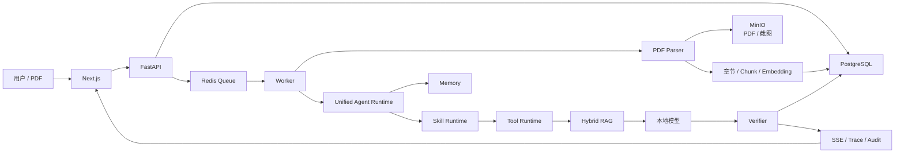
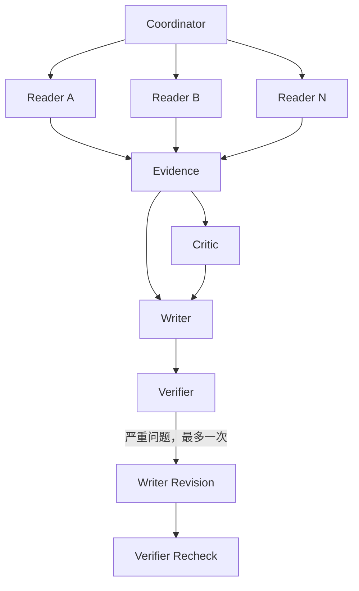

# PaperAgentSystem 项目面试完整介绍

> 用途：AI 应用开发岗位面试复习与项目讲解。
> 对应代码状态：2026-07-25 当前工作树。
> 事实来源：当前代码、产品/技术架构文档、冻结评测报告、Model Card、Dataset Card、故障复盘与最新测试。
> 重要原则：本文严格区分“默认产品链路”“可显式开启的实验链路”“只有机制测试的能力”和“真实模型评测结果”。

---

## 1. 一句话、30 秒和 2 分钟介绍

本节目的是准备不同时间长度的项目介绍，让面试官无论给出 30 秒还是 2 分钟，都能快速听懂系统价值与核心架构。

### 1.1 一句话

PaperAgentSystem 是一个面向论文阅读、证据问答、多论文比较和学术写作辅助的本地化 AI Agent 系统：它先把 PDF 解析成带章节、页码、版面和视觉对象的结构化证据，再通过混合 RAG、Skill/Tool 约束、会话记忆和结果核验生成可追溯回答。

### 1.2 30 秒版本

这个项目不是“把整篇 PDF 塞进 Prompt”。上传后，系统逐页恢复单栏或双栏阅读顺序，识别章节、页眉页脚、图表和算法区域，再按章节建立 parent/child Chunk。有论文的任务默认先由受约束动态 Planner 生成最多八步的公开 Plan，页面实时显示步骤状态；Safe RAG 产品执行器再完成判断、Skill、混合检索、生成和核验。系统用 PostgreSQL、Redis、MinIO、SSE 和 JSONL 审计支撑异步、恢复和追踪。多 Agent 已经接入真实 Worker，但因为 90 条真实模型消融没有通过效果与成本门槛，所以仍需双开关显式启用。

### 1.3 2 分钟版本

项目主要解决四类问题：

1. **论文不是普通纯文本**：双栏阅读顺序、页眉页脚、章节层级、图表和算法都会影响切分与检索。
2. **学术回答必须可追溯**：答案中的事实需要回到具体论文、章节、页码、原文片段和视觉截图。
3. **Agent 不能靠自由 Prompt 无限执行**：任务选择、Tool 权限、参数、预算、超时、重试、幂等和核验必须由代码约束。
4. **产品决策与效果晋级要分开**：动态 Planner 和多 Agent 的冻结集消融都没有通过效果/成本门槛；根据用户明确产品决策，Planner 后续默认启用以提供结构化计划和实时状态，但不能把这说成新的效果增益。多 Agent 仍不默认启用。

系统的默认链路是：

```text
用户问题
→ 有界历史与 Memory 回读
→ Requirement / 动作判断
→ Runtime 路由
→ Skill 选择与输入校验
→ 章节解析或混合 RAG
→ 大模型基于证据生成
→ Skill 输出校验与一次格式修复
→ 引用/结构 Verifier
→ 保存消息、证据、Token、Trace
→ 异步更新 Memory
```

如果同时开启 `MULTI_AGENT_ENABLED=true` 和 `ALLOW_EXPERIMENTAL_NO_GO=true`，并且问题包含至少两篇论文且明确要求比较、综述或综合分析，则会改走：

```text
Coordinator
→ Paper Reader × N（按论文并行）
→ Evidence
→ Critic
→ Writer
→ Verifier
→ 最多一次 Writer 定向修订与复验
```

---

## 2. 项目定位与边界

本节目的是明确系统解决什么问题、已经具备哪些能力以及哪些能力仍受产品或评测边界约束。

### 2.1 它是什么

- 本地化论文 AI 应用；
- 证据优先的 RAG 系统；
- 有显式状态、权限、预算和恢复语义的 Agent Runtime；
- 具备 Skill、Tool、Memory、多 Agent、评测和可观测性的完整工程；
- 适用于单论文问答、总结、章节定位、多论文比较、综述、方法审查、局限分析和引用核验。

### 2.2 它不是什么

- 不是通用网页搜索引擎；
- 不是把全部历史和整篇论文直接放入上下文；
- 不是完全自由的 AutoGPT 式循环；
- 不是默认开启的多 Agent 产品；
- 不是已经通过 SFT/RL 提升效果的模型项目；
- 不是自动替代研究者做事实判断的系统；
- 不是可以伪造实验、数据或引用的写作工具。

### 2.3 当前能力状态

| 能力 | 当前状态 | 面试时的准确说法 |
|---|---|---|
| PDF 解析、章节、视觉证据 | 默认生产链 | 已接入上传、索引和问答 |
| Safe RAG | 默认生产链 | 当前最稳定的论文证据路径 |
| Skill/Tool 契约 | 默认生产链 | 真实加载、选择、校验和 Trace |
| 短期/长期 Memory | 默认生产链 | 回读原消息，摘要只用于定位 |
| 动态 Planner | 默认开启 | 有论文任务生成公开 Plan；M06 NO-GO 历史结论仍保留 |
| 多 Agent | 可真实执行，默认关闭 | 双开关显式实验；N05 为 NO-GO |
| 项目专用 SFT/RL Adapter | 不可用 | Stage O 跳过，不宣称增益 |
| 真实 Embedding/Reranker | 目标配置与当前实现要区分 | 当前 Worker 实际使用确定性 Hash Embedding 和词法 Reranker |

---

## 3. 技术栈与总体架构

本节目的是从技术选型和分层关系解释系统如何把前端、API、任务队列、Agent Runtime、模型与数据基础设施组织成一个完整产品。

### 3.1 技术栈

- 前端：Next.js 14、React、TypeScript；
- API：FastAPI；
- 后台任务：Redis 队列/Celery 语义；
- 业务真值与向量字段：PostgreSQL + pgvector；
- 原始 PDF、截图和对象：MinIO/S3；
- PDF：PyMuPDF；
- 数据契约：Pydantic 2；
- ORM：SQLAlchemy 2；
- 模型服务：Ollama/OpenAI-compatible 接口；
- 可观测性：SSE、数据库事件、Trace、UTF-8 JSONL 审计；
- 部署：Docker Compose；
- 评测：版本化 JSONL、程序化 Judge、Bootstrap 置信区间和消融报告。

### 3.2 总体架构



### 3.3 为什么使用 Port-Adapter

领域和应用层不直接依赖 FastAPI、SQLAlchemy、Redis、MinIO 或 Ollama，而是依赖 Port。这样做有三个价值：

1. Fake 与真实基础设施可以执行相同契约测试；
2. Agent Runtime 不需要知道模型、存储和队列的物理实现；
3. 更换向量模型、对象存储或队列时，不需要重写业务状态机。

---

## 4. 两条最重要的端到端工作链路

本节目的是用论文入库和论文问答两条主链路串联系统模块，并明确每一步究竟由哪个 Agent、Worker 或确定性组件负责。

## 4.1 上传论文链路

本节目的是说明一篇原始 PDF 如何经过安全校验、解析、切分和索引，最终变成可供 Agent 检索的结构化证据；这条链路主要由 Ingestion Worker 执行，并不是由 LLM Agent 自由处理。

| 步骤 | 处理动作 | 负责的 Agent / 组件 |
|---:|---|---|
| 1 | 用户在前端选择 PDF | **前端上传组件**；不是 Agent，只负责采集文件和提交上传请求 |
| 2 | 校验文件名、大小、MIME、文件签名和 Workspace | **API 上传应用服务 + 文件安全校验器**；不是 LLM Agent，使用确定性规则拒绝非法输入 |
| 3 | 计算 checksum，处理内容去重与会话引用 | **PaperAgentApplication / 文件仓储适配器**；负责判断复用、恢复软删除记录或创建新文件 |
| 4 | 将原始 PDF 写入 MinIO | **ObjectStorage Adapter**；不是 Agent，负责持久化原始对象 |
| 5 | 在 PostgreSQL 保存 `File` 与 `ConversationFile` | **文件仓储与会话仓储**；不是 Agent，保存文件真值和会话引用关系 |
| 6 | 投递 `document_parse` 异步任务 | **API 应用服务 + Queue Adapter**；把耗时处理移交给 Worker，并保持任务幂等键 |
| 7 | 下载原始对象并启动解析 | **Document Ingestion Worker** 激活 `document_parser` Skill，并通过 Tool Runtime 调用 `parse_document`；它是受约束后台执行器，不是自由推理 Agent |
| 8 | 逐页恢复阅读顺序、识别章节、裁剪视觉对象并计算质量分 | **PyMuPDFParser / BasicPDFPipeline**；确定性文档处理组件负责版式解析，低质量页面按配置进入 OCR 降级 |
| 9 | 生成 parent/child Chunk | **StructureAwareChunker**；确定性切分组件根据章节边界和 Token 预算组织父子块 |
| 10 | 批量生成 1024 维向量 | **Embedding Adapter**；调用当前 Embedding Profile，不由主 Agent 自由选择物理模型 |
| 11 | 保存 `ParsedDocument`、`Section`、`Chunk` 和索引元数据 | **DocumentIndexer + PostgreSQL Repository**；负责版本、checksum、向量和来源元数据的一致性 |
| 12 | 将图、表、算法截图写入 MinIO | **解析流水线 + ObjectStorage Adapter**；保存可回看的视觉证据对象 |
| 13 | 标记任务完成并通知页面 | **Document Ingestion Worker + Task Event/SSE 组件**；提交状态和公开事件，前端只负责订阅展示 |

因此，上传论文链路可以面试化地概括为：**没有 LLM Agent 在“阅读后随意决定怎么入库”，而是 Document Ingestion Worker 按 `document_parser` Skill 和 Tool 权限，编排一组确定性解析、切分、向量化与存储组件。**

关键工程点：

- checksum 去重不等于直接复用一切，还要维护会话引用关系；
- 只有最后一个有效引用删除时，才删除原对象和派生索引；
- 索引带版本和解析 checksum，内容或模型版本变化时可重建；
- 解析失败、对象不存在和格式错误都使用显式错误，不伪造成功。

## 4.2 用户问答链路

本节目的是说明用户问题如何经过主 Agent 编排、动态规划、Skill 约束、Safe RAG 检索生成和 Verifier 核验，最终形成带证据的回答。

| 步骤 | 处理动作 | 负责的 Agent / 组件 |
|---:|---|---|
| 1 | 用户提交消息和选中的论文 | **前端会话组件 + API Route**；不是 Agent，负责协议转换、鉴权和参数提交 |
| 2 | 创建 `ProductTask` 并投递 `main_agent` 队列 | **PaperAgentApplication + Queue Adapter**；保存任务初始状态并生成幂等队列消息 |
| 3 | 检查取消状态、Workspace 和有效文件范围 | **Main Agent Worker / PaperAgentProcessor**；这是默认问答链的主执行者，所有后续动作都受任务边界约束 |
| 4 | 获取最近的有界消息 | **主 Agent 的 Context Builder**；只装载窗口内原始消息，避免无限扩大 Prompt |
| 5 | 必要时检索短期 `MemorySegment` | **ConversationMemoryCoordinator**；为主 Agent 提供当前会话的可追溯摘要片段 |
| 6 | 只有用户明确引用历史时检索跨会话 Summary | **ConversationMemoryCoordinator**；按需扩大检索范围，并保留回读原消息的来源 ID |
| 7 | 选择 Fast Path、默认 Dynamic Plan + Safe RAG，或双开关实验型 Multi-Agent | **Unified Agent Runtime / Runtime Router**；它是主 Agent 的控制层，依据文件数、意图和能力开关确定模式 |
| 8 | 为有论文任务生成最多八步的公开 DAG Plan | **Dynamic Planner Agent**；由小模型和 `ConstrainedLLMPlanner` 生成结构化计划，失败时回退 Safe RAG，页面只展示计划摘要而不展示隐藏思维链 |
| 9 | 判断 `clarify`、`retrieve` 或 `answer` | **主 Agent 的 Requirement Clarifier / ReAct Self-RAG 决策器**；小模型只输出受 Schema 约束的动作，不直接调用任意工具 |
| 10 | 选择并激活论文能力 | **主 Agent 的 SkillSelector + SkillRuntime**；按任务选择 Skill，校验输入契约、模型 Profile 和 Tool 白名单 |
| 11 | 校验并启动检索 Tool | **Tool Runtime**；代表主 Agent 检查参数、权限、预算和 Skill 是否允许 `search_document` |
| 12 | 执行章节检索、普通混合检索或多论文均衡检索 | **Safe RAG Retriever**；这是主 Agent 调用的确定性检索组件，不是独立子 Agent |
| 13 | 将召回结果组装成带 `[E1]`、`[E2]` 映射的上下文和 Prompt | **主 Agent 的 Context Builder / Prompt Builder**；控制证据预算、来源顺序、论文标签和视觉对象提示 |
| 14 | 基于证据生成回答 | **主 Agent 的大模型生成阶段**；默认单 Agent 路径中它不是独立 Writer Agent，只能依据提供证据生成 |
| 15 | 校验 Skill 输出，必要时进行一次格式修复 | **SkillRuntime + 主 Agent 的有界 Repair 阶段**；只修复表格或 Schema 格式，不重新运行解析与检索 |
| 16 | 检查必需字段、引用 ID 和终止条件 | **确定性 Verifier**；默认链中它不是多 Agent 模式的 LLM Verifier Agent，无效引用会失败关闭 |
| 17 | 保存回答、证据、Token、Trace 和监控事件 | **主 Agent Worker + Repository/Observability Adapter**；只有核验通过的结果才能成为最终 Assistant Message |
| 18 | 异步投递并生成会话摘要 | **Memory Summary Worker + ConversationMemoryCoordinator**；在回答完成后更新长期可检索摘要，不阻塞当前响应 |

如果用户显式打开多 Agent 双开关且任务满足多论文条件，第 7 步会改走另一套角色 DAG：**Coordinator Agent** 负责任务编排，多个 **Paper Reader Agent** 并行读取论文，**Evidence Agent** 汇总证据矩阵，**Critic Agent** 查找证据缺口，**Writer Agent** 生成引用草稿，最后由 **Verifier Agent** 独立核验；这条实验分支不能与上表中的默认确定性 Verifier 混为一谈。

为什么“格式修复”不重新跑完整链路：检索结果没有变，重新解析和检索只会增加成本与不确定性。因此系统保留证据，仅针对 Markdown 表格等输出契约进行一次有界修复。

---

## 5. PDF 解析模块

本节目的是解释系统如何把 PDF 的视觉版面恢复成保留页码、章节、阅读顺序和图表位置的结构化文档。

### 5.1 输入与输出

输入是受 Workspace 管理的 PDF 字节；输出不是一个字符串，而是结构化 `ParsedDocument`：

- 页级宽高、页码、单/双栏判断；
- TextBlock 的文本、字体、粗体、bbox、阅读顺序和角色；
- 章节号、标题、层级、父章节、页码范围和 block ID；
- 图、表、算法的类型、标题、bbox、截图和来源 block；
- 页眉页脚；
- 全文和解析质量；
- parser 名称与版本。

### 5.2 单栏与双栏阅读顺序

系统先排除页面顶部/底部边缘和视觉对象内部文字，再观察候选 block 在页面中线两侧的分布。

判定双栏需要满足：

- 左右两侧都至少有足够 block；
- 中间存在可见 gutter，当前阈值约为页宽的 1.5%；
- 左右纵向范围有足够重叠，当前阈值约为较短栏高度的 35%。

双栏页面的排序不是简单 `(y, x)`，而是：

1. 顶部页眉；
2. 位于两栏之前的跨栏标题；
3. 左栏从上到下；
4. 右栏从上到下；
5. 其余跨栏内容；
6. 底部页脚。

这一步直接影响 RAG：如果两栏内容交叉，后续 Chunk 即使向量正确，也会把不相邻的句子拼在一起。

### 5.3 页眉页脚

系统统计多页顶部 5% 和底部 5% 区域反复出现的文本。出现次数达到至少 2 次或约半数页面时标记为重复边缘文本；`Page ...` 形式也作为页脚候选。页眉页脚仍保留在解析结构中，但不进入正文全文和正文 Chunk。

### 5.4 章节识别

章节识别组合规则与版式特征：

- 数字标题，如 `2 Method`、`3.1 Dataset`；
- Appendix、罗马数字和字母编号；
- 中英文常见章节名，如 Abstract、Introduction、Methods、实验、结论；
- 字号相对正文基线放大约 1.22 倍；
- 粗体与短标题特征；
- 过滤图表标题、参考文献条目和目录页。

系统用栈恢复章节层级，保存 `parent_section_id`、`section_path`、直接 block 和后代 block。这样章节检索可以覆盖父章节下的全部子章节。

### 5.5 图、表与算法

视觉对象来源包括：

- PDF 原生图片区域；
- PyMuPDF 表格检测；
- 绘图边框；
- Figure/Table/Algorithm/图/表/算法标题；
- 标题与附近区域的空间关系。

裁剪时把视觉区域和标题合并，增加少量边距，以 2 倍矩阵渲染为 PNG。对象内部与裁剪区域重叠较高的文字标成 `artifact_body`，不进入普通正文 Chunk；标题、页码、章节、bbox 和来源 block 仍保留。回答命中相关对象时，前端可以显示截图，而不是只给一段失去结构的 OCR 文本。

### 5.6 解析质量与降级

当前质量分综合：

- 每页平均字符密度；
- 有文本页面比例；
- 空白页比例。

低于 0.6 时产生 `low_text_extraction_quality` 警告；存在空白页也会单独记录。需要注意：当前主解析器是 PyMuPDF 版式规则链，并不等于已经拥有适用于所有扫描 PDF 的强 OCR/版面模型。低质量扫描、复杂无边框表格和非常规排版仍是限制。

### 5.7 如何评测解析

- 阅读顺序正确率：按 Gold block 顺序计算相邻对或 Kendall 相关；
- 章节边界 F1：预测章节起止与 Gold 的匹配；
- 页眉页脚过滤 Precision/Recall；
- 图表检测 mAP 或 IoU 命中率；
- bbox 覆盖率与裁剪完整率；
- 解析字符召回；
- 单栏、双栏、扫描件分桶统计；
- 解析失败率、P50/P95 延迟和每页耗时。

---

## 6. 文档切分与索引

本节目的是说明系统如何在语义完整性与检索粒度之间取得平衡，并把解析结果构造成可重建、可追踪的 parent/child 向量索引。

### 6.1 为什么不是固定 Token 滑窗

论文的自然边界是章节和版面 block。纯固定窗口可能：

- 在标题和正文之间切断；
- 把两个章节混在一起；
- 丢失页码和 bbox；
- 让检索结果缺少邻接与父级语义。

因此系统使用结构感知的 parent/child Chunk。

### 6.2 Parent Chunk

每个章节生成一个 parent：

- 包含章节标题和该章节的直接正文 block；
- 保存章节路径、页面范围、bbox 和来源 block；
- 用于表示完整章节语义和章节展开。

### 6.3 Child Chunk

章节正文按原始 block 顺序累积，默认字符上限为 700。超过上限时结束当前 child，再从下一个 block 开始。

这不是机械地在第 700 个字符截断，而是优先保留 PDF block 边界。每个 child 保存：

- `parent_chunk_id`；
- 章节 ID、章节号、标题和路径；
- `chunk_index_in_section`；
- `previous_chunk_id` / `next_chunk_id`；
- 页码范围和 bbox；
- source block IDs。

当前实现没有传统的字符级重叠窗口，连续语义主要通过 block 完整性、前后邻接 ID和检索后的相邻扩展来补偿。

### 6.4 Embedding 与索引真相

当前 Worker 实际实例化的是 `MultilingualHashEmbeddingClient`：

- 处理中英文词项；
- 中文同时保留连续片段和二元组；
- 使用稳定哈希映射到 1024 维；
- 加入符号与词频对数权重；
- 最后做 L2 归一化。

Reranker 当前是 `MultilingualLexicalReranker`，依据词项覆盖和短语命中奖励重排。

`.env.example` 中仍存在 `EMBEDDING_MODEL_NAME=bge-m3`，README 也描述了 BGE-M3 目标配置，但当前默认 Worker 代码没有实例化 BGE-M3 客户端。因此面试必须说：

> 系统的模型接口和配置为真实 Embedding/Reranker 留出了替换位置，但当前代码路径使用可复现、无外部依赖的 Hash Embedding 与词法 Reranker；BGE-M3 是配置/演进目标，不应说成当前实际推理实现。

### 6.5 幂等与重建

索引保存 checksum、解析版本、索引版本和 embedding 标识。相同内容和兼容版本可以复用；checksum 或版本不一致时重建派生数据。删除文件时同步失效 Chunk、Section、Memory 引用和视觉对象，避免“已删除内容仍被检索”。

### 6.6 如何评测切分

- Chunk 边界完整率；
- 每个 Gold evidence 是否完整落入某个 child；
- Chunk 长度分布和超长率；
- 章节纯度：一个 Chunk 是否混入其他章节；
- 邻接恢复准确率；
- Evidence Recall@K；
- 删除后残留检索率，目标必须为 0；
- 不同字符上限的消融：Recall、上下文 Token、答案支持率。

---

## 7. RAG 模块

本节目的是解释系统如何理解查询、限定论文范围、执行多路召回、重排证据并为生成模型构建可靠上下文。

### 7.1 查询理解

查询进入检索前会做规则化重写和上下文补全。对于“分别列举”“它们的指标呢”这类省略追问，系统只在指代、主题重合或短追问条件满足时，把最近相关用户问题加入 `retrieval_query`。主题明显切换时不会继承旧范围。

### 7.2 Workspace 与文件过滤

召回的第一道边界不是相似度，而是：

- `workspace_id`；
- 当前会话仍有效的 `file_id`；
- 删除状态；
- 可选章节 ID。

模型不能通过 Prompt 提供或覆盖这些保护字段。

### 7.3 普通混合召回

默认有三路实际参与融合：

1. **Exact**：对规范化 Chunk 文本做关键词/正则式精确召回；
2. **Vector**：计算查询和 Chunk 向量余弦相似度；
3. **BM25**：基于词频、逆文档频率和长度归一化的稀疏召回。

每路默认最多取 30 个候选。系统再使用 Reciprocal Rank Fusion：

```text
RRF(d) = Σ 1 / (k + rank_i(d))
```

当前 `k=60`。RRF 的优点是无需把 BM25 分数和余弦分数强行归一到同一量纲，更依赖各路排名的共识。

融合后的候选交给 Reranker，默认最终返回 Top-8。最终排序结合 RRF 分和重排分。

### 7.4 章节检索

章节问题不会先把“数据集”等普通主题误当成强章节约束。系统只解析明确表达：

- “第 3.2 节”；
- “Section 4”；
- “方法章节”；
- “上一节”“本节”；
- 中英文常见章节别名。

章节解析顺序：

1. 编号精确匹配；
2. 编号 + 标题；
3. 标题精确；
4. 标题别名；
5. 模糊标题匹配。

模糊匹配阈值当前为 0.92；前两名差距小于约 0.06 时返回歧义并请求澄清，而不是自行选择。

章节问答在解析后的章节及子章节范围内执行混合检索；章节总结按文档顺序取上下文，默认最大约 12,000 字符，超限时进行确定性的头/中/尾覆盖。

### 7.5 多论文均衡检索

普通全局 Top-K 容易被一篇高相似论文占满。比较任务会：

1. 按每个文件分别检索；
2. 为每篇论文保留证据机会；
3. 在总 Top-8 预算内合并；
4. 每条证据携带文件名、file_id、章节和页码；
5. 记录缺失证据的论文；
6. 输出表格固定包含“论文”列，其他比较维度随问题变化。

### 7.6 上下文构建

Prompt 中的每条证据带程序分配的 `E1...En`，同时包含：

- 论文文件名；
- file_id；
- section path；
- page；
- quote/text；
- bbox；
- visual artifact 关联。

模型只负责引用已有 ID，不能自由发明 Citation ID。

### 7.7 RAG 失败与 Self-RAG

- 没有命中：明确证据不足；
- 显式章节不存在：返回章节未找到；
- 章节歧义：提出澄清；
- 比较中某篇无证据：标记缺失范围；
- 回答过短或非实质：在相同证据上最多重试一次；
- 引用无效：Verifier 拒绝保存；
- 不进行无限检索或无限反思。

### 7.8 如何评测 RAG

- Recall@K：Gold evidence 是否进入 Top-K；
- Precision@K：Top-K 中相关证据比例；
- MRR：首个相关证据排名的倒数；
- nDCG@K：多级相关性下的排序质量；
- Citation Recall/Precision；
- 多论文 Coverage：每篇要求论文是否至少有有效证据；
- Paper Identity Confusion：证据是否归错论文；
- Section Resolution Accuracy、歧义识别率；
- 删除内容残留率；
- P50/P95 检索延迟；
- 每次检索上下文字符数和 Token；
- Exact/Vector/BM25/Reranker 的消融。

---

## 8. 引用、Claim 与 Verifier

本节目的是说明系统如何把答案中的事实主张绑定到程序生成的证据引用，并在保存前执行失败关闭式核验。

### 8.1 引用不是模型自由文本

系统在构建上下文时分配 Evidence ID。回答中的 `[E1]` 等必须落在本次有效 ID 集合中。引用对象最终能回到：

```text
Evidence ID
→ Chunk ID
→ File ID
→ Page
→ Section
→ Quote
→ Bounding Box
→ 可选视觉截图
```

### 8.2 默认链路的核验边界

默认 Verifier 主要检查：

- 必填输出字段；
- 回答非空；
- 引用 ID 是否属于允许集合；
- 计划/步骤是否满足终止条件；
- Skill 输出是否符合对象、文本或 Markdown 表格契约。

系统还提供 Claim-Evidence 检查器，用事实词项与证据覆盖判断候选 Claim 是否得到支持。需要诚实说明：当前产品边界的强项是“引用集合和结构约束”，并不等于已经拥有完美的自然语言事实蕴含模型。

### 8.3 失败关闭

无效引用不会被静默删除后继续保存答案，而是让任务失败或返回证据不足。多 Agent 结果还会在产品边界再做一次独立核验，避免子链路把未持久化的引用传给最终消息。

### 8.4 如何评测

- Citation Precision = 正确引用 / 所有预测引用；
- Citation Recall = 命中的 Gold evidence / 所有 Gold evidence；
- Claim Support Rate = 有证据支持的事实 Claim / 全部事实 Claim；
- Hallucination Rate = 无支持的重要 Claim / 全部事实 Claim；
- Unknown Citation Rate；
- 数字、实体、公式和引用不可变项回归；
- Verifier False Accept / False Reject；
- 人工抽检引用原文是否真正支持结论。

---

## 9. Agent Runtime 与任务状态

本节目的是解释主 Agent 如何在显式状态机中完成澄清、规划、执行、预算控制、恢复和进度公开，而不是依赖无限自由循环。

### 9.1 为什么自定义 Runtime

项目关心的是：

- 显式 Task/Step 状态；
- 恢复与幂等；
- 每步预算；
- 取消、超时和重试；
- Tool 权限；
- 逐步 Trace；
- 可替换模型和基础设施。

这些需求比“快速搭一个会调用工具的 Agent”更重要，所以核心没有交给 LangChain/AutoGen 的自由循环。

### 9.2 Runtime 模式

| 模式 | 进入条件 | 当前策略 |
|---|---|---|
| `fast_path` | 没有论文文件的简单任务 | 低开销回答 |
| `safe_rag` | 有论文，或高级能力未晋级 | 默认论文链路 |
| `dynamic_plan` | 有论文且 Planner 开关开启 | 默认生成受约束公开 Plan |
| `multi_agent` | ≥2 篇论文 + 比较/综述/综合 + 双门禁 | 可执行实验，默认关闭 |

高级 Runtime Adapter 不可用时回退 Safe RAG，并记录 `fallback_reason`。

### 9.3 Requirement 与澄清

系统在选择 Skill 和计划前判断：

- 目标是否明确；
- 是否给出了需要的论文范围；
- 是否有足够上下文；
- 是否应检索；
- 是否必须询问关键缺失信息。

澄清是有界的，避免每个问题都追问，也避免信息不足时盲猜。用户回答澄清后恢复原 Task，而不是新建无关任务。

### 9.4 预算与终止

- Plan 默认最多 8 步；
- 重规划最多 2 次；
- 子 Agent 深度固定为 1；
- 多 Agent 修订最多 1 轮；
- 每个角色有 Token、步骤、Tool 次数、超时和重试预算；
- 每个动作前检查取消、权限和预算；
- 每个动作后记录状态和 Trace。

### 9.5 如何评测 Runtime

- Plan Validity；
- Required Step Recall；
- Invalid Step Rate；
- Replan Success Rate；
- Loop Rate；
- Failure Recovery Rate；
- Cancellation Response；
- Task Success；
- 每 Case model/tool call；
- Token/success；
- P50/P95 端到端延迟。

### 9.6 默认动态 Planner 与页面状态

2026-07-25 起，`DYNAMIC_PLANNER_ENABLED` 默认是 `true`。只要任务带论文文件，统一 Runtime
就优先生成 Plan V2；无论文的简单问题仍走 Fast Path，多 Agent 仍受原双开关控制。

Planner 使用运行时选中的 small Profile，输入包含用户需求、候选 Skill、允许的 Tool Schema
和预算。生成结果最多八步，必须满足：

- Pydantic Schema；
- 依赖无环；
- Skill/Tool 来自 Registry；
- Tool 位于允许集合；
- 步骤预算总和不超过全局预算；
- 每步有完成条件；
- 整体有终止条件。

模型输出无效时最多结构化修复一次，仍无效则生成安全固定计划。系统只把以下公开状态写入
TaskEvent：

- plan ID 和版本；
- 目标与终止条件；
- 步骤 ID、标题、类型和依赖；
- pending、active、completed、skipped；
- Plan 是否使用 fallback。

ProductService 在实际执行问题判断、检索、回答生成和 Verifier 时，推进相应计划步骤。前端
任务监控通过 SSE 实时更新；页面刷新后也能从 PostgreSQL 中的历史 TaskEvent 重建计划。原始
Planner Prompt、模型原始输出和隐藏思维链不会发送到页面。

这里需要准确表述：当前公开 Plan 对现有 Safe RAG 产品执行器形成受约束的任务分解与状态层，
没有让模型绕过原执行器自由调用任意 Tool。M06 NO-GO 仍是历史效果结论，默认启用来自明确
产品决策，尚未产生新的冻结 Task Success 或成本估计。

---

## 10. Skill 机制

本节目的是说明系统如何用 Skill 封装论文任务方法、输入输出契约和 Tool 白名单，使模型能力能够被版本化、约束和评测。

### 10.1 Skill 与 Tool 的区别

- **Skill** 是“如何完成一种任务”的能力包：触发条件、步骤、约束、输入输出和允许的 Tool。
- **Tool** 是原子执行能力：解析、检索、读写 Workspace、生成结构化中间产物。

Skill 不直接等于一段 Prompt，Tool 也不是让模型任意调用 Python 函数。

### 10.2 Skill 包结构

```text
skill-name/
├── SKILL.md
├── manifest.yaml
├── tools/tools.yaml
├── references/
├── assets/
└── scripts/
```

Manifest 包含：

- name/version/description；
- model_profile；
- routing keywords；
- 输入输出契约；
- Tool 白名单与实现绑定；
- 示例和验收规则。

### 10.3 加载与执行生命周期

```text
SkillManifestLoader
→ 发现目录
→ 校验 Manifest、Schema 和 Tool 绑定
→ 注册到唯一 SkillRegistry
→ SkillSelector 计算候选
→ 只加载选中 Skill 的正文
→ 校验 Skill 输入
→ 记录 skill.activate
→ Tool 调用前检查白名单和参数
→ Tool 返回后校验输出
→ 生成结果并校验 Skill 输出
→ 记录 skill.complete
```

当前 Selector 是确定性关键词路由：

- 统计每个 Skill 的 routing keyword 命中数；
- 按分数和名称稳定排序；
- 返回 Top-3 候选；
- 没有命中时使用 fallback Skill。

因此不能说“Skill Selector 已是训练好的语义路由模型”。它的优势是可解释、可复现；弱点是同义表达和复杂意图泛化有限。

### 10.4 11 个能力型 Skill

| Skill | 作用 |
|---|---|
| `document_parser` | PDF 解析与结构化溯源 |
| `paper_reader` | 单论文 Paper Card |
| `summary_generator` | 保留数字和证据的总结 |
| `claim_extractor` | 提取原子事实主张 |
| `claim_verifier` | 判断支持、矛盾或证据不足 |
| `citation_manager` | 整理系统分配的引用 |
| `insight_extractor` | 区分事实与推断的洞见 |
| `comparison_analyzer` | 多论文统一维度比较 |
| `literature_synthesizer` | 基于证据矩阵生成综述 |
| `methodology_reviewer` | 审查方法和实验设计 |
| `limitation_analyst` | 区分作者局限与审阅推断 |

普通论文问答是内置 Safe RAG 步骤，不存在一个名为 `paper_qa` 的 Skill。监控事件也不能把普通 RAG 伪装成 Skill 激活。

### 10.5 输出契约

Skill 输出可以是：

- JSON object + JSON Schema；
- 普通文本 + 最小长度；
- Markdown + 必需标记；
- Markdown table + 必需列。

例如比较 Skill 固定要求“论文”列，但“方法、数据集、结果”等列根据问题动态决定。首次生成不合规时只允许一次修复。

### 10.6 如何评测 Skill

- Skill Top-1 / Top-3；
- fallback 使用率；
- 输入 Schema 合法率；
- 输出契约通过率；
- 误触发率与漏触发率；
- 每类意图的混淆矩阵；
- 格式修复成功率与新增 Token；
- 端到端 Task Success。

特别注意：Manifest 19/19 或示例全部通过只证明加载和契约机制正确，不代表真实用户 Skill Top-1 为 100%。

---

## 11. Tool Runtime

本节目的是解释 Agent 如何通过注册表安全调用原子工具，以及系统如何在调用前后执行参数、权限、预算和审计检查。

### 11.1 Tool 分类

文档 Tool：

- `parse_document`
- `search_document`
- `get_document_section`

学术 Tool：

- `extract_paper_card`
- `build_comparison_table`
- `build_writing_brief`
- `draft_paper_section`
- `rewrite_academic_text`
- `build_literature_review`

Workspace Tool：

- `list_workspace_files`
- `search_workspace_files`
- `read_workspace_entry`
- `write_workspace_entry`
- `promote_workspace_entry`
- `save_artifact`

### 11.2 一次 Tool 调用发生什么

1. 生成作用域内的幂等 key；
2. 查询是否已有完成结果；
3. 从 Registry 找 Tool；
4. 拒绝调用者注入 `workspace_id`、`user_id`、`task_id` 等保护字段；
5. 检查当前 Skill 白名单；
6. 检查权限；
7. 高风险操作检查显式确认；
8. Pydantic 校验输入；
9. 在 timeout 内执行；
10. 只对声明为可重试的异常按预算重试；
11. 校验输出；
12. 大输出写 DataRef，不把大对象直接塞回模型上下文；
13. 缓存幂等结果；
14. 写 Trace，包括耗时、尝试次数和参数是否合法。

### 11.3 安全意义

Prompt Injection 即使诱导模型输出 `workspace_id=其他用户`，也会因为保护字段注入被拒绝；即使 Tool 存在，只要不在当前 Skill 白名单或缺少权限也不能执行。

### 11.4 如何评测

- Tool Selection F1；
- Argument Exact Rate；
- Argument Schema Valid Rate；
- Tool Success Rate；
- timeout/retry 行为；
- 幂等重放一致性；
- 未授权调用阻断率；
- Prompt Injection Block Rate；
- 大输出 DataRef 转换率；
- Tool P50/P95；
- 失败调用和被策略阻断的调用都计入成本与轨迹。

参数 Schema 合法不等于参数语义正确，更不等于任务成功。

---

## 12. Memory 与多轮上下文

本节目的是说明系统如何在控制上下文长度的同时保持多轮对话连续性，并确保摘要可追溯、数据可删除。

### 12.1 四种状态要分开

| 状态 | 作用 |
|---|---|
| 最近消息 | 当前会话即时上下文 |
| MemorySegment | 当前会话较早消息的可检索摘要 |
| ConversationSummary | 跨会话定位 |
| Agent State | Task、Plan、Observation、预算和运行状态 |

Redis 只承担队列、锁、取消和事件协调，不是长期事实真值。

### 12.2 短期 Memory

默认达到 8 条消息或约 1200 个词项时生成 MemorySegment。当前摘要是确定性拼接压缩，不是 LLM 自由总结。每个 Segment 保存：

- summary；
- embedding；
- source message IDs；
- 起止时间；
- conversation/workspace。

召回时用词法重合和向量相似度排序，然后根据 `source_message_ids` 回读仍未删除的原始消息。摘要用于定位，原消息才是事实来源。

### 12.3 长期 Memory

每次回答保存后异步投递幂等 `memory_summary`：

- 更新 ConversationSummary；
- 为摘要生成 embedding；
- 记录全部来源消息；
- 可检索历史会话和 Workspace 文件。

只有问题明确包含“以前、历史、其他会话”等意图时，才扩大到跨会话检索，并排除当前会话。

用户偏好只有在明确同意保存时进入长期偏好；临时表达不会自动变成永久偏好。

### 12.4 多轮追问选择

系统不会始终拼接完整历史，而是结合：

- 指代词；
- 省略式短问；
- 与上一问题的主题重合；
- 时间位置；
- 是否明显换话题。

例如“这些数据集的指标呢？”会继承上轮数据集主题；“换一个问题，解释 Transformer”不应继续沿用旧论文范围。

### 12.5 删除与遗忘

删除消息、会话或文件后：

- 原消息不再回读；
- Segment/Summary 失效或删除；
- Workspace 搜索索引失效；
- 文件引用归零后删除对象与 Chunk；
- 已删除内容的再次检索率目标为 0。

### 12.6 如何评测

- Memory Recall@K；
- Source Traceability：摘要命中后能否回到原消息；
- Context Precision：注入历史中真正相关的比例；
- Context Recall：需要的历史是否被找回；
- Topic Switch Leakage；
- Deleted Memory Recall，目标 0；
- 摘要更新幂等性；
- Token 节省；
- 注入 Memory 前后的 Task Success 消融。

---

## 13. 多 Agent 生产链：当前最大的架构变化

本节目的是介绍多 Agent 的真实 Worker 接线、角色 DAG、共享 Blackboard 和失败语义，同时解释它为什么仍未成为默认生产路径。

### 13.1 当前真实状态

多 Agent 已经完成真实 Worker 接线，不再只是 Fake 或离线 Coordinator。它包括：

- `MultiAgentRuntimeAdapter`；
- `ProductionRoleRunner`；
- PostgreSQL Blackboard；
- 按论文隔离的真实检索 Tool；
- 角色 Manifest、Schema、预算和 Tool 白名单；
- SSE/Trace/Audit；
- 取消、失败、幂等重放；
- 最多一次 Writer/Verifier 修订。

但它默认仍关闭。必须同时设置：

```env
MULTI_AGENT_ENABLED=true
ALLOW_EXPERIMENTAL_NO_GO=true
```

并满足：

- 至少两个不同 `file_id`；
- 问题包含比较、对比、综述、综合、compare、review 或 synthesize 等意图。

### 13.2 角色分工

| 角色 | 主要职责 | 关键约束 |
|---|---|---|
| Coordinator | 根据论文集合构建固定有界 DAG 和预算 | 不递归创建 Agent |
| Paper Reader | 每个 Reader 只读一篇分配论文 | 文件作用域强制隔离 |
| Evidence | 合并 Paper Card，建立 Evidence Matrix | Writer 之前必须完成 |
| Critic | 找证据缺口、冲突和遗漏 | 可选失败可降级 |
| Writer | 只依据 Evidence Matrix 写带引用草稿 | 不直接读整篇论文 |
| Verifier | 独立检查引用、支持与严重问题 | 失败不能保存成功答案 |

### 13.3 DAG 与并发



Reader 批次使用异步并发。角色之间不复制整篇论文，只传 `ArtifactRef`、`DataRef` 或 `blackboard://` 引用。

### 13.4 Blackboard

Blackboard 是任务级结构化共享状态，保存：

- Paper Card；
- Evidence；
- Critique；
- Draft；
- Verification Result。

每条记录包含 workspace、task、producer role、version 和 payload。主键与查询都带任务作用域，删除源文件时会级联使相关证据失效。

### 13.5 失败语义

- 单个 Reader 失败：保留其他论文结果，显式列出缺失论文；
- Critic 失败：可降级继续；
- Evidence、Writer 或 Verifier 失败：任务失败；
- Verifier 普通拒绝：失败；
- Verifier 发现可修复的严重问题：最多一次定向修订和复验；
- 第二次仍失败：不保存答案；
- 已有通过核验的 Blackboard 结果：按幂等语义复用；
- 取消：角色执行前和修订前检查。

### 13.6 为什么仍然 NO-GO

N05 使用冻结 300-case 中预先声明的 90 个 L4/L5 多论文 Case，模型为 `qwen3.5:4b`，同模型、同论文集合和同预算口径进行配对比较。

| 指标 | Single Agent → Full System 结果 |
|---|---:|
| Task Success delta | -1.11 个百分点 |
| Claim Support delta | +5.63 个百分点 |
| 总 Token 增长 | +398.03% |
| Baseline P95 | 11,453 ms |
| Candidate P95 | 55,139 ms |
| Candidate 总 Token | 748,363 |
| 系统异常率 | 0 |

结论：Claim Support 有提升，但 Task Success 没有提升，延迟和 Token 成本显著恶化。Critic 到 Verifier 的额外阶段增加约 886.6 Token 和 6.61 秒，却没有质量增益；完整修订还使 Claim Support 下降约 2.07 个百分点。因此“机制可用”和“默认晋级”必须分开。

### 13.7 如何进一步评测

- Task Success 与 Claim Support；
- 每篇论文 Coverage；
- Paper Identity Confusion；
- 冲突 Recall；
- 严重无支持事实减少率；
- Reader 并发收益；
- 部分失败可用率；
- 角色 Tool 参数合法率；
- 总 Token、Token/success；
- P95 延迟；
- 每个角色的边际贡献；
- 与 Safe RAG 的配对 Bootstrap CI。

当前冻结 N05 没有 Paper Identity、Coverage 和 Tool Validity 的人工标注，因此这些只能作为机制/验收指标，不能伪造成真实模型效果数字。

---

## 14. 模型层与大小模型分工

本节目的是说明不同模型 Profile 如何承担决策、规划和生成任务，以及逻辑配置与物理模型权重如何解耦。

### 14.1 当前 Profile

| 角色 | 基础模型 | 用途 |
|---|---|---|
| Small decision | `qwen3:1.7b` | 有界判断、路由实验 |
| Answer/evaluation | `qwen3.5:4b` | 证据生成和冻结评测 |

模型通过 Runtime Port 接入，调用记录 profile、模型版本、输入/输出 Token 和延迟。模型不可用时显式失败，不用 Fake 回答冒充生产结果。

### 14.2 为什么 1.7B + 4B

- 高频、结构化、低风险判断交给小模型；
- 复杂生成交给 4B；
- 可以统计 4B call rate；
- 通过 Profile 替换模型，不在 Skill 中硬编码物理路径；
- 为未来 SFT/RL Adapter 保留发布和回滚边界。

### 14.3 当前限制

- 项目专用 SFT/RL 没有执行，不存在效果估计；
- Cascade 不可用；
- 小模型判断和关键词 Skill 路由仍可能是瓶颈；
- 本地模型的生成和引用能力是冻结评测低分的主要来源之一。

---

## 15. 数据、存储、队列与 API

本节目的是解释 PostgreSQL、MinIO、Redis、Worker、SSE 和 API 如何共同支撑持久化、异步执行、恢复与前后端通信。

### 15.1 PostgreSQL

保存业务真值：

- Workspace、Conversation、Message；
- File 与会话引用；
- Task/Step/状态；
- ParsedDocument、Section、Chunk、Embedding；
- Citation/Evidence；
- MemorySegment、ConversationSummary、Preference；
- Skill/Tool/Trace；
- Blackboard；
- TaskEvent。

### 15.2 MinIO

保存大对象：

- 原始 PDF；
- 图、表、算法截图；
- Artifact；
- 其他不适合直接放数据库的内容。

数据库保存对象键、checksum、元数据和引用关系。

### 15.3 Redis/Worker

处理：

- `document_parse`；
- `main_agent`；
- `memory_summary`；
- 取消、锁、重试和短期事件协调。

数据库仍是 Task 状态真值；Redis 丢失或重启不应让已持久化任务和事件消失。

### 15.4 SSE

SSE 适合服务器到浏览器的单向进度：

- 比 WebSocket 简单；
- 支持自动重连；
- 使用 Last-Event-ID 恢复；
- 连接断开不影响后台任务；
- 历史事件可从数据库回读。

### 15.5 主要 API

所有业务路由位于 `/api/v1`：

| API | 作用 |
|---|---|
| `POST/GET /conversations` | 新建、列表和搜索会话 |
| `GET/DELETE /conversations/{id}` | 读取或删除会话 |
| `GET /conversations/{id}/usage` | Token 使用 |
| `POST /conversations/{id}/files` | 上传 PDF |
| `GET /files` | 文件列表 |
| `POST /conversations/{id}/messages` | 发送消息 |
| `GET /product-tasks/{id}` | 任务状态 |
| `GET /product-tasks/{id}/monitor` | 监控历史 |
| `GET /tasks/{id}/events` | SSE |
| `GET /visual-artifacts/{id}/image` | 视觉证据 |
| `GET /debug/files/{id}/parse` | 解析诊断 |
| `POST /debug/retrieval/preview` | 无 LLM 检索诊断 |
| `/model-settings/*` | 模型选择、检查、下载 |
| `/admin/evaluation/*` | 管理员评测 |
| `/admin/hitl/*` | 人工审核与治理 |

---

## 16. 前端

本节目的是说明前端如何把会话、文件、动态计划、任务进度、引用证据和评测信息转化为可操作、可观察的用户界面。

前端不是简单聊天框，还包括：

- 会话列表和搜索；
- 文件上传和有效文件范围；
- 消息与任务状态；
- 监控面板；
- Token 使用；
- 模型设置；
- 引用原文预览；
- 图、表、算法截图；
- Markdown 比较表格；
- 管理员评测和 Case 下钻。

同一个 `[E1]` 在回答中多次出现时，每个 occurrence 独立管理 hover、键盘 focus 和 click pin；比较结果只解析系统验证过的 pipe-table 契约，不渲染任意模型 HTML，以缩小注入面。

---

## 17. 可观测性、可靠性与安全

本节目的是说明系统如何通过 Trace、事件、指标、幂等、回退、权限隔离和输入防护实现可诊断且可安全失败的运行环境。

### 17.1 三层观测

1. **TaskEvent**：用户可见的公开进度；
2. **TraceSpan**：组件、动作、版本、耗时、错误和计数；
3. **JSONL Audit**：后台文件访问、对象键和动作审计。

日志默认不记录完整 Prompt、论文全文、回答正文、密钥或隐藏思维链。

### 17.2 可靠性

- checksum 去重；
- Queue 和 Tool 幂等；
- Task/Step 持久化；
- timeout/retry/dead-letter；
- 取消；
- 数据库真值；
- 索引版本和重建；
- 一次有界回答重试；
- 一次 Skill 格式修复；
- 多 Agent 一次修订；
- 无效引用 fail-closed。

### 17.3 安全

- Workspace/Conversation/Task 作用域；
- MIME + PDF 签名 + 大小校验；
- 路径穿越和符号链接逃逸防护；
- Prompt 和论文内容均视为不可信；
- Tool 保护字段由系统注入；
- Skill Tool 白名单；
- 权限和确认策略；
- 未配置真实 Sandbox 时拒绝执行代码；
- 删除覆盖原始对象与派生索引；
- 管理员接口 Token 隔离。

### 17.4 如何评测

- Prompt Injection Block Rate；
- 越权访问成功率，目标 0；
- 路径逃逸成功率，目标 0；
- 删除后召回率，目标 0；
- 幂等重复副作用率；
- 取消响应时间；
- 故障恢复率；
- 部分失败可用率；
- 日志敏感信息泄漏扫描。

---

## 18. 评测体系

本节目的是解释系统如何用冻结数据集、分层指标、配对置信区间和成本数据区分“机制可运行”与“效果值得上线”。

### 18.1 数据集

`paperagent-eval-v1` 固定 300 条：

- L1/L2/L3 各 60；
- L4/L5 各 45；
- L6 30；
- 英文 240，中文 60；
- 218 个证据任务，657 个 Gold span。

来源为 QASPER v0.3 test 和 CSL Benchmark test。数据只用于测试，`usable_for_training=false`。跨 split 的论文、会话、来源簇、文本指纹和 Embedding cluster 泄漏均为 0。

L4/L5 是确定性组合的多论文比较/Evidence Matrix；L6 覆盖 Prompt Injection、Tool 故障、取消、部分失败和澄清。逻辑页码属于评测 release 渲染 PDF，不冒充出版 PDF 页码。

### 18.2 指标分类

**效果**

- Task Success：最终任务正确完成，不只是格式合法；
- Answer Correctness；
- Citation Precision/Recall；
- Claim Support；
- Hallucination Rate。

**路由**

- Intent Top-1/Top-3；
- Skill Top-1/Top-3；
- Tool Selection F1；
- 参数 Exact 与 Schema Valid。

**轨迹**

- Plan Validity；
- Required Step Recall；
- Invalid Step Rate；
- Tool Success；
- Replan Success；
- Loop Rate。

**效率与成本**

- Model/Tool calls；
- Input/Output Token；
- P50/P95 latency；
- Token/success；
- 4B call rate；
- GPU seconds；
- monetary cost。

**鲁棒性**

- Failure Recovery；
- Partial Failure Usability；
- Cancellation Response；
- Prompt Injection Block。

所有可用比例和延迟保留有效 Case，报告 95% Bootstrap CI；系统比较使用相同 Case ID 的 paired bootstrap。分母不存在时显示 N/A，不把别的指标改名顶替。

### 18.3 B0～B3 冻结结果

| 系统 | N | Task Success（95% CI） | Citation Recall | Mean Token | P95 ms |
|---|---:|---:|---:|---:|---:|
| B0 Vanilla RAG | 300 | 8.00% [5.00%, 11.00%] | 45.28% | 1488.3 | 6032.4 |
| B1 Fixed Workflow | 300 | 6.33% [4.00%, 9.00%] | 42.94% | 1159.5 | 5750.8 |
| B2 Bounded ReAct | 300 | 6.33% [3.67%, 9.17%] | 40.73% | 1019.5 | 9376.6 |
| B3 Full 4B | 300 | 7.00% [4.67%, 9.67%] | 39.77% | 1132.5 | 10502.3 |

所有 Task Success 置信区间重叠，没有基线显著优于 B0。默认安全策略仍选择固定、可控的 Safe Path，而不是因为架构更复杂就宣称效果更好。

### 18.4 Planner 结论

- Plan Schema Validity：100%；
- 无效 Tool 调用：0；
- Required Step Recall：96.84%；
- 但端到端 Task Success 只提升约 1.33 个百分点；
- 配对 95% CI 为约 [-3.33pp, 6.00pp]；
- recovery 没有提升；
- Token/success 增加约 78.55%。

M06 当时的评测结论仍是 NO-GO；2026-07-25 根据明确产品决策，Planner 改为默认启用。这个变化的目标是任务分解和状态可观察性，不代表产生了新的效果晋级证据。

### 18.5 为什么低分仍有价值

低分说明生成、核验和路由仍是主要瓶颈，也证明项目没有用容易样本或只展示成功 Demo。面试中应强调：

> 我把工程闭环和模型效果分开评估。机制测试证明系统能按契约运行，冻结真实模型评测决定它是否值得默认启用。结果不好时保留 NO-GO，比堆 Agent 名词更可信。

### 18.6 当前测试基线

2026-07-25 Planner 默认启用变更后的复核：

- 不依赖 Docker 的 Python 测试：`419 passed`；
- 变更前一次完整测试启动结果：417 passed、1 skipped、8 errors；
- 其中 8 个 error 均发生在 Redis/MinIO/SSE Testcontainers fixture，原因是本机 Docker daemon 未启动，不是业务断言失败；
- 最近一次 Docker 环境下的项目过程记录为完整后端 `426 passed`；
- 当前前端组件 `22/22`、TypeScript 和 Next.js production build 通过。

面试时最好把“当前本机复核”和“最近完整 Docker 验证”分开陈述。

---

## 19. 关键技术取舍

本节目的是展示项目在框架、存储、通信、隐私和高级 Agent 能力上的设计权衡，以及每个选择背后的工程理由。

### 19.1 为什么不用 LangChain 做核心 Runtime

可以接入 LangChain 的模型或 Tool Adapter，但核心需要强类型状态、幂等、恢复、预算、权限和精确 Trace。自定义 Runtime 让 Task 状态属于领域模型，而不是框架内部临时状态。

### 19.2 为什么不用 AutoGen 自由对话

多 Agent 只允许固定角色、深度 1、引用式消息和 Blackboard 真值。自由群聊难以控制文件权限、Token、终止和失败语义。

### 19.3 为什么 PostgreSQL + pgvector

- 业务数据与向量在同一事务边界；
- Workspace 过滤自然；
- 删除论文时容易同步失效 Chunk；
- SQL、全文字段和向量可以组合；
- MVP 减少独立向量数据库运维。

### 19.4 为什么 SSE

进度主要是服务端单向推送，SSE 的重连和 Last-Event-ID 足够；任务真值持久化在数据库，不依赖长连接。

### 19.5 为什么不保存 CoT

隐藏推理不是可靠审计证据，还可能泄露 Prompt 和论文。系统记录结构化 action、tool、observation、引用和结果，不记录完整思维链。

### 19.6 为什么 Planner 默认开启但多 Agent 仍关闭

架构复杂度原则上应由冻结评测证明增益。M06 与 N05 都没有通过效果/成本门槛，但两者后续产品策略不同：Planner 根据明确产品决策默认生成公开计划，并继续由受约束 Safe RAG 执行；多 Agent 因角色调用、Token 和延迟成本更高，仍保留双门禁。面试中必须说明 Planner 默认启用是产品选择，不是篡改 NO-GO 结论。

---

## 20. 代表性故障与解决

本节目的是通过真实失败案例说明系统如何定位根因、建立回归约束并避免同类问题再次发生。

### 20.1 双栏正文交叉

**问题**：按 `(y, x)` 排序会左右栏交替。
**解决**：逐页栏数判断，跨栏标题优先，左栏完整后再右栏。
**验证**：阅读顺序、章节和 Chunk 回归。

### 20.2 图表文字污染正文

**问题**：表格内部文本混入普通 Chunk。
**解决**：视觉 bbox、标题和来源 block 独立建模，内部文字标记为 `artifact_body`。
**结果**：正文检索和视觉证据解耦。

### 20.3 “数据集”被误当章节

**问题**：普通主题被当强 section hint，找不到就拒答。
**解决**：只解析明确章节表达；普通主题走 RAG。
**结果**：主题问答和章节定位语义分离。

### 20.4 多论文 Top-K 被一篇占满

**问题**：全局 Top-8 可能只有 Alpha，没有 Beta。
**解决**：按文件独立检索，再在总预算内均衡合并。
**结果**：比较答案能保留逐论文证据。

### 20.5 多轮追问丢主题

**问题**：“分别列举这些指标”没有独立检索主题。
**解决**：有界相关历史 + Memory 回读 + retrieval query 补全。
**结果**：只继承必要上下文，换题时不污染。

### 20.6 Skill 表格格式让整条任务重跑

**问题**：内容已有证据，但少一列导致从头重试。
**解决**：拆分无副作用的输出校验，只做一次格式修复。
**结果**：降低延迟和重复检索。

### 20.7 共享文件被过早删除

**问题**：同一对象被多个会话引用，删除一个会话后原对象和索引被清理。
**解决**：以有效 ConversationFile 引用数决定物理删除。
**结果**：最后一个引用归零才清理。

### 20.8 多 Agent 机制通过但效果不晋级

**问题**：角色链可运行不等于值得默认开启。
**解决**：90 Case 配对消融、边际贡献和成本门槛。
**结果**：真实接线保留，默认双开关关闭。

---

## 21. 项目目录如何讲

本节目的是帮助面试时沿代码目录快速定位各层职责，把架构概念映射到真实工程结构。

| 目录 | 面试解释 |
|---|---|
| `backend/apps/api/` | REST、文件上传、产品服务和管理员接口 |
| `backend/apps/worker/` | 真实 Worker 依赖装配和任务消费 |
| `backend/agent_runtime/` | Requirement、路由、计划、上下文、核验 |
| `backend/document_processing/` | PDF、版式、章节和视觉对象 |
| `backend/rag/` | Chunk、索引、混合检索、章节解析和引用 |
| `backend/skills/` | 11 个 Skill 包、Loader、Registry、Runtime |
| `backend/tool_runtime/` | 文档、学术、Workspace Tool 和安全执行器 |
| `backend/memory/` | 短期/长期 Memory |
| `backend/subagents/` | 六角色协议、Coordinator、Runner、Adapter、Blackboard 协作 |
| `backend/models/` | Model Registry、Profile、Ollama Client 和 usage |
| `backend/infrastructure/` | PostgreSQL、Redis、MinIO、SSE、Fake、Sandbox |
| `frontend/` | 对话 UI、证据浮层、监控、模型设置和评测页 |
| `evaluation/` | 数据集、指标、Baseline、消融和报告 |
| `training/` | 与在线系统解耦的训练工程 |
| `infrastructure/` | Compose、Dockerfile、Alembic、OTel |
| `tests/` | 单元、契约、组件、集成、产品流程、安全与评测 |

---

## 22. 高频面试问题

本节目的是准备面试官最可能追问的问题，并给出简洁、准确且不过度承诺的回答口径。

### Q1：它到底是 RAG 还是 Agent？

RAG 是证据底座，Agent 是受约束的控制层。系统不仅检索，还会判断澄清/回答/检索、选择 Skill、校验 Tool、维护任务状态、使用 Memory、执行核验和恢复；但默认不会自由循环。

### Q2：如何降低幻觉？

Workspace 范围检索、程序分配 Evidence ID、证据约束 Prompt、Skill 输出契约、引用集合核验和 fail-closed 保存。还会公开说明证据不足。

### Q3：文档怎么切？

先做版式和章节恢复；每章节一个 parent，正文按 block 聚合成约 700 字符 child，保存章节路径、页码、bbox、前后邻接和来源 block。没有字符级固定重叠，靠结构和邻接扩展补上下文。

### Q4：RAG 怎么做？

Exact、Vector、BM25 各取默认 30 个候选，用 `k=60` 的 RRF 融合，再用词法 Reranker 排到 Top-8。章节问题先解析章节并限制作用域；多论文比较按文件均衡召回。

### Q5：当前用 BGE-M3 吗？

配置和文档目标中有 BGE-M3，但当前 Worker 实际是 1024 维稳定 Hash Embedding 和词法 Reranker。必须按代码说，不把目标配置说成现状。

### Q6：Skill 怎么选？

当前是基于 Manifest routing keywords 的确定性打分，返回 Top-3，零命中走 fallback。选中后才加载指令，输入、Tool 和输出都受 Schema/白名单约束。

### Q7：Tool 怎么保证安全？

Registry、Pydantic 输入输出、Skill 白名单、权限、确认、系统注入作用域、禁止保护字段覆盖、timeout、retry、幂等、DataRef 和 Trace。

### Q8：Memory 会不会把所有历史塞进去？

不会。最近消息有界；短期摘要只用于定位并回读原消息；跨会话只在明确历史意图时开启；换题时不继承旧主题。

### Q9：为什么多 Agent 默认不开？

真实链路已经完成，但 90 Case 消融中 Task Success 下降 1.11pp，总 Token 增长 398.03%，P95 从 11.45s 增至 55.14s。Claim Support 提升不足以抵消成本和端到端失败。

### Q10：如何评价这个项目最有价值的地方？

不是 Agent 数量，而是把版式证据、结构化检索、权限、任务状态、Memory、核验、观测和冻结评测连成可运行闭环，并能依据数据拒绝不划算的复杂方案。

### Q11：最大的技术债是什么？

- 当前实际 Embedding/Reranker 仍是确定性基线；
- Skill Selector 是关键词；
- 小模型生成与引用能力限制端到端成功率；
- OCR 和复杂版面覆盖有限；
- 本地产品仍以固定 Workspace 为主；
- 高级 Planner/多 Agent 未晋级；
- 项目专用 SFT/RL 不可用。

### Q12：下一步最优先做什么？

1. 在独立 validation set 上替换真实 Embedding/Reranker并做检索消融；
2. 收集合法的 Query Rewrite、Skill Route 和引用失败数据；
3. 强化 Claim-level NLI/Verifier；
4. 优化小模型证据生成，不先增加编排深度；
5. 补真实复杂扫描/表格集；
6. 完成多租户认证上下文和容量测试。

---

## 23. 面试演示脚本

本节目的是提供可直接执行的 5 分钟和 10 分钟演示顺序，让系统能力、运行状态和评测证据形成完整叙事。

### 23.1 5 分钟

1. 30 秒介绍产品和证据优先原则；
2. 上传双栏 PDF，展示解析、章节树和视觉截图；
3. 提问“使用了哪些数据集？给页码和证据”；
4. 展示监控中的 Memory、Skill、RAG、生成和 Verifier；
5. 追问“这些数据集分别对应什么指标？”；
6. 展示引用浮层和比较表；
7. 最后展示评测报告，说明 Planner 的历史 NO-GO 与后续默认产品决策，以及多 Agent 仍为 NO-GO。

### 23.2 10 分钟

在 5 分钟基础上增加：

- Chunk parent/child 图；
- 检索诊断中的 Exact/Vector/BM25/RRF；
- 多论文均衡证据；
- Tool 参数与保护字段；
- Blackboard 和角色失败语义；
- 300-case 数据集与 Bootstrap CI；
- 当前限制和下一步。

---

## 24. 不要过度陈述

本节目的是划清实现事实、实验结论和未来规划的边界，避免把可运行能力或产品策略错误表述为效果提升。

不要说：

- “当前所有向量都是 BGE-M3。”
- “所有任务都由动态 Planner 自动规划。”
- “多 Agent 已默认上线。”
- “SFT/RL 已提升系统。”
- “Schema 合法率等于任务成功率。”
- “系统保存完整思维链。”
- “所有历史都会注入每轮。”
- “300-case 证明模型效果很好。”
- “404/417/426 是同一环境下的一个固定数字。”

准确说法：

- 无论文任务默认 Fast Path；有论文任务默认动态 Planner + Safe RAG 执行；
- 多 Agent 已真实接线，但双门禁关闭且评测 NO-GO；
- 当前 Worker 使用可复现 Hash Embedding 与词法 Reranker；
- Skill、Tool、Memory 和引用契约真实参与产品链；
- 机制测试、模型效果和当前环境验证分开报告；
- 低分、失败和 N/A 都保留。

---

## 25. 最终背诵清单

本节目的是把整套项目介绍压缩成面试前可快速复习的知识点和最终总结话术。

面试前至少能脱稿回答：

1. 一句话定位；
2. 上传 PDF 后的完整链路；
3. 双栏阅读顺序；
4. 章节识别；
5. 图表为何不混入正文；
6. parent/child Chunk 与 700 字符上限；
7. 当前真实 Embedding/Reranker；
8. Exact + Vector + BM25 + RRF + Rerank；
9. 章节检索和普通主题检索的区别；
10. 多论文均衡 Top-K；
11. Evidence ID 如何回到页码和 bbox；
12. Runtime 四种模式；
13. Skill 与 Tool 的区别；
14. 11 个 Skill；
15. Tool 安全和幂等；
16. 短期/长期 Memory 与原消息回读；
17. 多 Agent 六角色和 Blackboard；
18. 多 Agent 的失败与一次修订；
19. 为什么多 Agent NO-GO；
20. PostgreSQL、Redis、MinIO 的分工；
21. SSE、Trace、Audit；
22. 300-case 数据集；
23. Task Success、Citation Recall、Claim Support、Token/success；
24. 当前测试基线；
25. 当前限制和下一步。

最后可以这样收尾：

> PaperAgentSystem 的核心不是把 RAG、Skill 和多 Agent 名词堆在一起，而是让论文证据、模型决策、工具权限、任务状态、记忆、核验和评测形成闭环。项目最有价值的工程判断，是把“能运行”和“值得默认上线”分开：高级能力只有在冻结集上同时证明效果、成本和可靠性，才会晋级。
