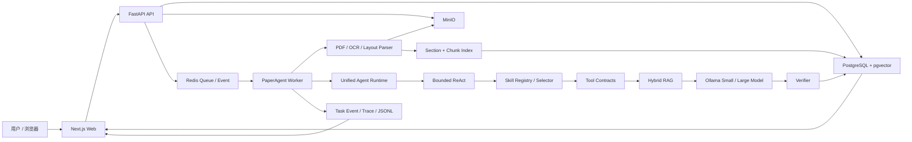

# PaperAgentSystem 项目面试完整介绍

> 文档用途：帮助项目负责人在面试中从产品、算法、Agent、RAG、工程、评测和业务价值多个角度完整介绍系统。  
> 对应代码状态：`2026-07-23`。  
> 项目根目录：`D:\vscode\Projects\PaperAgentSystem`。

---

## 1. 先记住这三种介绍方式

### 1.1 30 秒版本

PaperAgentSystem 是一个面向学术论文阅读、分析、比较和写作的本地化智能体系统。它不是简单地把整篇 PDF 塞给大模型，而是先完成单栏/双栏版式解析、章节识别、图表和算法截图、结构化分块与混合检索，再由小模型判断下一步动作、Skill 约束任务流程、大模型依据证据生成回答，最后用 Verifier 检查引用是否合法。系统支持多轮上下文、异步任务、执行进度监控和逐任务审计日志，并通过冻结数据集、资源成本和消融实验决定高级 Agent 能力是否进入默认链路。

### 1.2 2 分钟版本

这个项目解决的是复杂论文任务中四个比较实际的问题：

1. 论文是长文档，而且存在单栏、双栏、图表、算法和扫描件，直接抽文本容易打乱阅读顺序；
2. 用户的任务不只是问答，还包括比较、结构化分析、综述、写作和引用核验，需要不同的执行策略；
3. 多轮追问经常省略论文、数据集或章节名称，需要系统判断是否继承历史上下文；
4. Agent 系统不能只展示一个最终答案，还需要可恢复、可核验、可评测，并控制模型调用、Token 和工具权限。

系统采用 Next.js、FastAPI、Redis、PostgreSQL/pgvector、MinIO 和 Ollama。PDF 上传后由 Worker 异步解析并建立章节化索引；用户提问后，小模型通过受限 ReAct 决定澄清、直接回答还是检索。需要论文证据时，系统激活真实 Skill，校验 Skill 输入和 Tool 参数，再执行章节解析、Exact/Vector/BM25 多路召回、RRF 合并和重排。大模型只能依据 Top-K 证据回答，并使用 `[E1]` 形式的引用，Verifier 会检查输出字段和引用 ID，失败的回答不会保存。

我还实现了动态 Plan-and-Execute、多智能体 Evidence Blackboard、Critic—Writer—Verifier 闭环和完整评测框架。但真实消融没有证明它们在当前小模型和数据集上值得增加成本，所以默认产品链路仍采用更稳健的 Safe RAG。这一点体现了项目的核心原则：不是“功能做出来就上线”，而是根据效果、延迟和 Token 成本做晋级决策。

### 1.3 10 分钟版本的讲解顺序

建议按以下顺序讲，不要一开始就陷入代码细节：

1. 业务问题与产品目标；
2. 整体架构和一轮请求的数据流；
3. PDF 解析与视觉证据；
4. RAG、Skill、Tool、Memory 和 Verifier；
5. 不同论文任务如何执行；
6. 动态规划与多智能体为什么没有默认启用；
7. 评测体系、指标与真实结果；
8. 自己解决过的关键故障和技术取舍；
9. 项目边界与下一步可优化点。

---

## 2. 项目背景、目标与核心思想

### 2.1 原始问题

论文阅读和科研写作任务通常同时具备以下特点：

- 单篇论文内容长，无法无损地直接放进模型上下文；
- 多论文任务需要跨文件对齐方法、数据集、指标和实验结果；
- 用户会连续追问，例如先问“使用了哪些数据集”，再问“分别说明它们的作用”；
- 答案必须能够回到论文原文、章节和页码；
- 图、表和算法不能被当作普通正文打乱；
- 复杂任务需要规划、工具调用、预算管理和失败恢复；
- 模型生成的引用、数字和结论必须经过核验。

### 2.2 产品目标

系统希望在一个类似 ChatGPT 的统一对话入口中完成：

- 单论文问答；
- 论文总结和 Paper Card；
- 方法学分析、洞见和局限性分析；
- 多论文比较；
- 文献综述；
- 学术章节草拟；
- 压缩、扩写、润色和重组；
- Claim 提取、Claim 核验和引用核验；
- PDF 解析、图表查看和检索诊断；
- 多轮上下文继承和会话记忆。

### 2.3 五个核心设计原则

#### 原则一：Evidence First

论文事实必须先检索证据，再生成答案。回答中的事实使用证据 ID，证据绑定文件、章节、页码、文本和 bbox。

#### 原则二：结构化契约

Agent 决策、Skill 输入输出、Tool 参数、计划、Observation、子 Agent 消息和评测结果都使用 Pydantic/JSON Schema 等结构化契约，避免模块间传递随意文本。

#### 原则三：Fail Closed

无论文、无证据、章节歧义、非法 Tool 参数、无效引用或模型输出过短时，系统返回澄清或明确错误，不把不可靠结果伪装成成功。

#### 原则四：异步、持久化、可恢复

上传解析和回答任务通过 Redis 队列进入 Worker；PostgreSQL 保存任务、事件、结果和 Trace，Redis 只承担队列、通知、锁和短期协调。

#### 原则五：用评测决定晋级

动态 Planner、多智能体和模型训练不会因为“代码能跑”就成为默认能力。系统同时评估效果、延迟、Token 和资源成本，未达到门槛的能力保持实验状态。

---

## 3. 整体架构



### 3.1 进程职责

| 进程/服务 | 主要职责 |
|---|---|
| Web | 会话、上传、消息、引用、截图、任务监控、模型设置和评测页面 |
| API | 参数校验、会话与文件管理、数据库事务、对象存储、任务入队和查询接口 |
| Worker | PDF 解析、索引、检索、模型调用、Skill/Tool 生命周期、核验和日志 |
| PostgreSQL | 业务真值、文档结构、Chunk、向量、Memory、Task、Event、Trace 和模型配置 |
| Redis | 队列、任务通知、取消、锁、事件唤醒和短期协调 |
| MinIO | 原始 PDF、视觉截图和 Workspace/Artifact 对象 |
| Ollama | 小模型与大模型的本地 OpenAI-compatible 推理 |
| OpenTelemetry Collector | 收集和转发可观测数据 |

### 3.2 控制流与数据流

- 控制流：Web → API → Redis Queue → Worker → TaskEvent → Web。
- 文档数据流：PDF → MinIO → Parser → Section/Chunk → PostgreSQL/pgvector。
- 回答数据流：Question → History Resolver → ReAct → Skill → RAG → LLM → Verifier → Message。
- 视觉数据流：PDF Region → PNG → MinIO → Visual Artifact API → Answer Gallery。

### 3.3 为什么这样拆分

- API 不执行耗时 PDF/LLM 任务，避免 HTTP 请求长时间阻塞；
- Worker 可以独立扩容；
- PostgreSQL 作为真值，避免 Redis 丢数据后无法恢复；
- MinIO 适合保存 PDF 和 PNG 等大对象；
- pgvector 与业务表在同一数据库中，事务、删除和权限边界更简单；
- 本地 Ollama 适合论文隐私和小模型实验。

---

## 4. 一次完整请求是如何执行的

## 4.1 上传论文

入口：`backend/apps/api/product_service.py::PaperAgentApplication.upload_file`

执行顺序：

1. 校验文件不为空；
2. 校验 MIME 或扩展名为 PDF；
3. 计算 SHA-256；
4. 在当前 Workspace 中查找相同 checksum；
5. 新文件上传到 MinIO；重复文件复用已有记录；
6. 建立 Conversation 与 File 的关联；
7. 将 `parse_status` 设置为 `queued`；
8. 以 `parse:<workspace>:<file>:<checksum>` 作为幂等键，将 `document_parse` 任务写入 Redis 队列；
9. API 立即返回文件信息和 task_id。

这里的价值是：

- 避免重复上传和重复解析；
- API 不等待 PDF 解析；
- 文件对象、数据库记录和会话关联彼此独立；
- 相同文件可以被多个会话复用。

## 4.2 PDF 解析与索引

入口：`PaperAgentProcessor.parse`

执行顺序：

1. 产生“开始解析 PDF”任务事件；
2. 指定激活 `document_parser` Skill；
3. 校验 `parse_document` Tool 输入；
4. 从 MinIO 下载 PDF；
5. 使用 `BasicPDFPipeline` 和 `PyMuPDFParser` 解析；
6. 判断页面是单栏还是双栏，恢复阅读顺序；
7. 识别页眉、页脚、标题、章节和目录页；
8. 检测图、表和算法区域并生成 PNG；
9. 把视觉截图上传到 MinIO；
10. 使用 `StructureAwareChunker` 建立父子 Chunk；
11. 保存 ParsedDocument、Section、Chunk、Embedding 和视觉元数据；
12. 更新文件 `parse_status`；
13. 完成 Tool 输出和 Skill 输出校验；
14. 写 TaskEvent、Trace 和审计日志。

## 4.3 用户发送消息

入口：`PaperAgentApplication.submit_message`

执行顺序：

1. 保存用户消息；
2. 校验每个 file_id 属于当前 Workspace；
3. 保存 Message 与 File 的关联；
4. 新会话使用首条消息生成标题；
5. 检查上一条 assistant 消息是否为未解决的 clarification；
6. 如果是澄清回复，则恢复原 task_id；
7. 否则创建新的 `main_agent` 任务；
8. 返回 task_id，前端开始展示进度。

## 4.4 Agent 回答

入口：`PaperAgentProcessor.answer`

默认链路：

```text
加载相关历史
→ UnifiedRuntimeRouter
→ 小模型 ReAct 决策
→ clarify / answer / retrieve
→ Skill 激活
→ 确保索引最新
→ 章节解析或普通混合检索
→ 构造证据 Prompt
→ 大模型生成
→ Verifier 检查
→ 保存回答、引用、截图和用量
```

详细步骤：

1. 读取当前问题、会话、选中文件和澄清回复；
2. `_related_conversation_context` 选择相关历史，而不是拼接全部聊天记录；
3. Unified Runtime 根据有无文件、是否多论文、是否要求重规划选择运行模式；
4. 小模型执行一次受限 ReAct，只允许输出：
   - `clarify`
   - `retrieve`
   - `answer`
5. 如果需要澄清，最多两轮，并保存 root_task_id 以便恢复；
6. 如果是一般问题，直接由大模型回答；
7. 如果需要论文事实，则激活 Skill；
8. 检查每个文件的索引 checksum，过期则重新解析；
9. 判断用户是否明确指定章节：
   - 明确章节：调用 Section Resolver；
   - 未明确章节：执行普通 RAG；
10. 从 Exact、Section、Vector、BM25 等通道获取证据；
11. 将 Skill 指令、历史、问题、证据和视觉候选写入 Prompt；
12. 大模型必须使用 `[E1]`、`[E2]` 等标签；
13. Verifier 检查回答字段和引用 ID 是否有效；
14. 验证失败时不保存回答；
15. 验证成功后保存 Message、Citation、Visual Artifact、Token usage 和任务元数据。

## 4.5 前端如何收到进度

- Worker 把阶段事件保存为 TaskEvent；
- Redis 用于事件通知；
- SSE/任务监控接口向前端暴露公开阶段；
- 公开事件只包含阶段、状态、计数和安全元数据；
- 隐藏推理、完整 Prompt 和论文全文不进入进度面板；
- 每个任务同时写入 `runtime/logs/agent/<task_id>.jsonl`。

---

## 5. PDF 解析系统

## 5.1 关键代码

| 文件 | 作用 |
|---|---|
| `backend/document_processing/pdf_parser.py` | PyMuPDF 主解析器、栏布局、阅读顺序、视觉区域和章节 |
| `backend/document_processing/schema.py` | BoundingBox、TextBlock、VisualArtifact、ParsedPage、Section 等数据模型 |
| `backend/document_processing/pipeline.py` | PDF Pipeline 入口 |
| `backend/document_processing/ocr.py` | PaddleOCR/Tesseract Adapter 与 OCR fallback |

## 5.2 单栏与双栏判断

系统不是对整篇论文只判断一次，而是逐页判断：

1. 获取页面正文 block 和 bbox；
2. 排除视觉区域内部文字；
3. 根据 block 的横向分布、页面中心区域和左右两侧密度判断栏数；
4. 如果是单栏，按 `(y, x)` 排序；
5. 如果是双栏：
   - 找出跨栏标题；
   - 先排序并读取左栏；
   - 再排序并读取右栏；
   - 顶部跨栏内容放在两栏正文之前。

这个设计解决了双栏论文中“左栏第一段后错误跳到右栏第一段”的问题。

## 5.3 图、表和算法截图

视觉区域来源包括：

- PDF 原生图片区域；
- PyMuPDF `find_tables()` 表格区域；
- 绘图边框形成的 boxed region；
- Figure/Table/Algorithm 中英文标题；
- 算法标题附近的文本区域。

处理逻辑：

1. 根据标题和候选区域的距离、包含关系和位置打分；
2. 合并标题与主体 bbox；
3. 限制 bbox 在页面范围内；
4. 使用约 2 倍分辨率裁剪为 PNG；
5. 保存 artifact_id、kind、label、section、page、bbox、source block；
6. 将视觉主体 block 标记为非正文；
7. 标题仍保留，用于检索和关联；
8. 回答提到相关图、表或算法时，返回截图引用。

## 5.4 章节识别

章节识别综合使用：

- 标题编号，例如 `2`、`2.1`；
- 字号相对正文基线的变化；
- 标题长度；
- 常见学术章节名称；
- 目录页检测；
- 层级编号生成 section path。

每个 Chunk 保存：

- file_id；
- section_id 和 section_path；
- page_start/page_end；
- bbox；
- parent/child level；
- chunk_index_in_section；
- checksum 和 embedding model。

## 5.5 OCR

当 PDF 原生文本过少或质量不足时，可进入 OCR fallback：

- PaddleOCR 为主要 Adapter；
- Tesseract 为备选 Adapter；
- OCR 输出保留 page 和 bbox；
- 低置信度结果写入 Trace；
- OCR 结果仍进入统一 ParsedDocument Schema。

## 5.6 局限

- 无边框表格可能无法被 `find_tables()` 稳定识别；
- 整页扫描图片依赖 OCR 质量；
- 极复杂的三栏、侧栏和跨页表格仍可能需要专用 Layout 模型；
- 当前方案优先保证可解释、可测试和本地运行，而不是依赖大型视觉模型。

---

## 6. RAG 系统

## 6.1 索引

入口：`backend/rag/indexing.py`

`StructureAwareChunker` 以章节为边界建立父子 Chunk。Child Chunk 默认控制在约 700 字符以内，同时保留父级章节上下文。

`DocumentIndexer`：

- 以 workspace_id + file_id 隔离；
- 使用 checksum 判断索引是否过期；
- 批量生成 Embedding；
- 保存 section、page、bbox 和邻接信息；
- 支持删除文件后的索引失效。

## 6.2 当前实际 Embedding 与 Reranker

当前 Worker 组合根使用：

- `MultilingualHashEmbeddingClient`
- `MultilingualLexicalReranker`

它们的优势是本地、确定性、测试可复现，不依赖额外模型服务。系统的 Port 和环境配置为 BGE-M3/独立 Reranker Adapter 预留了替换点，但面试时应明确：

> 当前默认代码链路是多语言哈希 Embedding + 词法 Reranker；BGE-M3 是可替换目标，不应说成当前 Worker 已经在线使用。

## 6.3 查询链路

入口：`backend/rag/retrieval.py`

1. Query Rewriter 生成查询变体；
2. 判断是否存在明确章节引用；
3. ExactMatchRetriever 处理精确词项；
4. SectionRetriever 限制章节范围；
5. VectorRetriever 计算向量相似度；
6. BM25Retriever 处理关键词匹配；
7. ResultMerger 使用 RRF 合并不同排名；
8. Reranker 对候选重新排序；
9. 返回 Top-8 RetrievalHit。

## 6.4 为什么混合检索

- Vector 对语义改写更稳；
- BM25 对模型名、数据集名、数字和术语更稳；
- Exact 对明确名称和引用更稳；
- Section scope 可以减少跨章节干扰；
- RRF 不要求不同通道的分数处于同一尺度。

## 6.5 章节问题如何处理

`SectionReferenceParser` 和 `SectionResolver` 支持：

- 章节编号；
- 标题；
- 中英文别名；
- 上下文指代；
- 歧义检测；
- 不存在章节的澄清。

系统只在用户明确给出章节编号、标题或结构性章节表达时使用强章节约束。

例如：

- “第 3.2 节使用了什么方法？”属于章节问题；
- “这篇文章用了哪些数据集？”属于主题问题，应走普通 RAG；
- “分别列举一下”需要结合上一轮问题重写检索查询。

## 6.6 引用

每个 RetrievalHit 会转换为 `[E1]`、`[E2]` 等证据。Citation 包含：

- evidence_id；
- file_id；
- chunk_id；
- section_path；
- page_start/page_end；
- bbox；
- quote；
- score。

大模型不能自己生成任意引用 ID。Verifier 只接受本轮证据集合中的 ID。

---

## 7. 多轮会话与 Memory

## 7.1 当前产品主链路

产品回答入口使用 `_related_conversation_context`：

- 识别“它、这个、上述、继续、分别、列举、举例”等指代或省略信号；
- 计算当前问题和历史问题的主题重合；
- 优先选择最近且相关的用户/助手消息；
- 最多注入 8 条、约 3600 字符；
- 保存 source_message_ids；
- 省略式追问会将上一轮相关用户问题加入本轮 retrieval query；
- 明显换话题时不继承无关历史。

## 7.2 短期记忆

文件：`backend/memory/short_term.py`

职责：

- 获取最近消息；
- 超过阈值时生成摘要；
- 摘要保存原始 message_id；
- recall 时返回摘要和来源；
- 消息删除后使相关摘要失效。

## 7.3 长期记忆

文件：`backend/memory/long_term.py`

职责：

- 生成 ConversationSummary；
- 保存用户显式偏好；
- 跨会话搜索摘要；
- 检索历史文件相关信息；
- 删除会话或偏好时执行 forget。

## 7.4 必须讲清的边界

- 当前产品问答主链路直接使用“相关历史选择器”；
- ShortTermMemoryService 和 LongTermMemoryService 是更通用的 Memory 能力；
- 不应宣称所有长期记忆都会自动注入每轮回答；
- Redis 不是长期记忆库，它只负责队列和协调；
- Task/Plan/Observation 属于 Agent 工作状态，也不是对话记忆。

---

## 8. Skill 系统

## 8.1 生命周期

```text
SkillManifestLoader
→ SkillRegistry
→ SkillSelector
→ SkillRuntime.activate
→ Tool input/output validation
→ SkillRuntime.complete
```

### SkillManifestLoader

从每个 Skill 目录加载：

- `SKILL.md`
- `manifest.yaml`
- 输入/输出 Schema
- `tools/tools.yaml`
- Tool 对应的真实 Pydantic Model

### SkillRegistry

- 保存唯一 Skill 定义；
- 按名称获取 Skill；
- 激活时写 Trace；
- 完成时写 Trace；
- Tool 开始、完成和拒绝均写 Trace。

### SkillSelector

当前实现是确定性的关键词计分：

- 遍历 routing_keywords；
- 命中数作为 score；
- 生成 Top-3 candidate；
- 没有命中时 fallback 到 `paper_reader`。

这不是学习型路由器。面试时可以说当前优先保证稳定和可解释，后续可以在不改变 Registry/Runtime 契约的情况下替换成小模型 Selector。

### SkillRuntime

- 校验 Skill 结构化输入；
- 调用 Registry 真实激活；
- 检查 Tool 是否在 Skill 白名单；
- 使用 Tool Pydantic Input 校验参数；
- 使用 Tool Pydantic Output 校验结果；
- 校验 Skill 最终输出格式。

## 8.2 11 个 Skill

| Skill | 何时触发 | 主要 Tool | 输出 |
|---|---|---|---|
| `document_parser` | 上传后解析 PDF、提取章节/图表 | `parse_document` | object |
| `paper_reader` | 单篇结构化阅读、Paper Card、默认 fallback | `parse_document`、`search_document`、`get_document_section`、`extract_paper_card` | Markdown |
| `summary_generator` | 总结、摘要 | `search_document` | Markdown |
| `methodology_reviewer` | 方法和实验设计审查 | `search_document`、`get_document_section` | Markdown |
| `insight_extractor` | 提炼洞见和启示 | `search_document` | Markdown |
| `limitation_analyst` | 分析作者局限与推断局限 | `search_document` | Markdown |
| `claim_extractor` | 将论文内容拆为原子主张 | `search_document`、`get_document_section` | Markdown |
| `claim_verifier` | 判断主张被支持、矛盾或证据不足 | `search_document` | Markdown |
| `citation_manager` | 整理和核验引用映射 | `search_document` | Markdown |
| `comparison_analyzer` | 多论文按统一维度比较 | `search_document`、`build_comparison_table` | Markdown Table |
| `literature_synthesizer` | 多论文证据矩阵与综述 | `search_document`、`build_literature_review`、`save_artifact` | Markdown |

## 8.3 为什么没有 `paper_qa` Skill

当前系统不存在名为 `paper_qa` 的目录。普通论文问答是统一 Safe RAG 能力：

- Selector 根据问题选择最接近的 Skill；
- 无明确专用 Skill 时 fallback 到 `paper_reader`；
- 产品监控中显示“论文问答 RAG 流程”，而不是虚构 `paper_qa Skill`；
- 只有 Registry 真正激活后才记录 `skill_selected`。

这个设计修复了过去“监控写了 paper_qa，但目录中没有对应 Skill”的不一致。

## 8.4 当前产品主链路与专用 Tool 的边界

当前对话入口对论文任务统一执行：

1. 激活选中的 Skill；
2. 校验并记录 `search_document`；
3. 执行真实 HybridRetriever；
4. 将 Skill 指令放进 Prompt；
5. 校验最终输出。

`build_comparison_table`、`build_literature_review`、`draft_paper_section` 等专用领域 Tool 已实现，但并非每次聊天都会由动态 Planner 自动编排。面试时应区分：

- **默认产品主链路**：统一 Safe RAG；
- **领域服务和 Tool 能力**：已实现、可测试、可被高级工作流调用；
- **动态自动编排**：实验能力，未默认晋级。

---

## 9. Tool 系统

## 9.1 Document Tools

文件：`backend/tool_runtime/document_tools.py`

- `parse_document`
- `search_document`
- `get_document_section`

## 9.2 Academic Tools

文件：`backend/tool_runtime/academic_tools.py`

- `extract_paper_card`
- `build_comparison_table`
- `build_writing_brief`
- `draft_paper_section`
- `rewrite_academic_text`
- `build_literature_review`

## 9.3 Workspace Tools

文件：`backend/tool_runtime/workspace_tools.py`

- 列出 Workspace 文件；
- 搜索 Workspace；
- 读取 Entry；
- 写入 Entry；
- Promote 临时 Entry；
- 保存 Artifact。

## 9.4 ToolRuntime 的安全和可靠性

文件：`backend/tool_runtime/runtime.py`

执行顺序：

1. 使用 workspace_id + task_id + idempotency_key 查重；
2. 检查 Tool 是否存在；
3. 禁止模型注入 workspace_id、task_id、permissions 等系统字段；
4. 检查 Tool 是否在当前 Skill allowed_tools 中；
5. 检查权限；
6. 检查是否需要用户确认；
7. Pydantic 校验输入；
8. 执行 timeout 和 retry；
9. Pydantic 校验输出；
10. 大输出保存为 DataRef，避免上下文爆炸；
11. 保存幂等结果；
12. 写入 Trace，包括 attempts 和 parameters_valid。

Tool 参数合法率的定义是：

```text
valid_calls / total_calls
```

Skill 中 19 个 Tool 示例全部通过只说明“契约示例正确”，不能替代真实模型调用的产品 KPI。

---

## 10. 每种论文任务如何执行

## 10.1 单论文问答

示例：“这篇论文使用了哪些数据集？”

```text
ReAct → retrieve
→ paper_reader/fallback Skill
→ search_document
→ Ordinary Hybrid RAG
→ Top-8 Evidence
→ LLM with [E1..En]
→ Verifier
→ Citation + Answer
```

关键点：

- “数据集”不是章节名，不进入强章节限制；
- 如果论文未解析，先自动 parse；
- 回答只使用当前文件证据；
- 没有证据时返回证据不足。

## 10.2 省略式多轮追问

示例：

1. “这篇论文使用了哪些数据集？”
2. “分别说明它们是怎么用的。”

执行逻辑：

1. 检测“分别”和“它们”；
2. 找到最近相关用户问题；
3. 生成带上一轮主题的 retrieval_query；
4. 重新执行 RAG；
5. Prompt 同时包含有限历史和新证据；
6. metadata 保存 history_source_message_ids。

## 10.3 论文总结

Skill：`summary_generator`

1. 根据用户目标确定摘要范围；
2. 检索贡献、方法、数据集、实验和结论证据；
3. 保留关键数字；
4. 生成结构化 Markdown；
5. 检查证据覆盖和引用。

与普通问答的区别是 Skill 指令要求覆盖多个论文维度，而不是回答一个局部问题。

## 10.4 单论文结构化分析 / Paper Card

Skill：`paper_reader`

领域实现：

- `backend/academic_tasks/paper_analysis.py`
- `backend/subagents/paper_reader.py`
- `extract_paper_card` Tool

Paper Card 主要字段：

- title；
- problem；
- methodology；
- datasets；
- metrics；
- results；
- contributions；
- limitations；
- evidence；
- missing fields。

字段只有在找到证据时才填充，找不到则进入 missing，不用模型猜测。

## 10.5 方法学评审

Skill：`methodology_reviewer`

1. 解析 Methods/Experiments 等章节；
2. 检索方法、对照、数据划分、指标和实验设置；
3. 区分作者明确报告的信息和缺失信息；
4. 使用 checklist 判断是否存在可复现性问题；
5. 不补造未报告的超参数或对照实验。

## 10.6 洞见提炼

Skill：`insight_extractor`

1. 检索结果、讨论、消融和局限证据；
2. 提取证据直接支持的事实；
3. 将跨证据推导标记为 inference；
4. 每条洞见保留 evidence ID；
5. 不把推断写成论文原结论。

## 10.7 局限性分析

Skill：`limitation_analyst`

输出分为：

- 作者明确陈述的局限；
- 根据方法和实验边界推断的局限；
- 证据不足、不能判断的部分。

推断必须明确标记，不能伪装为作者原话。

## 10.8 Claim 提取

Skill：`claim_extractor`

1. 选择目标章节或范围；
2. 把复合段落拆成最小可核验事实；
3. 每条 Claim 保存来源；
4. 数字、比较关系和条件不能丢失；
5. 输出原子 Claim 列表。

## 10.9 Claim 核验

Skill：`claim_verifier`

1. 接收明确 Claim；
2. 检索对应证据；
3. 判定 supported、contradicted 或 insufficient；
4. 检查数字和引用；
5. 不使用“看起来合理”代替证据。

## 10.10 引用核验

Skill：`citation_manager`

1. 读取系统已经分配的 Citation；
2. 检查引用 ID 是否存在；
3. 检查 Claim 与 quote 的支持关系；
4. 检查文件、章节和页码映射；
5. 输出有效、无效和证据不足引用。

## 10.11 多论文比较

Skill：`comparison_analyzer`

领域实现：`backend/academic_tasks/comparison.py`

推荐流程：

1. 每篇论文先生成 Paper Card；
2. 标准化比较维度；
3. 生成 `论文 × 维度` 矩阵；
4. 对 methodology、datasets、metrics、results、contributions、limitations 逐项比较；
5. 检查结果中的数字是否能在证据 quote 中找到；
6. 只有各单元都有证据且数字通过核验时才生成比较结论；
7. 缺失字段单独列出。

默认产品路径仍走 Safe RAG；并行 Paper Reader 与完整 Multi-Agent 比较仅在显式实验开关下使用。

## 10.12 文献综述

Skill：`literature_synthesizer`

领域实现：`backend/academic_tasks/literature_review.py`

1. 从多篇论文提取 Evidence Map；
2. 按主题组织 Evidence Matrix；
3. Fact 必须包含 source_id 和 evidence_id；
4. Inference 必须显式标记；
5. 基于矩阵生成综述；
6. 运行 Claim traceability 检查；
7. 用户需要时保存为 Artifact。

## 10.13 学术章节撰写

领域实现：

- `backend/academic_tasks/writing_brief.py`
- `backend/academic_tasks/drafting.py`

流程：

1. 将用户要求转换为 Writing Brief；
2. 将材料分为 fact、opinion、inference；
3. 只有具备 source_id + evidence_id 的 fact 可以作为确定事实；
4. 根据章节类型生成 Paragraph Plan；
5. Introduction、Related Work、Methods、Experiments、Results、Discussion、Conclusion 使用不同段落目的；
6. 每个段落保存 statement_id 和 evidence_id；
7. 缺少用户要点或支持事实时，标记 missing_information；
8. 输出始终标记 review_required。

## 10.14 改写与润色

领域实现：`backend/academic_tasks/rewriting.py`

支持：

- compress；
- expand；
- polish；
- restructure。

改写前提取不可变项：

- 数字；
- 公式；
- 引用；
- 保护术语；
- 原始命题。

改写后检查：

- 不可变项保留率；
- 语义重合；
- 学术风格；
- missing invariants；
- regression_passed。

这比“直接让模型润色”更安全，因为数字、公式和引用不会被静默改写。

---

## 11. Agent Runtime

## 11.1 默认 Unified Runtime

文件：`backend/agent_runtime/unified.py`

运行模式：

| 模式 | 使用条件 |
|---|---|
| `FAST_PATH` | 没有关联论文的一般任务 |
| `SAFE_RAG` | 默认论文任务 |
| `DYNAMIC_PLAN` | 显式启用并允许实验 No-Go 能力 |
| `MULTI_AGENT` | 多论文任务且显式启用实验能力 |

多论文或重规划请求在实验开关关闭时会自动回到 Safe RAG，并记录 fallback_reason。

## 11.2 ReAct Self-RAG

文件：`backend/agent_runtime/react_self_rag.py`

这是受限的一步决策，不是无限循环：

- LLM 只输出 JSON；
- action 只能为 clarify/retrieve/answer；
- 不保存隐藏推理；
- Schema 失败时使用确定性 fallback；
- clarification 最多两轮。

## 11.3 Requirement Clarifier

文件：`backend/agent_runtime/requirement_clarifier.py`

用于更通用的复杂任务需求检查：

- 是否有目标论文；
- 是否有输出目标；
- 是否有章节/范围；
- 是否有风格、语言、长度等约束；
- 最多两轮澄清；
- 用户回复后恢复原 Task。

## 11.4 Planner 与 Executor

主要文件：

- `planner.py`
- `llm_planner.py`
- `completion_evaluator.py`
- `strategy_replanner.py`
- `dynamic_executor.py`
- `executor.py`

Plan V2 包含：

- goal；
- DAG dependency；
- step type；
- Tool/Skill；
- input references；
- output Schema；
- evidence requirement；
- budget；
- risk；
- fallback；
- completion predicate。

Dynamic Executor：

- 按拓扑顺序或可执行 batch 领取 step；
- 原子保存 Observation；
- 记录 Token、延迟和预算；
- 支持取消；
- 支持幂等恢复；
- 根据失败类型生成 Plan Patch；
- 最多受限次数 Replan。

## 11.5 为什么默认没有启用动态 Planner

真实消融中，动态规划没有在当前模型和数据集上达到效果/成本晋级线。复杂架构能够运行不代表它一定优于固定安全工作流，因此默认保持 Safe RAG。

这是一个很好的面试回答：

> 我把 Planner 当成需要被评测的算法模块，而不是 Agent 项目的装饰。结构合法率和步骤召回通过，只能证明机制正确；只有端到端任务成功率、引用质量和单位成功成本同时改善，才允许进入默认链路。

---

## 12. 多智能体系统

## 12.1 六个角色

| 角色 | 职责 |
|---|---|
| Coordinator | 拆分多论文任务、分配预算、汇总状态 |
| Paper Reader | 每篇论文生成 Paper Card |
| Evidence | 标准化证据并写入 Blackboard |
| Critic | 查找证据缺口、冲突和遗漏 |
| Writer | 基于 Evidence Matrix 生成或修订结果 |
| Verifier | 独立核验 Claim、Citation 和 inference |

## 12.2 协议

文件：`backend/subagents/protocol.py` 和 `PROTOCOL.md`

- 每个角色有独立 YAML Manifest；
- 每个角色有输入/输出 JSON Schema；
- 每个角色有 Tool 白名单、预算和停止条件；
- Agent 之间传 ArtifactRef/DataRef；
- 不传完整原文和隐藏推理；
- 子 Agent 不能直接联系用户；
- 深度限制为 1；
- 必需角色失败时 fail closed；
- Critic 可以按策略降级。

## 12.3 Evidence Blackboard

领域模型：`backend/core/domain/blackboard.py`  
PostgreSQL Adapter：`backend/infrastructure/postgres/blackboard.py`

特点：

- append-only event；
- PostgreSQL 为真值；
- optimistic lock；
- Workspace 隔离；
- Claim、Evidence、Conflict 和 Resolution 可追溯；
- 原始文件删除后相关证据失效；
- 可根据事件确定性重建状态。

## 12.4 Coordinator

文件：`backend/subagents/coordinator.py`

- 将多论文 spawn step 扩展为 DAG；
- 按文件创建 Paper Reader assignment；
- 控制并发、Token、Worker 和超时；
- 重复论文只读取一次；
- 支持部分失败；
- 汇总每个角色运行记录。

## 12.5 Critic—Writer—Verifier

文件：`backend/subagents/review_loop.py`

- Critic 最多一轮；
- 每个 issue 必须有 resolution；
- Writer 根据 issue 修订；
- Verifier 独立检查；
- Verifier 驱动的修订最多一轮；
- 最终 Claim 必须回到 Evidence Matrix 或标为 inference；
- unresolved conflict 必须保留。

## 12.6 为什么默认没有启用多智能体

真实 90-case 消融中：

- Full vs Single Claim Support：`+5.63pp`
- Task Success：`-1.11pp`
- 总 Token：`+398.03%`

因此系统保留多智能体实现，但默认采用 Single Agent/Safe RAG。这说明项目具备“算法实验—成本评估—产品晋级”的闭环。

---

## 13. 模型系统

## 13.1 模型职责

| 角色 | 主要职责 |
|---|---|
| Small Model | ReAct 决策、意图和低成本路由 |
| Large Model | 证据约束的回答生成、复杂分析 |
| Embedding | 文档和查询向量 |
| Reranker | 对候选证据重新排序 |

默认本地模型：

- `qwen3:1.7b`
- `qwen3.5:4b`

## 13.2 Model Registry

文件：

- `backend/models/registry.py`
- `backend/models/registry.yaml`
- `backend/models/runtime.py`
- `backend/models/client.py`

系统区分：

- logical profile；
- model role；
- base/sft/rl stage；
- model version；
- availability；
- selected runtime config；
- input/output/total token usage。

模型设置页面可以：

- 查看小模型和大模型；
- 检查 Ollama 是否安装；
- 下载 Base 模型；
- 切换当前模型；
- 将选择保存到 PostgreSQL。

## 13.3 SFT 的真实边界

`training/` 中存在训练数据契约、导出工具、profile、preflight 和样例，但没有把缺少真实训练资产时的结果伪装成已训练模型。

面试中不要说：

- “SFT 已经提升了线上效果”；
- “RL 模型已经上线”；
- “模型级联已经证明有效”。

正确说法是：

> 系统把训练工程与在线服务解耦，并建立了数据治理、版本和晋级契约；当前成品默认使用 Base 模型，训练效果需要独立的真实资产和评测结果才能声明。

---

## 14. 数据与存储

## 14.1 PostgreSQL

主要模型位于 `backend/infrastructure/postgres/models.py`：

- User、Workspace；
- Conversation、Message；
- File、ConversationFile、MessageFile；
- Task、Plan、Step、ToolCall；
- Requirement、Clarification；
- QueueJob、TaskEvent、TraceSpan；
- ObjectBlob；
- ParsedDocument、DocumentSection、DocumentChunk；
- WorkspaceEntry、WorkspaceSearch；
- MemorySegment、ConversationSummary、MemoryPreference；
- ModelRuntimeConfig、ModelUsage；
- BlackboardEntry、BlackboardEvent。

迁移脚本：

| 版本 | 内容 |
|---|---|
| 0001 | 核心业务表 |
| 0002 | Workspace 与 Memory |
| 0003 | SubAgent Run |
| 0004 | Document Chunk |
| 0005 | Trace Span |
| 0006 | Model Runtime Config |
| 0007 | Model Usage |
| 0008 | Document Section |
| 0009 | Blackboard |

## 14.2 Redis

文件：`backend/infrastructure/redis/`

- `queue.py`：任务入队、状态、幂等、恢复；
- `celery_app.py`：Celery 应用；
- `tasks.py`：任务注册。

Redis 不保存最终业务真值。任务最终状态在 PostgreSQL。

## 14.3 MinIO

文件：`backend/infrastructure/minio/object_store.py`

负责：

- PDF 上传和下载；
- SHA-256 去重；
- Workspace bucket/prefix；
- 视觉 PNG；
- Artifact；
- 引用计数和删除。

## 14.4 本地运行目录

| 目录 | 内容 |
|---|---|
| `runtime/logs/agent/` | 每任务 JSONL 审计日志 |
| `runtime/diagnostics/rag/` | PDF 解析与检索诊断 JSON/Markdown |
| `runtime/scratch/` | 可清理实验临时文件 |

---

## 15. 代码目录逐层说明

## 15.1 根目录

| 目录/文件 | 作用 |
|---|---|
| `backend/` | 所有 Python 在线业务、Agent、领域服务和基础设施 Adapter |
| `frontend/` | Next.js Web |
| `infrastructure/` | Docker、Compose、OTel 和 Alembic 入口 |
| `evaluation/` | 数据集、Baseline、指标、Judge、实验和冻结报告 |
| `training/` | 独立训练数据与配置工程 |
| `tests/` | 单元、契约、集成、产品和安全测试 |
| `runtime/` | 运行日志、诊断和临时产物 |
| `scripts/` | Windows 启停脚本 |
| `docs/` | 产品、架构、评测、安全、演示和面试材料 |
| `pyproject.toml` | Python 包、依赖、pytest、Ruff、Mypy 和构建配置 |
| `.env.example` | 环境变量模板 |
| `start-paperagent.cmd` | Windows 双击启动入口 |
| `stop-paperagent.cmd` | Windows 双击停止入口 |

## 15.2 `backend/apps/`

### `backend/apps/api/`

| 文件 | 作用 |
|---|---|
| `main.py` | FastAPI 创建、健康检查、路由挂载 |
| `routes.py` | Conversation、File、Message、Task、Model、Debug、Admin API |
| `product_service.py` | 当前产品主链路：上传、消息、解析、RAG、生成、核验 |
| `dependencies.py` | Real/Fake Adapter 组合与依赖注入 |
| `config.py` | API Settings |

### `backend/apps/worker/`

| 文件 | 作用 |
|---|---|
| `runtime.py` | 生产 Worker 组合根，连接 DB/Redis/MinIO/Ollama/Skill |
| `tasks.py` | MainAgent、SubAgent、DocumentParse、MemorySummary Task |
| `handler_registry.py` | 任务类型到处理器的注册 |
| `fake_queue.py` | 测试用队列 |
| `main.py` | Worker 入口 |

## 15.3 `backend/core/`

### `core/domain/`

纯领域实体和枚举：

- User、Workspace；
- Conversation、Message、File；
- Task、Plan、Step、ToolCall；
- Requirement 和 Clarification；
- Blackboard；
- 强类型 ID；
- 状态枚举。

### `core/ports/`

抽象接口：

- LLM、Embedding、Reranker；
- Parser、Retriever、Verifier；
- Repository；
- ObjectStore、TaskQueue；
- TraceWriter；
- Blackboard；
- SubAgent；
- Registry。

意义：领域逻辑不直接依赖 FastAPI、SQLAlchemy、Redis、MinIO 或 Ollama。

### `core/api/`

公开 API Schema 和 Task Event 契约。

## 15.4 `backend/agent_runtime/`

| 文件 | 作用 |
|---|---|
| `unified.py` | Fast/Safe/Dynamic/Multi-Agent 统一路由 |
| `react_self_rag.py` | clarify/retrieve/answer 决策 |
| `requirement_clarifier.py` | 复杂需求完整性与澄清 |
| `skill_selector.py` | Skill Top-3 与 fallback |
| `planner.py` | Plan V2、DAG、Budget、Patch |
| `llm_planner.py` | 受 Schema 约束的 LLM Planner |
| `completion_evaluator.py` | 完成条件和证据充分度 |
| `strategy_replanner.py` | 按失败类型选择重规划策略 |
| `dynamic_executor.py` | 持久化动态计划执行 |
| `executor.py` | 基础计划执行器 |
| `context_builder.py` | Token 预算下的上下文拼装 |
| `verifier.py` | 字段、Claim、数字和引用核验 |
| `schema.py` | Agent State 与数据结构 |

## 15.5 `backend/academic_tasks/`

| 文件 | 作用 |
|---|---|
| `paper_analysis.py` | Evidence → Paper Card 字段 |
| `comparison.py` | 多 Paper Card 证据矩阵和数字核验 |
| `writing_brief.py` | Writing Brief 与 Evidence Map |
| `drafting.py` | 章节段落计划和证据约束草稿 |
| `rewriting.py` | 不可变项保护的学术改写 |
| `literature_review.py` | Evidence Matrix 优先的综述 |

## 15.6 `backend/document_processing/`

PDF、OCR、版面、章节、视觉截图和 Parse Schema。

## 15.7 `backend/rag/`

| 文件 | 作用 |
|---|---|
| `indexing.py` | 结构化 Chunk 和索引 |
| `retrieval.py` | Exact/Section/Vector/BM25/RRF/Rerank |
| `section_resolver.py` | 章节引用解析 |
| `citations.py` | Citation 和 Claim-Evidence |
| `local_models.py` | 本地确定性 Embedding/Reranker |
| `schema.py` | Chunk Schema |

## 15.8 `backend/memory/`

- `short_term.py`：会话内摘要与来源回读；
- `long_term.py`：跨会话摘要、偏好、搜索与遗忘；
- `README.md`：Memory、Agent State 和 Redis 的边界。

## 15.9 `backend/skills/`

- `loader.py`：加载 Manifest、Schema、Tool Binding；
- `runtime.py`：Skill 激活、完成和 Tool 校验；
- 11 个 Skill 子目录；
- 每个子目录包含 SKILL.md、manifest、Schema、examples、tools 和可选 references。

## 15.10 `backend/tool_runtime/`

- `runtime.py`：权限、幂等、timeout、retry、Schema 和 Trace；
- `document_tools.py`：解析、检索、章节；
- `academic_tools.py`：Paper Card、比较、写作、改写、综述；
- `workspace_tools.py`：文件、Entry、Artifact。

## 15.11 `backend/subagents/`

- `protocol.py`：角色协议和 Schema；
- `coordinator.py`：多 Agent DAG 和预算；
- `manager.py`：子任务持久化、并发、取消和部分失败；
- `paper_reader.py`：单论文子 Agent；
- `review_loop.py`：Critic—Writer—Verifier；
- `roles/`：六角色 Manifest 和 Schema；
- `promotion_policy.yaml`：消融后的角色晋级策略。

## 15.12 `backend/models/`

模型 Registry、Ollama Client、运行时选择、Token usage 和训练前置评测报告。

## 15.13 `backend/infrastructure/`

| 子目录 | 作用 |
|---|---|
| `postgres/` | SQLAlchemy、Repository、Migration、Blackboard |
| `redis/` | Queue、Celery、Task |
| `minio/` | ObjectStore |
| `sse/` | TaskEvent 与 SSE |
| `fake/` | 测试 Adapter 与故障注入 |
| `sandbox/` | 禁用型 Sandbox，未配置时明确拒绝执行 |

## 15.14 其他后端目录

| 目录 | 作用 |
|---|---|
| `conversations/` | 通用 Conversation Service |
| `observability/` | Trace 和 JSONL Task Audit |
| `security/` | 文件校验、路径/Prompt/Tool 安全 Guard |

## 15.15 `frontend/`

| 文件/目录 | 作用 |
|---|---|
| `src/app/page.tsx` | 用户首页 |
| `src/app/admin/evaluation/page.tsx` | 管理员评测页 |
| `AppLayout.tsx` | 主应用状态、会话、文件、消息、监控和诊断 |
| `ConversationList.tsx` | 会话列表 |
| `AttachmentPicker.tsx` | 上传和选择论文 |
| `MessageComposer.tsx` | 消息输入与任务状态 |
| `MessageList.tsx` | 消息和视觉证据 |
| `CitationCard.tsx` | 引用原文和页码 |
| `FilePreview.tsx` | 文件预览 |
| `ModelProfileManager.tsx` | 小/大模型设置 |
| `src/lib/api.ts` | API Client 和 TypeScript 类型 |

## 15.16 `infrastructure/`

| 位置 | 作用 |
|---|---|
| `docker/compose.yaml` | Web、API、Worker、PG、Redis、MinIO、Router、OTel |
| `docker/Dockerfile.python` | Python 服务镜像 |
| `docker/Dockerfile.web` | Next.js 镜像 |
| `docker/service_runtime.py` | Model Router/占位模型服务健康端点 |
| `docker/otel-collector.yaml` | OpenTelemetry Collector |
| `database/alembic.ini` | Alembic 入口 |

## 15.17 `evaluation/`

| 子目录/文件 | 作用 |
|---|---|
| `datasets/` | 数据契约、公开样本构建、审计和 Dataset Card |
| `baselines/` | B0～B3 系统配置 |
| `metrics/` | 指标目录、计算引擎、CI 和 paired bootstrap |
| `judges/` | 程序化 Judge、重复 Judge 和校准 |
| `runner.py` | 可恢复评测执行器 |
| `dashboard.py` | 管理员评测 Read Model |
| `m06_planner_ablation.py` | Planner 消融 |
| `n05_multi_agent_ablation.py` | 多智能体消融 |
| `p04_final_report.py` | 最终冻结报告 |
| `p05_demo.py` | 无服务依赖的证据链 Demo |
| `reports/` | 版本化 JSON/Markdown/Manifest |

## 15.18 `training/`

独立训练工程：

- 训练样本 Schema；
- Tool/Agent Schema 导出；
- 数据 split 和去重；
- profile 配置；
- preflight；
- 数据治理；
- CLI；
- 样例数据。

它不依赖在线服务，也不会在缺少模型权重和审核数据时伪造 Adapter。

## 15.19 `tests/`

覆盖：

- Contract；
- Unit；
- Component；
- Product Workflow；
- PostgreSQL/Redis/MinIO Integration；
- Skill/Tool；
- PDF/RAG；
- Memory；
- Dynamic Planner；
- Multi-Agent；
- Security；
- Deployment；
- Frontend Component。

---

## 16. API 入口

主要 REST API：

| API | 作用 |
|---|---|
| `POST /conversations` | 新建会话 |
| `GET /conversations` | 列表和搜索 |
| `GET/DELETE /conversations/{id}` | 读取或删除 |
| `POST /conversations/{id}/files` | 上传 PDF |
| `GET /files` | 文件列表 |
| `POST /conversations/{id}/messages` | 发送消息 |
| `GET /product-tasks/{id}` | 查询任务 |
| `GET /product-tasks/{id}/monitor` | 任务监控历史 |
| `GET /visual-artifacts/{id}/image` | 获取截图 |
| `GET /debug/files/{id}/parse` | 查看解析结果 |
| `POST /debug/retrieval/preview` | 不调用 LLM 的检索诊断 |
| `GET/POST /model-settings/*` | 模型检查、下载和选择 |
| `GET /tasks/{id}/events` | SSE 事件 |
| `/admin/evaluation/*` | 管理员评测 |
| `/admin/hitl/*` | 人工审核和数据治理 |

---

## 17. 可靠性、安全与可观测性

## 17.1 可靠性

- 上传 checksum 去重；
- Queue idempotency key；
- Tool idempotency key；
- Task/Step 状态持久化；
- 取消、timeout、retry 和 dead-letter 语义；
- checksum 变化触发重建索引；
- 非实质性短回答自动重试一次；
- 无效引用回答不保存；
- 删除文件后索引、Memory 和证据失效；
- 启动脚本自动检测 Docker、同步数据库密码和等待健康状态。

## 17.2 安全

- Workspace 范围校验；
- 文件 MIME、签名和路径校验；
- 禁止路径穿越和符号链接逃逸；
- Tool 保护字段不能由模型注入；
- Tool 必须在 Skill 白名单；
- 危险 Tool 需要确认；
- Prompt Injection 不直接获得权限；
- 未配置真实 Sandbox 时拒绝执行代码；
- 审计日志不保存论文全文和隐藏推理。

## 17.3 可观测性

三层观测：

1. TaskEvent：给用户看的公开进度；
2. TraceSpan：组件、耗时、错误和 metadata；
3. JSONL Audit：后台动作、文件 ID、对象键和访问记录。

Token 统计按 small/large 分开保存 input、output 和 total。

---

## 18. 评测体系

## 18.1 评测不是单一准确率

系统从三类维度评估：

### 效果

- Task Success；
- Citation Recall/Support；
- Skill Top-1；
- Tool F1/参数合法率；
- Required Step Recall；
- Claim Support；
- Memory Recall。

### 效率

- P50/P95 latency；
- model calls；
- tool calls；
- replan 次数；
- 并发收益。

### 成本

- input/output/total Token；
- small/large model usage；
- 单位成功 Token；
- GPU seconds；
- 资源预算。

## 18.2 数据集

- 固定 300-case；
- L1～L6 难度；
- 中英文；
- 单论文、多论文、章节、证据矩阵等任务；
- 公开来源和许可；
- train/validation/test 隔离；
- 基于论文和会话去重；
- 部分样本进行双标注和一致性审计。

## 18.3 Baseline

| 系统 | 思路 |
|---|---|
| B0 | Vanilla RAG |
| B1 | Fixed Workflow |
| B2 | Bounded ReAct |
| B3 | Full 4B |

冻结 P04 结果中，四组 Task Success 均较低且置信区间重叠，没有系统显著优于 B0。这个结果不能包装成“模型效果很好”，但证明评测体系能够揭露真实短板，而不是只用容易的内部样本。

## 18.4 简历中的 30 次会话指标如何解释

简历中的：

- Skill Top-1；
- Tool 参数合法率；
- RAG Recall@10；
- 引用支持率；
- 端到端完成率；
- Memory Recall@10；
- 摘要到原消息追溯率；

属于早期 30 次会话的功能验收集。后来的 300-case 冻结评测更严格，任务成功定义、难度和数据范围不同。

面试中应这样解释：

> 30-session 指标验证了各模块在受控产品场景中能够闭环；300-case 冻结集用于检验泛化和真实模型效果。两者目的和分母不同，不能直接比较。我保留了严格评测中的低分和 No-Go 决策，因为这比选择性展示好看的样本更可信。

## 18.5 当前工程验证

- Python 测试：398 项通过；
- 前端组件测试：20 项通过；
- TypeScript、Next.js Build、Ruff 通过；
- API、Worker、Web Docker 镜像构建通过；
- PostgreSQL、Redis、MinIO 集成测试通过；
- 启动后的核心服务均有健康检查。

---

## 19. 关键技术取舍

## 19.1 为什么不用 LangChain 作为核心

目标岗位可能会问 LangChain。建议回答：

> 我了解 LangChain 的 Runnable、Tool、Memory 和 Agent 抽象，但这个项目的重点是可恢复执行、强 Schema、预算、幂等、精确 Trace 和自定义评测，所以核心 Runtime 使用显式状态与 Port-Adapter。这样每一步的状态和失败语义都可控。LangChain 可以作为模型或 Tool Adapter 接入，但不让框架决定系统领域模型。

## 19.2 为什么不用 AutoGen 直接做多智能体

- 需要限制角色和递归深度；
- Agent 之间只能传引用；
- 需要 Blackboard 真值和事件重建；
- 需要预算、失败策略和消融；
- 自定义协议比自由对话更可控。

## 19.3 为什么 PostgreSQL + pgvector

- 业务表和向量同库；
- 删除论文时可事务性失效 Chunk；
- 权限和 Workspace 过滤简单；
- 减少独立向量数据库运维；
- 同时支持 SQL、FTS 和 Vector。

## 19.4 为什么 SSE

- 任务进度主要是服务端单向推送；
- SSE 支持自动重连和 Last-Event-ID；
- 比 WebSocket 更简单；
- 真正任务状态仍在 PostgreSQL，不依赖连接存在。

## 19.5 为什么 1.7B + 4B

- 小模型处理高频、低风险、结构化决策；
- 大模型只处理生成和复杂推理；
- 减少大模型调用；
- 用 Model Profile 保留替换空间；
- Token usage 可以按角色统计。

## 19.6 为什么不保存 CoT

- 隐藏推理不是可靠审计证据；
- 可能泄露 Prompt 和数据；
- 监控只需要 action、tool、observation 和结果；
- 使用结构化决策替代记录思维过程。

---

## 20. 最值得讲的故障与解决案例

## 20.1 双栏 PDF 阅读顺序错误

问题：原生 PDF block 顺序不一定是人类阅读顺序。  
方案：逐页栏数判断、跨栏标题检测、左栏完整排序后再读右栏。  
结果：正文 Chunk 不再交叉，章节与引用更稳定。

## 20.2 图表文字混入正文

问题：表格或算法内部文字进入普通 Chunk，导致检索上下文混乱。  
方案：检测视觉 bbox，单独截图并标记 artifact body block；主体不进入正文，标题保留。  
结果：回答可以同时引用正文和截图。

## 20.3 “数据集”被误判为章节

问题：模型生成 section_hint 后，系统把“数据集”当成强章节范围，找不到就返回“未找到指定章节”。  
方案：只信任用户明确的结构化章节表达；普通主题问题走 RAG。  
结果：数据集问题和省略式追问恢复正常。

## 20.4 多轮追问不记得上一轮

问题：每轮只用当前问题检索，“分别列举”缺少检索主题。  
方案：基于指代和主题重合选择历史，并把最近相关用户问题加入 retrieval_query。  
结果：继承必要历史，同时避免全量历史污染。

## 20.5 监控显示不存在的 `paper_qa Skill`

问题：UI 事件把内置 RAG 步骤错误标为 Skill。  
方案：只有 `SkillRegistry.activate()` 后才能发 `skill_selected`；普通步骤改为 `paper_qa_rag`。  
结果：监控与真实执行链路一致。

## 20.6 Tool 目录为空但存在参数合法率

问题：早期文档中的 Tool 指标来自执行轨迹，物理根目录却没有 Tool 实现，概念不清晰。  
方案：Tool 实现统一到 `backend/tool_runtime/`，Skill 在本地 `tools/tools.yaml` 声明绑定，运行时使用真实 Pydantic 模型校验。  
结果：Tool 指标、代码和 Skill 文档可以互相追溯。

## 20.7 Windows 双击无法启动

问题包括：

- PowerShell 5.1 将 Docker stderr 升级为终止错误；
- Compose 没读取根目录 `.env`；
- 旧 PostgreSQL 卷密码与新配置不一致；
- model-router 复用重构前镜像；
- 顶层 `infrastructure` 缺少显式包入口。

方案：

- 局部抑制 Docker 探测错误；
- 显式 `--env-file .env`；
- 不删卷地同步数据库角色密码；
- 默认使用 Docker Cache Build；
- 补 `infrastructure/__init__.py`；
- 等待 Router/API/Web 健康。

结果：双击入口可自动启动 Docker Desktop，并完成全栈健康检查。

---

## 21. 面试高频问题与参考回答

### Q1：这到底是 RAG 还是 Agent？

它以 RAG 作为证据底座，但不止是固定检索。系统会判断是否澄清、检索或直接回答，选择 Skill，校验 Tool，维护 Task 状态和 Memory，执行核验、恢复、预算和 Trace。高级模块还包括动态 Plan 和多智能体，只是没有默认晋级。

### Q2：如何降低幻觉？

四层约束：

1. 检索证据；
2. Prompt 要求只基于证据；
3. 事实使用系统分配的 Evidence ID；
4. Verifier 检查引用集合，失败结果不保存。

另外，Fact、Opinion、Inference 在写作链路中显式区分。

### Q3：如何保证 Tool 调用安全？

Skill 白名单、权限、确认、保护字段、Pydantic 输入输出、timeout、retry、幂等、DataRef 和 Trace。

### Q4：如何处理长上下文？

论文通过章节化父子 Chunk 和 Top-K RAG压缩；会话历史通过相关性筛选和摘要；Tool 大输出通过 DataRef；ContextBuilder按 Token 预算组装。

### Q5：多轮记忆如何判断要不要用？

不是永远拼接。系统结合指代词、省略式表达、主题重合和时间位置，选择有限历史。无相关性或明显换话题时不注入。

### Q6：双栏 PDF 怎么识别？

基于文本 block 的横向分布和页面中心区域，逐页判断。双栏时识别跨栏标题，再分别按纵向排序左栏和右栏。

### Q7：图表怎么精准裁剪？

组合原生图片、表格检测、绘图边框和标题邻近关系，计算 bbox 后高分辨率裁剪；同时保存 page、section、kind 和 source block。

### Q8：为什么多智能体没有上线？

真实消融显示 Claim Support 有提升，但 Task Success 没提升且 Token 增长约 398%。因此不满足效果/成本门槛，保留实验实现但默认关闭。

### Q9：为什么评测 Task Success 很低？

冻结集使用严格的端到端条件和困难公开问题，不是简单 smoke。低分暴露了小模型在生成、引用和路由上的真实短板。工程决策依据统计结果，而不是隐藏失败样本。

### Q10：你在项目中最核心的贡献是什么？

可以从四点回答：

1. 设计统一 Agent 架构和模块契约；
2. 打通 PDF—RAG—Memory—Skill—Tool—Verifier 全链路；
3. 建立任务监控、审计和故障恢复；
4. 建立冻结评测、成本指标和晋级机制。

### Q11：为什么自定义 Runtime？

为了强类型状态、可恢复执行、预算、幂等、权限和逐步 Trace。框架可以作为 Adapter，但核心领域状态由系统自己掌握。

### Q12：如何扩展一个新 Skill？

1. 新建 Skill 目录；
2. 编写 SKILL.md；
3. 编写 manifest；
4. 定义结构化输入输出；
5. 声明 tools/tools.yaml；
6. 绑定真实 Tool Pydantic Model；
7. Loader 加载；
8. Registry 注册；
9. 增加触发、契约和产品链路测试。

### Q13：如何扩展到更多用户？

- 将固定 LOCAL_WORKSPACE_ID 替换为认证上下文；
- API 和 Worker 按 workspace/tenant 过滤；
- Worker 水平扩容；
- Redis/Celery 控制并发；
- PostgreSQL 按租户索引或分区；
- MinIO 使用租户 prefix/bucket；
- 模型服务单独扩缩容。

### Q14：最主要的当前限制是什么？

- 默认 Embedding/Reranker 是确定性本地实现；
- Skill Selector 是关键词路由；
- 部分领域 Tool 尚未由默认动态工作流自动编排；
- OCR 和无边框表格仍受版面质量限制；
- 当前产品入口使用固定本地 Workspace；
- 高级 Planner/多智能体没有通过晋级门槛。

### Q15：如果再优化，优先做什么？

1. 在独立 validation set 上替换真实 Embedding/Reranker并做检索消融；
2. 收集合法授权的 Selector/Query Rewriter 数据；
3. 用小模型结构化路由替换关键词 Selector；
4. 将专用领域 Tool 逐个接入受约束计划模板；
5. 改善 Claim-level Verifier；
6. 增加复杂版面模型，但保留可解释 fallback。

---

## 22. 面试时不要过度陈述

以下说法不准确：

- “系统当前使用 BGE-M3 生成所有向量。”
- “所有任务都由动态 Planner 自动规划。”
- “多智能体已经成为默认生产链路。”
- “SFT/RL 已经提高了系统效果。”
- “Tool 示例 19/19 就等于线上参数合法率 100%。”
- “所有长期记忆都会自动注入每轮回答。”
- “系统保存了模型完整思维链。”
- “存在一个 `paper_qa` Skill。”
- “300-case 评测证明模型效果很好。”

准确说法：

- 默认产品链路是 Safe RAG；
- 高级能力通过开关隔离；
- 当前 Embedding/Reranker 强调可复现；
- Skill 和 Tool 契约真实生效；
- 评测结果决定是否晋级；
- 失败、No-Go 和限制均被保留。

---

## 23. 5 分钟演示脚本

### 第 1 分钟：整体界面

- 打开 `http://localhost:3000`；
- 说明左侧会话、中央对话、上传入口和模型设置；
- 简要展示任务监控。

### 第 2 分钟：上传论文

- 上传一篇双栏 PDF；
- 展示解析任务；
- 打开解析诊断；
- 展示章节树、Chunk、页面布局和视觉截图。

### 第 3 分钟：论文问答

提问：

```text
这篇论文使用了哪些数据集？请说明它们的作用并提供页码证据。
```

展示：

- 小模型判断；
- Skill 激活；
- RAG；
- 大模型生成；
- Verifier；
- 引用卡片。

### 第 4 分钟：多轮追问

提问：

```text
分别列举这些数据集对应的实验指标。
```

解释系统如何继承上一轮检索主题，并展示 history_used 和引用。

### 第 5 分钟：可观测与评测

- 打开监控浮层；
- 展示 JSONL 日志路径；
- 打开检索诊断；
- 简要展示 `/admin/evaluation`；
- 最后说明动态 Planner 和多智能体因消融 No-Go 默认关闭。

---

## 24. 最终记忆清单

面试前至少能脱稿回答：

1. 项目一句话是什么；
2. 为什么不是简单聊天/RAG；
3. 上传 PDF 后发生什么；
4. 双栏阅读顺序怎么做；
5. 图表为什么不混入正文；
6. RAG 有哪些召回通道；
7. 章节问题和主题问题如何区分；
8. 多轮追问如何继承历史；
9. Skill 和 Tool 的真实生命周期；
10. 11 个 Skill 分别做什么；
11. 普通问答为什么没有 `paper_qa` Skill；
12. Verifier 如何阻止无效引用；
13. PostgreSQL、Redis、MinIO 分别保存什么；
14. 1.7B 和 4B 如何分工；
15. 动态 Planner 为什么默认关闭；
16. 多智能体为什么默认关闭；
17. 30-session 与 300-case 指标如何区分；
18. 当前 Embedding 的真实实现；
19. 最有代表性的三个故障与修复；
20. 自己作为项目负责人的核心贡献。

一句收尾：

> 这个项目最重要的不是堆叠了多少 Agent 名词，而是把论文证据、结构化决策、工具权限、持久化执行、核验、观测和评测连成了一个可运行闭环；同时我用真实消融拒绝了当前没有成本收益的复杂方案。
